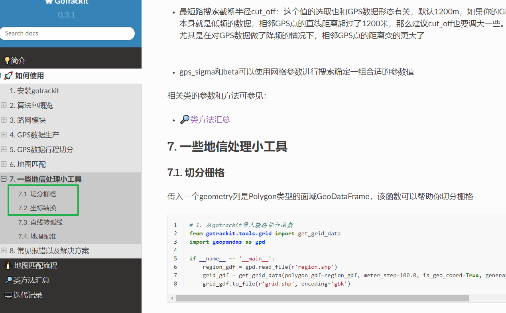
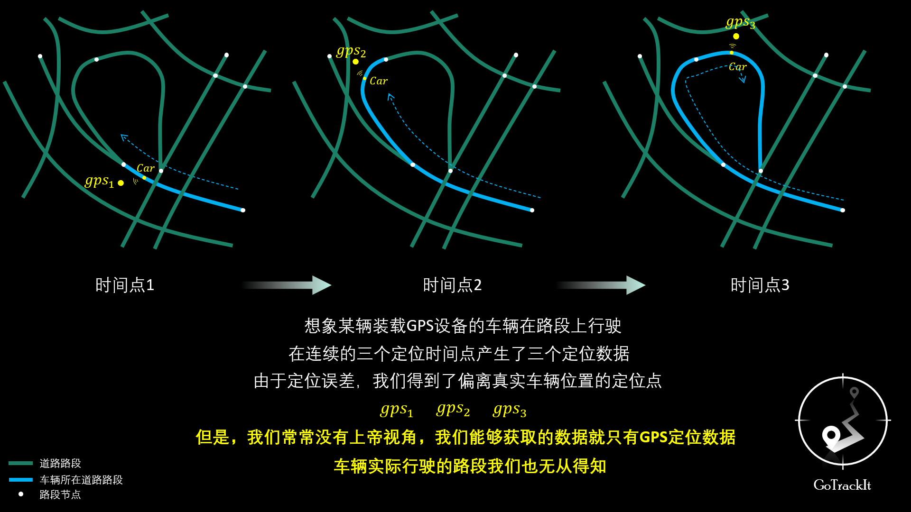
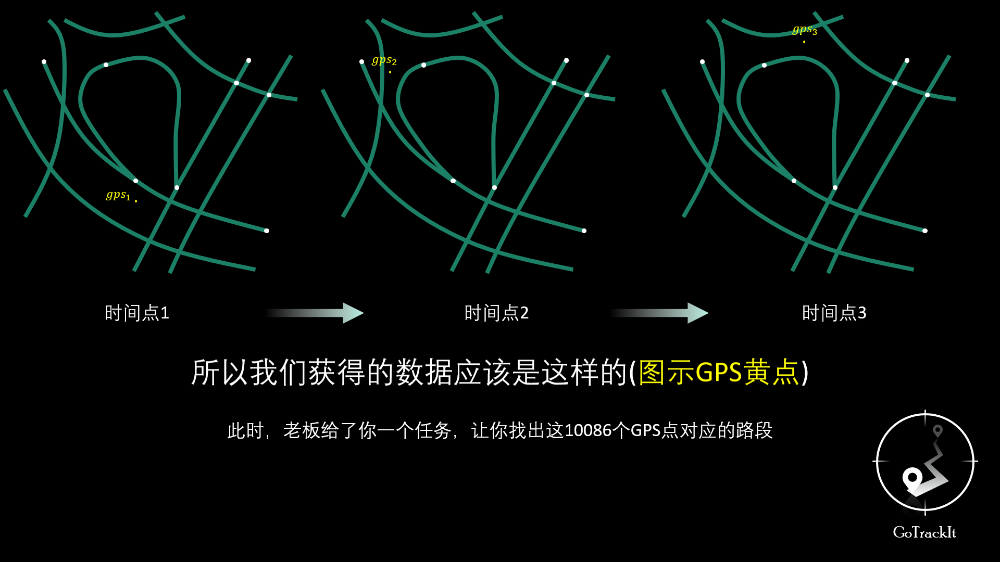
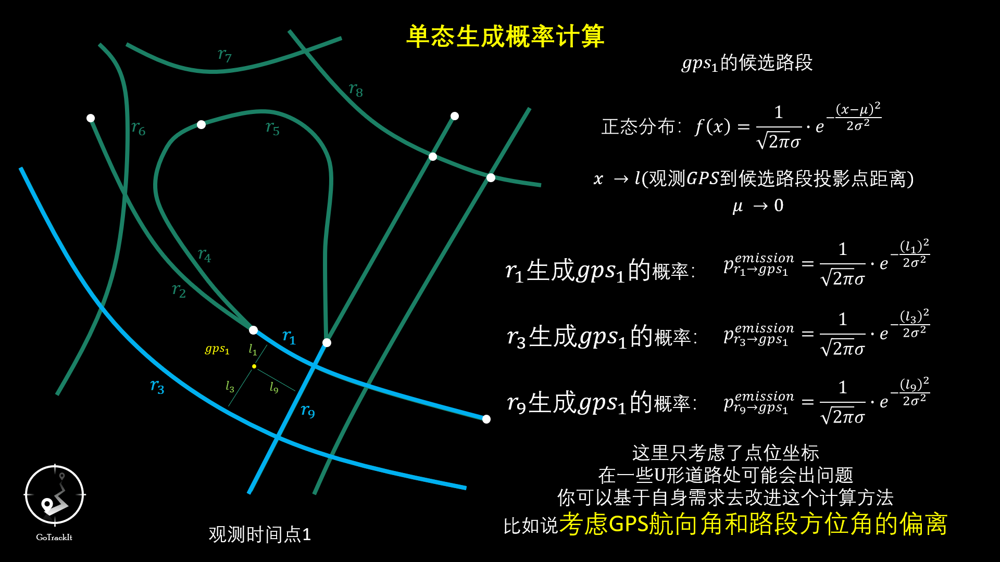

**Read this in other languages: [Chinese](README.md) or [English](README_EN.md).**


<div align="center">
    
</div>


<br>

<div align=center>

[](https://gotrackit.readthedocs.io/en/latest/?badge=latest)


[](https://pepy.tech/project/gotrackit)


~ 💪一个包搞定：路网获取、路网优化、宏微观地图匹配、匹配可视化、问题路段快速定位💪 ~

👻Developed by Tk, Email: 794568794@qq.com👻

🔑gotrackit迭代更新很快，记得关注版本更新信息哦🔑

**❗❗❗不要下载GitHub仓库上的代码来使用!!!  直接pip安装gotrackit为第三方库即可使用❗❗❗**

😆😁👉[gotrackit用户手册](https://gotrackit.readthedocs.io/en/latest/)👈😝😉
</div>
<br>


**💬版本状态：06.27已更新: v0.3.5**

更新命令：pip install --upgrade  -i https://pypi.org/simple/ gotrackit

- 全面移除对地理矢量文件的crs检查，用户自己需要确保输入的几何矢量图层的crs为EPSG:4326.

- 地图匹配接口：冗余计算代码剔除.

- 平面投影坐标系参数：老版本部分接口参数名称为plain_prj，现统一为plain_crs.

- 上新了一些GIS小工具
<div align="center">
    
</div>


<div align=center>
~ 稀疏轨迹匹配与路径补全 ~
</div>

<br>

深圳稀疏轨迹点样例1：
<div align="center">
    
</div>


<div align="center">
    
</div>


<br>

<div align=center>
~ 常规匹配 ~
</div>

<br>

<div align="center">
    
</div>

<div align="center">
    
</div>


<div align="center">
    
</div>

<div align="center">
    
</div>

<br>

<div align=center>
~ 用户交流群， 遇到BUG无法解决请进群交流，别忘了给项目一颗star哦， 您的支持是我迭代的动力 ~
</div>

<br>

<div align="center">
    
</div>


## 1. 简介
本地图匹配包基于隐马尔可夫模型(HMM)实现了连续GPS点位的概率建模，利用这个包可以轻松对GPS数据进行地图匹配，本开源包的特点如下:

**😻数据无忧**
- 提供路网生产模块以及大量路网处理优化工具，您不需要准备任何路网和GPS数据即可玩转地图匹配；
- 提供GPS样例数据生产模块，解决没有GPS数据的难题；
- 提供GPS数据清洗接口，包括行程切分、滑动窗口降噪、数据降频、停留点识别、点位增密。


**☑️文档齐全**
- 中文文档，有详细的操作指引；
- 算法原理讲解部分不涉及复杂的公式推导，使用动画形式剖析算法原理,简洁明了。


**🚀匹配算法优化**
- 支持基于路径预存储的FastMapMatching、支持多核并行匹配、支持网格参数搜索；
- 对基于HMM匹配的初步路径进行了优化，对于不连通的位置会自动搜路补全，对于实际路网不连通的位置会输出警告信息，方便用户回溯问题。


**🌈匹配结果支持动画可视化**
- 匹配结果提供三种输出形式：GPS点匹配结果表(csv)、匹配结果矢量化图层、矢量图层匹配动画(HTML文件)，HTML动画方便用户直观地感受匹配结果，同时可以提高问题排查的效率。


### 1.1. 如何安装gotrackit

#### __所需前置依赖__

- geopy(2.4.1)
- gdal(3.4.3)
- shapely(2.0.3)
- fiona(1.9.5)
- pyproj(3.6.1)
- geopandas(0.14.3)
- networkx(3.2.1)
- pandas(2.0.3)
- numpy(1.26.2)
- keplergl(0.3.2)

括号中为作者使用版本(基于python3.11), 仅供参考

#### __使用pip安装__

安装：

``` shell
pip install -i https://pypi.org/simple/ gotrackit
```

更新：
``` shell
pip install --upgrade  -i https://pypi.org/simple/ gotrackit
```

### 1.2 如何使用gotrackit

- [用户手册](https://gotrackit.readthedocs.io/en/latest/)

- [基于隐马尔可夫模型(HMM)的地图匹配算法动画版！学不会你来打我！](https://www.bilibili.com/video/BV1gQ4y1w7dC)

- [一个python包搞定路网获取+地图匹配！](https://www.bilibili.com/video/BV1nC411z7Vg)

- [gotrackit地图匹配包参数详解与问题排查](https://www.bilibili.com/video/BV1qK421Y7hV)

- [QGIS路网拓扑显示、底图加载、样式复用、map保存](https://www.bilibili.com/video/BV1Sq421F7QX)


### 1.3. 如何引用gotrackit

如果你想在文章中引用gotrackit，请附上以下链接：

``` shell
https://github.com/zdsjjtTLG/TrackIt
```

### 1.4. BUG提交

如果确定是BUG，请提交在以下页面：

[BUG提交页面](https://github.com/zdsjjtTLG/TrackIt/issues)


## 2. 地图匹配问题





__如何依据GPS数据推算车辆的实际路径？__




