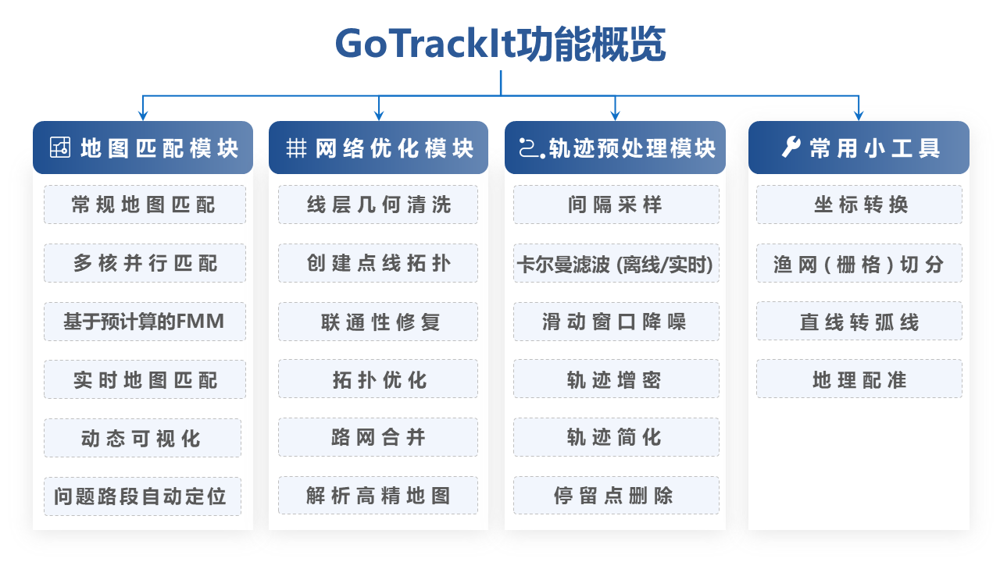
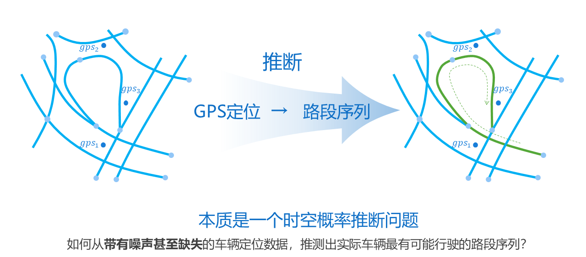

**Read this in other languages: [Chinese](README.md) or [English](README_EN.md).**

<div align="center">
<a href="https://gotrackit.readthedocs.io/en/latest/">
    
</a>
</div>


<div align=center>

[](https://gotrackit.readthedocs.io/en/latest/?badge=latest)


[](https://pepy.tech/project/gotrackit)


<div align="center">
<a href="https://gotrackit.readthedocs.io/en/latest/">
    
</a>
</div>

gotrackit是一个基于**改进隐马尔可夫模型**实现的全流程地图匹配包

~ 💪一个包搞定：路网获取、路网优化、宏微观地图匹配、匹配可视化、问题路段快速定位💪 ~

👻Developed by TangKai, Email: 794568794@qq.com，关注B站Up：[码不停的Tank](https://space.bilibili.com/49719605) 获取更多开源分享👻

🔑gotrackit迭代更新很快，记得关注版本更新信息哦🔑

**❗❗❗不要下载GitHub仓库上的代码来使用!!!  直接pip安装gotrackit为第三方库即可使用❗❗❗**

😆😁👉[gotrackit用户手册](https://gotrackit.readthedocs.io/en/latest/)👈😝😉

</div>

**💬版本状态: 2025.02.17 已更新v0.3.18**

- 路径匹配可视化：修复GPS点颜色显示错误的BUG
- 路径匹配模块：[修复issue#34](https://github.com/zdsjjtTLG/TrackIt/issues/34)提及的问题
- 路径匹配模块：优化对数概率计算、优化内存占用
- 轨迹处理模块：优化途径点数目与指定值不相符的BUG-[issue#29](https://github.com/zdsjjtTLG/TrackIt/issues/29)
- 轨迹处理模块：[修复issue#31](https://github.com/zdsjjtTLG/TrackIt/issues/31)提及的问题
- 路径匹配模块：[新增st-match](https://gotrackit.readthedocs.io/en/latest/UserGuide/路径匹配/#st-match0318)
- 路网优化模块：[拓扑优化函数新增文档使用说明](https://gotrackit.readthedocs.io/en/latest/UserGuide/路网优化/#_6)
- 其他代码优化、BUG修复

详情见：[v0.3.18更新](https://gotrackit.readthedocs.io/en/latest/blog/2025/02/07/v0318%E6%9B%B4%E6%96%B0/)


<div align=center>
~ gotrackit功能概览 ~
</div>

<div align="center">
<a href="https://gotrackit.readthedocs.io/en/latest/">
    
</a>
</div>


<div align=center>
~ 稀疏轨迹匹配与路径补全 ~
</div>

<br>

深圳稀疏轨迹点样例1：
<div align="center">
    
</div>


<div align="center">
    
</div>


<br>

<div align=center>
~ 常规匹配 ~
</div>

<br>

<div align="center">
    
</div>

<div align="center">
    
</div>

<div align="center">
    
</div>

<br>

<div align=center>
~ 目前两个用户交流群人数均已超过200人， 请添加小助手微信后再入群~
</div>

<div align=center>
~ 别忘了给项目一颗star哦， 您的支持是我迭代的动力 ~
</div>

<br>

<div align="center">
    
</div>


## 1. 简介
GoTrackIt由[杭州浙诚数据科技有限公司](https://www.zhechengdata.com/)-数据分析团队开发，我们基于改进的隐马尔可夫模型(HMM)实现了连续GPS点位的概率建模，利用这个包可以轻松对GPS数据进行地图匹配，本开源包的特点如下:

**😻数据无忧**
- 提供路网生产模块以及大量路网处理优化工具，您不需要准备任何路网和GPS数据即可玩转地图匹配；
- 提供GPS样例数据生产模块，解决没有GPS数据的难题；
- 提供GPS数据清洗接口，包括行程切分、滤波平滑、停留点识别、点位增密等功能。


**☑️文档齐全**
- 中文文档，有详细的操作指引；
- 算法原理讲解部分不涉及复杂的公式推导，使用动画形式剖析算法原理,简洁明了。


**🚀匹配算法优化**
- 支持基于路径预计算的FastMapMatching、支持多核并行匹配、支持网格参数搜索；
- 对基于HMM匹配的初步路径进行了优化，对于不连通的位置会自动搜路补全，对于实际路网不连通的位置会输出警告信息，方便用户回溯问题。


**🌈匹配结果支持动画可视化**
- 匹配结果提供三种输出形式：GPS点匹配结果表(csv)、匹配结果矢量化图层、矢量图层匹配动画(HTML文件)，HTML动画方便用户直观地感受匹配结果，同时可以提高问题排查的效率。


### 1.1. 如何安装gotrackit

#### __使用pip安装__

安装：

``` shell
pip install -i https://pypi.org/simple/ gotrackit
```

更新：
``` shell
pip install --upgrade  -i https://pypi.org/simple/ gotrackit
```
详细的安装教程见：[如何安装](https://gotrackit.readthedocs.io/en/latest/UserGuide/如何下载/)

### 1.2 如何使用gotrackit

- [用户手册](https://gotrackit.readthedocs.io/en/latest/)

- [基于隐马尔可夫模型(HMM)的地图匹配算法动画版！学不会你来打我！](https://www.bilibili.com/video/BV1gQ4y1w7dC)

- [一个python包搞定路网获取+地图匹配！](https://www.bilibili.com/video/BV1nC411z7Vg)

- [gotrackit地图匹配包参数详解与问题排查](https://www.bilibili.com/video/BV1qK421Y7hV)

- [QGIS路网拓扑显示、底图加载、样式复用、map保存](https://www.bilibili.com/video/BV1Sq421F7QX)


### 1.3. 如何引用gotrackit

如果你想在文章中引用gotrackit，请附上以下链接：

``` shell
https://github.com/zdsjjtTLG/TrackIt
```

### 1.4. BUG提交

如果确定是BUG，请提交在以下页面：

[BUG提交页面](https://github.com/zdsjjtTLG/TrackIt/issues)


## 2. 贡献者名单

在GoTrackIt的迭代发展过程中，他们对GoTrackIt提出了很多宝贵的意见，带来了大量实用的设计思路，助力GotTrackIt成为更加普及的开源项目！


- 陈先龙，314059@qq.com，广州市交通规划研究院有限公司-模型工程师
- 郑贵兵，1441411885@qq.com，广州市交通规划研究院有限公司-GIS工程师
- 万志杨，1115897470@qq.com，四川省交通运输发展战略和规划科学研究院-交通大数据工程师
- 郭凯，rsroyceguo@gmail.com，独立开发者
- 费怡瑄，2022224127@chd.edu.cn，长安大学信息工程学院-硕士研究生
- 参考了知乎网友 @空之箱大战春日影 关于滤波的代码：[文章链接](https://zhuanlan.zhihu.com/p/710241984/)
- 参考了CSDN网友 @瞌睡的代码仓库 关于贝塞尔曲线的代码：[文章链接](https://blog.csdn.net/qq_37643054/article/details/135938121)
- 参考了某位大神网友关于坐标转换的文章，这个网上资料太多，不清楚是谁的原创，如有人知道可以告知作者，我们会将他列为贡献者
- 参考了Paul Newson、John Krumm的论文：[Hidden Markov Map Matching Through Noise and Sparseness](https://dl.acm.org/doi/10.1145/1653771.1653818)
- 参考了武汉大学YangCan的论文：[Fast map matching, an algorithm integrating hidden Markov model with precomputation](https://www.tandfonline.com/doi/full/10.1080/13658816.2017.1400548)

## 3. 地图匹配定义




## 4. 地图匹配应用场景


