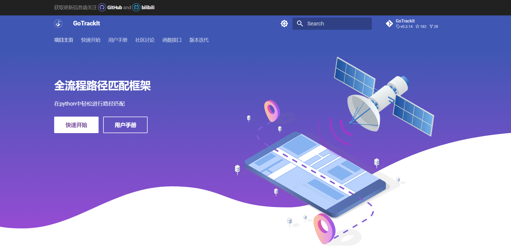
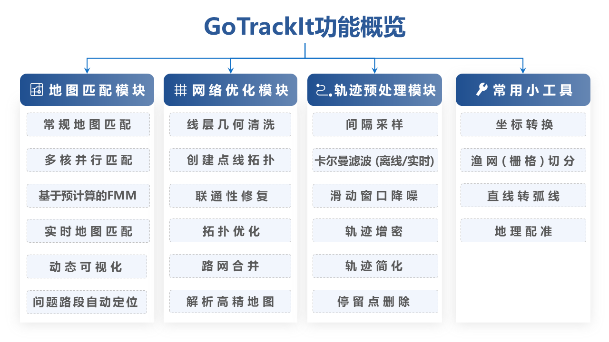
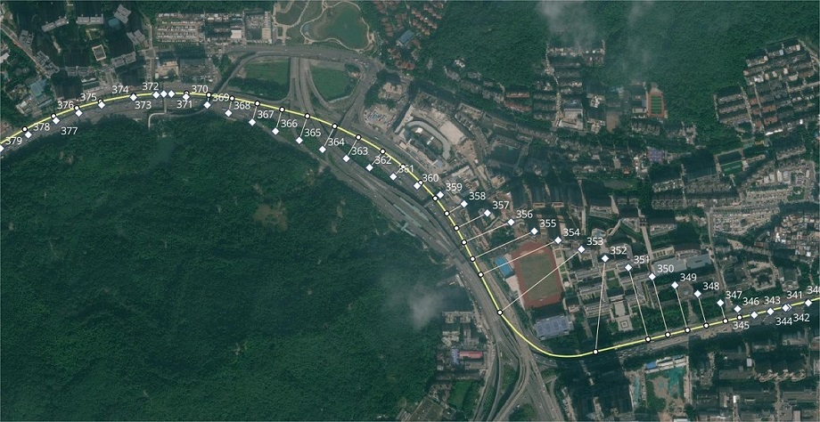

**Read this in other languages: [Chinese](README.md) or [English](README_EN.md).**

<div align="center">
<a href="https://gotrackit.readthedocs.io/en/latest/">
    
</a>
</div>


<div align=center>

[](https://gotrackit.readthedocs.io/en/latest/?badge=latest)


[](https://pepy.tech/project/gotrackit)


<div align="center">
<a href="https://gotrackit.readthedocs.io/en/latest/">
    
</a>
</div>

gotrackit是一个基于**改进隐马尔可夫模型**实现的全流程地图匹配包

~ 💪一个包搞定：路网获取、路网优化、宏微观地图匹配、匹配可视化、问题路段快速定位💪 ~


🔑gotrackit迭代更新很快，记得关注版本更新信息哦🔑

**❗❗❗不要下载GitHub仓库上的代码来使用!!!  直接pip安装gotrackit为第三方库即可使用❗❗❗**

😆😁👉[gotrackit用户手册](https://gotrackit.readthedocs.io/en/latest/)👈😝😉

</div>


**💬版本状态: 2026.06.09 已经更新v0.3.24**

- 修复pandas版本不兼容的bug


<div align=center>
~ gotrackit功能概览 ~
</div>

<div align="center">
<a href="https://gotrackit.readthedocs.io/en/latest/">
    
</a>
</div>


<div align=center>
~ 稀疏轨迹匹配与路径补全 ~
</div>

<br>

深圳稀疏轨迹点样例1：
<div align="center">
    
</div>


<div align="center">
    
</div>


<br>

<div align=center>
~ 常规匹配 ~
</div>

<br>

<div align="center">
    
</div>

<div align="center">
    
</div>

<div align="center">
    
</div>

<br>

<div align=center>
~ 目前两个用户交流群人数均已超过200人， 请添加小助手微信后再入群~
</div>

<div align=center>
~ 别忘了给项目一颗star哦， 您的支持是我迭代的动力 ~
</div>

<br>

<div align="center">
    
</div>

## 1 简介
GoTrackIt基于改进的隐马尔可夫模型(HMM)实现了连续GPS点位的概率建模，利用这个包可以轻松对GPS数据进行地图匹配，本开源包的特点如下:

**😻数据无忧**
- 提供路网生产模块以及大量路网处理优化工具，您不需要准备任何路网和GPS数据即可玩转地图匹配；
- 提供GPS样例数据生产模块，解决没有GPS数据的难题；
- 提供GPS数据清洗接口，包括行程切分、滤波平滑、停留点识别、点位增密等功能。

**☑️文档齐全**
- 中文文档，有详细的操作指引；
- 算法原理讲解部分不涉及复杂的公式推导，使用动画形式剖析算法原理,简洁明了。

**🚀匹配算法优化**
- 支持基于路径预计算的FastMapMatching、支持多核并行匹配、支持网格参数搜索；
- 对基于HMM匹配的初步路径进行了优化，对于不连通的位置会自动搜路补全，对于实际路网不连通的位置会输出警告信息，方便用户回溯问题。

**🌈匹配结果支持动画可视化**
- 匹配结果提供三种输出形式：GPS点匹配结果表(csv)、匹配结果矢量化图层、矢量图层匹配动画(HTML文件)，HTML动画方便用户直观地感受匹配结果，同时可以提高问题排查的效率。


### 1.1 如何安装gotrackit

#### __使用pip安装__

安装：

``` shell
pip install -i https://pypi.org/simple/ gotrackit
```

更新：
``` shell
pip install --upgrade  -i https://pypi.org/simple/ gotrackit
```
详细的安装教程见：[如何安装](https://gotrackit.readthedocs.io/en/latest/UserGuide/如何下载/)

### 1.2 如何使用gotrackit

- [用户手册](https://gotrackit.readthedocs.io/en/latest/)

- [基于隐马尔可夫模型(HMM)的地图匹配算法动画版！学不会你来打我！](https://www.bilibili.com/video/BV1gQ4y1w7dC)

- [一个python包搞定路网获取+地图匹配！](https://www.bilibili.com/video/BV1nC411z7Vg)

- [gotrackit地图匹配包参数详解与问题排查](https://www.bilibili.com/video/BV1qK421Y7hV)

- [QGIS路网拓扑显示、底图加载、样式复用、map保存](https://www.bilibili.com/video/BV1Sq421F7QX)

### 1.3 如何引用gotrackit

Tang,K.(2023, December 20)._GoTrackIt_.Retrieved from https://github.com/zdsjjtTLG/TrackIt

### 1.4 BUG提交

如果确定是BUG，请提交在以下页面：

[BUG提交页面](https://github.com/zdsjjtTLG/TrackIt/issues)