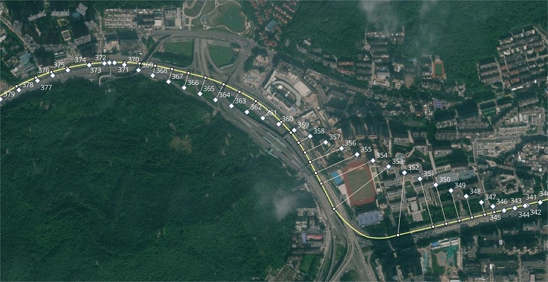

**Read this in other languages: [Chinese](README.md) or [English](README.md).**

<div align="center">
    
</div>

<br>

<div align=center>

[](https://gotrackit.readthedocs.io/en/latest/?badge=latest)


[](https://pepy.tech/project/gotrackit)


![Algorithm](https://img.shields.io/badge/-HMM-9EC231?style=flat&logo=data:image/png;base64,iVBORw0KGgoAAAANSUhEUgAAAMgAAADICAYAAACtWK6eAAAAAXNSR0IArs4c6QAAIABJREFUeF7tXQe0NVV13l9UNLo0tgRNMLFHrGAUDQI2rNgQUZqiEhBFQYygUkRFwQICURRQBEWMghgDiLQo9kJE7IomolhiQ7HE7pfz/evcP5fHe/fNzN5nZu59Z69112Pxz2n7zDen7L2/DatSNVA1sKIGUHVTNVA1sLIGKkDq21E1MEMDFSD19agaqACp70DVQDcN1BWkm95qqTWigQqQNTLRdZjdNFAB0k1vtdQa0UAFyBqZ6DrMbhqoAOmmt1pqjWigAmSNTHQdZjcNVIB001sttUY0UAGyRia6DrObBipAuumtllojGqgAWSMTXYfZTQMVIN30VkutEQ1UgKyRia7D7KaBCpBuequl1ogGKkDWyETXYXbTwFwAhORNzewOZnb7/HfpaC83s3U/APpbZWANkNzIzG6Tf7ddpjs/MbMr8+9SAN8fuMvLNj9KgJDc2My2nPr9XUvlTQBzsZnp9wUAX21ZR328gQZI3tHM7jH104dMwNigQfHpRzRPZ5nZBwF8tGXZYo+PBiAkH25m25vZ/czs7wuM+Edm9hkz+6KZXQjgvAJtLHyVJB9mZlub2d0zKDYsMOhvm9kHzOx0AOcUqL9xlYMDhOQ9zWwfM3tK417HPPhlM3uffgA+FFPlYtZC8v5pJd4m/+7c8yhPN7M3ALio53bXNTcYQPIeVcDYu8NyHK2rSzJYzgKgpX7NC8l7pxX30RkU+ogNLSdnoPQ6P4MAhOQDzew4M9P+dWxyrpm9Wz8AV42tcyX7Q/Iv0hb0CfmnLe8Y5WAAL++rY70DhOSTzextfQ3Q0c53zeyMDJSPOOoZfVGSuhARMLYzs78ZfYfN3g/gkX30s1eAkDw7L9l9jC2yjQ+a2bvM7EQAf4iseKi6SF7bzHYzsyeZmVb0eZOrANy4dKd7AwhJfY0fX3pAhev/vECSgfKrwm0VqZ7kDTIwBA7dRM2znA9At2rFpBeAkDzczF5YbBT9V/y1KaDI2DV6ycZWgUK/EtfoQ+lgfwCvKdV4cYCQ3MXMTik1gIHrlUFysqKM0hJM8pZTK8atB9ZXqeZ3BvCOEpUXBQjJ65jZp81skxKdH1Gd3zGzf9EPwG/H0K+0al83X6HrGl1uH4ssl5rZZgB+Hz3I0gB5rpkdFd3pEdeniToGgO7sBxOST83G10X/ME3reN90aD86WunFAEJSNwxaPeSbs9bkgrya6NauNyH5qLxqPKS3RsfT0NfzKvKzyC6VBMgBZvaKyM7OYV3aF2vb9amSfSd5nwyMnUq2Mwd1HwjgsMh+FgEIyRuZmXydShmdvmdml6UD8q3y/lr77TGLbvEOB/CLyE6SvKGZvSj/IquOrkvnMp3Trsg7ilLvhYy7dwPw06gBlAKIvD21zYiQz6VD/nvN7L/M7Btm9tWlCiD5lxkscl3ZNF8K6K/+/1hE4xBIZHB0C0kZ+AQOuZqPReQx/Vkz01lMf/URuwKA/v96ydtvbb3105w9LnAc2wOQq1CIlALIgWbm9Zf5sZk9A8B7uo6UpL5U2n7IE1WuCbfoWldgObnZCCid4lNI3ikDo2/v5+VUoBdfH8J/M7NPANAXvJOQVKjDaZ0KX73Q8QD2DKhnXRWlAPJ+M/M4uyke4DEA9NUNE5JbmdlD80/eqkOJwC+QvLZNB0g+L4Pj5m3KBT+rlUGuNxcAkGNnmGSbjbbPHvkGgLCLoXCAZNvHL50u7HsCON6jpdXKknxQ2q7tkH/ayw8h/5E+Ui8FMNMZMjsTHmJmDx6ik2ams9M79QOgQKZiki8cPulsYFMA2ua5pQRA5Bn6YUfPFMCk68pehKTCeSdAGcJuIOPWQQBevdyASe6ft6syuvYteskmwPhWX42TfImZ6YPQVV4E4JVdC0+XKwEQ7+B2iDrItlUQSbl8a2+vQKG+RRcRuqbU7Z+RVOSersl1gO1bFBv+tsjDbpsBkHxA3sa1KTb97EUpSjTEQ7kEQN5uZjt3HNlPAYjBZFDJBrc9BgDK/2g1yYPXJUfflwoCxgkAejVwrrBy6sD/1x1fhM8DCLndKwEQ7R91c9RFzkkhr7pxGoUMCJS+xz8aYEwGTlJXtQrg6iLfBRDif1YCIOI76roKnAJgDNeXV5uUBQbK6IAxBRCtoDIXdJFfpzPd9bsUXFqmBEDo6NhRAHSVOUohua2ZPdPM5t3XSbaLN6ZtiOwXoxRvaDaAkHc7pJJpDTNdQTg0ritPHfJHLSR16yWgyK4yT6LbRQFDN1OjFpIub4wKkBFMb3YrF1A2G0F3ZnVBXtUCxqBu+G10lF1pOgO5AqSNtgs/S1JBSfJeLsEy6On9D5LB9rB0M6hgrrkSkvrwvKFrp8cMEHlSdmWbmIst1nKTljlqBZJdu05qcLm3ZnDIYXDuhKTHny/MXFDiDCJfna4WaRmnxvKCdXqp8vlEQLlbpwr8hb6QgdF5e+Lvgr8Gklo9tIp0kUsA/EOXgkvLlACIbka6Wn8/C2AMNJcu3WZ3boFkP1dF7QuL3UNbqtCouvbd8JdwcqidAUBeEW4pARDFoCsWvYv8AcAQPkdd+rpqmewQqa1OiNFqRoM6a+wGQGTcCyEkxUHWdRU+AkDIx6kEQLxEDXcG8JV5n+Uci6LDcV9keWI/32viy7UA+tMqKK7gLvIsAG/sUrCPLZa2Vx4D1C7Jn//UiMENVUd2tjtmAObCb2aQKB5nboWk4jk8lwuPiIpVKbGCeAcn2pyuW7TBXwqS/5Q5sv58oM78KYNE7PlzKSS9u5BbAVAMvFvCAaIekfRc9Sp0c3P3yAaogOTLzOzgAZperklFLOqiYO4kJVU60+FJ/QMAYV7QpQByvsNf6Y8iW4hkpujjDUlMLgqf3bePtlq0cRKAp7d4fvBHMyOkwm67OryGElqXAoi4icS40VW2GTo3XZuOkzzBzHZvU6bHZ89NvFyP6LE9V1MkRa7huY0Lu8HSQEoBZMdE5+IhE34TAAUsjVpyjg1tB8b+Aip09r5j4Q2eNakBH5unAAgjSy8FEN1f6x67q4j1Y2MA+jtKycbA/0zM9bcbZQev2SnZSkRmMEoWenWXpNhadMXvYW25BwDPu3c1zRUBSB6scmh4chDuAeBNY3z5cgJSsQTOo9wVwJfG2HGS2qZqu9pVLgMQmvukJEC8h9ZRhd9OZoyk8riXTHR/Ut76iqG9lGy1GtVQqYZX2V7p7OHJPRgecFcSIOJwutCp6E2iyeM8/SEpMrySRrgXTOh/Mt3Pqzz9XaVsmDEtoo8kRbLg5bLaGoC4xsKkGEDyNkvMiJ48eC9Jfv0vDRuto6IcbtuZBnWVpsXgsfdSmtXkjyQ3FbmrlCJ7fvxYwm5TJKp4sDzRpGFMJtNzVRog3uvezwHo6jrvgMPVi5L03srN6ot8qPZZ6WBJUh8Yua2IK6qE7JT27f9aouI2dZLU6uGh6iliGC0NkIj9+qA2EZIytCkPYQl5c145fr3K3lxuK1pJ5MZSQuQJ/JYSFTepM8D2oWa2APCxJu21eaYoQPI2S8ljPDHbg9lESO6Vrhxf30ahLZ5df95oWqbwueTZAI5t2pfI5wJsH58G0JWLbeZQ+gCIuGU9h03ZQu7e9/09yeebWYn0wkomI4/lTjksMj2q2CtLJA3aD8ARkS//anVlRnfZLTy2j9Yfm9X6Nfn3PgByWzPTvfv1mnZqmed6jVUnKYdDOR5Gi5w4dwRwnqdikmKflLX4Jp56Vij7YgCHFqh32SoDiKp/Y2Z3SYSD/12iz8UBkrdZHr5eVSHntXv1sYrkHBxHFlC2bqqeCODjEXWTFDmz9NqVv3ZWNw4AoLRxRSWvHvJG8IzhVAC7lOpoXwDxBlFp/MVXkcxzJUNdtCgDq65UvxhZMUklAZLP2+0j6811FUmrPN3PgNVD1W2bbjrFjF9EegFIXkW8NpGiqwhJpTyQ42G0aNyPBVAkv0Z2e5EF2mNvWmnMxRIZBa0eRWwf08roEyAv1irgfPuKrCIF3UfEdK9r6iud455ZPHsVy/2lxE3OrgCUVzFUglaPQwCUOCuuH2ufAFFCGK+TXPgqQnLjnLI69AVIvL1KVfZwAMog1YukHIxqMyRxzJIO6+x0etQgglYPdUeH83UJh0pJbwDJ2ywZxnZzDka8T11p8a/WNElRhSppTbScDWCILFVyGVfymxI5Vh4dlViHpHYS2lF45MQUd17KcNr/CpIB8o8pw6z3FudXOfjHdeDNyUZ/55mhFcqelmiLlMN8MCGpr30IcdqSQbidAUneOnnsikzbm8N+cwCfKK3kXleQDBLd33uv5d6ccnK7QlxJymC3QbCCT06H8acF19mpOpKvM7Nndyo8u5AC2TrleM/zL6OxjMceeTuAJ3sqaFp2CIB4EzROxtb5a5aucy83M2W3jRSlF3hWZIXeupwE0LOa3zCN9Ydt+0dSwUwXm5k37fYDAcjJs7j0DpD8FTktHdi3d47uTACPbVtHiunw5FBcqbkjAcg1ZXRSyNlSHgEbAfjfNgNOYcpHy3O5TZllnj09Hcyf6KyjcfGhAPKwdI44t3EvV36wlat2CsrxEGuv1ItDAXgPnAGqWLkKkiKVOCe4kVYOgjkgSmcP77ZWN4MuV502ehgEIHkV+Xcze0ybzi7z7KcSxeR9m9SRbqzE1bpnk2dbPBMe4tmi7VaPFgJJ47MASTE9PqNVp6/5cKddg6fNIQESFb56IAAFZq0oJCOMlEvrH2VG3lX0oNyK0cFRxyb2mZmXAUHxHhpa72HCgwEkryKy0HpvI3TtKxKCS5Z7OQKYMpar9v0APOQCno+aqyxJfcWjeXtfBeCFK+j/z8xMyUMVPOeRQT5IQwPkXsnarEPztTyaS3kklk2YUsi/6qOJGGBLZ38HLV4o8GrZmAySB6X59brPi45WxHfy/O1VBgVIXkXkWh6RG/1qPFrJoizwyfnwloEabXUwDWw3vKrkv/VyMwvxSJjq3HbTxBN5DrR6eJnuXwvgn8OV0KDCMQBE9gitIl5Gbtk2tNW6Inu4ChybNtBB00dGQSDRtLNNnitgTFTMyyMnBBSJcEIsMNs26cuMZ+QKpNWjiDf0an0bHCB5FRHR9cyD9moDyf+uvbUOjAJH5BnhKwDkbLlwQjLiHDitFxnwpHudLY8PUFgvwVsr9XMsALl+XkW65qSbHp+Iw0RaFyUK5VQ0o4xjCykkI67cp3XzLn31A7wVlLFXq0crg2TkJI0CIHkVkQ/TYNQzKyhVWYoeBEARgQsrJHVGEGPk/Uc2yKcDKBHh2XiYowFIBkkpL9TGCpl68Ec5ErC4x2iXzkWXSdQ7igtXZOLgRH15bO9OJNtedyS3msYGEOVI/4iZacs1pFwld3EAXm7hIcfQum2SOmcpnuQ2rQvHFtCWasuVbFuxTc2ubVQAyatIxL25R4eikRE4PFmOPO0PWjaHH+tMcrMBO3IwAF1DDy5jBIiMhlpFFFzVtyhDrMDhSWPdd5/D28u8W2IKuXZ45atXqC2tVg8ZBweX0QEkryKlGEZWU/juABQWvOYlp7MeIoHRYwCcNZYJGCVAMkhKeN/O0vurAbxgLBMzhn6k262I6L82QzkOwDPbFCj97JgB8reJ8l9Gpz4OjO8BsF1pZc9j/STPEOldD33/plI8pLTV3+6hrcZNjBYgeRXZycxObTyabg+KOFnuEXKTqLJEAySVvEfBViWI6aZb2xmAJzNykbkbNUAySJQX4zlFRm+mvBwCRy/xzYXGULxakuIREEi8Tocr9fV1iVxv7+ID6dDAPADkRulWQ+4j8s6Nlnoob6jRgod2ubA/GMDPG3al18dGD5C8ikTFsE8rtx7KW75qhQ7tvcaYtxyyzQVAMkg+GJin73spB3upxJht52Cunicp582oi5OLAJSgSg3T6VwAhGRdQcKmvHtFJJ9rZkd1r2HZknUF8SiUZD2DeBQYVLZgjvh6BvHMEcl6i+VRYEDZzKcrHjMxI5aQeovVRaskqx2ki+KCy5CUX1ZrFsuW3ah2kDYKI1kt6W0UVuhZkq80sz5ccKolvc0cFmJCnNWFeu27RDsFczauNA/VF6sJSArxWTVpuhoOs5ZIKqZcYbg3bqK4wGeqN+8sZZKs8SCBb1uXqhLTiXLbi7LnHl3KO8vUeJBVAFIjCp1vmKc4SWV+Eji28NTjLFsjCpdTIMkak+58szzFSV43rRqKplS6hCGlxqSvAJDKajLga5ky/orPqrfkNKsMtbKaTCuIZOXFGhYcCq8tnjW25RArL5YURjKSWVERcJHRgWuBWfG1ZrZvy5d31uOVWTFQmQJIGDevYppJKgpRVvgoWWRu3oic5dN6rty8UW9dXj1KsLv/RSZAi7yJWUR2d1nIZSmPksruHqXJST0kS+UHERG2WALlshIli5QfRGHMcgSNlJofJFKbOcFKyQxT22SQRHZ7ETJM7ZbSOEfzf9UMU5FvWd5eReSmqDkKW0wMyR3NLJo9pOYobDEHjR4NDMCpWW4baXzdbeHjsiGwYYlGj9Ust43U1PKhoKQtNU96Q72TfGjiOz6v4eNNH6t50ptqqs1zgTHmOwFonPebpNwo9BWNlEMBKA/7aIWkXEfEaxUprS4sku7l+PjplGpvA2cneo1hH4S0IeWhOM3MvMlRzgTQOsotbe10KXAf5yQtLX4kgOcH1xlSHcmnm9mJIZX9fyVKR7dR29RoJI82s32cfTkdQG/uML0DJLP0icLHK1unfOUilGstKRBIGXFlf4mUNwJ4VmSF3rpIKs1ziTwbG6ax/rBt/0gqpv1iM7th27JLnn9gX2yYQwDkFDPbxamgNycu3d09dSTr/W8DlvulXTg5pSuWT9ngUiDF82RMGwP4atcBBpHPNT77dO3npFyvACGppDgfd3Za17rKfPpFTz0kr2Nmv/PUsULZ0wA8qUC9jaskWcoruvOqPel8ZkjRWURxJx7ZHEDx/JF9A0TGKRmpPHIYAG0d3JLi3jc0MyWqj5azASgJUO+SjK/yHpCBNFoeDUB1u4VkhP/XiQCKex/3BpCcIPJLTu1+L+cs/76znvXFUwzExikG4stR9U3V84GU+103Lr8vUPeyVZJUmyWoPJ8IQKtSiJC8pZmJME6ZdT1yl3RgLzF36/vUJ0B0Faovh0deCuAlngqWK5sTV340ut4EEN2YbZOo/a8sUPc0yJVLUP2Pvp1TG7sCkMdDqJDUPB7irPQQAC9z1jGzeJ8A+ZwzCUv46jGtmYJMKhr3Y9Ph/VslJpLkRjm/eYkEN3sCOL5QvyNWkc+nhKtFiSV6AUiQi0OR1WMJSJ6arn9PKvBCfF1pzLwXC0v7RfLe2a/q9gX6vC8A2S2KSdAqsi0AMT8Wkb4A8nYz29kxgqKrxxKQPC/d08sFP1oUK6G9vPcWb12/SOqsIb169/HLjfMAAIdHK2AZgEesIqcC8JoNVhxqcYBkjiUdzq/nUHjx1WMJSA42sxJ7W1mgdwTg8onKecxlT7qJQ6crFX0xgEML1LtslQGryG/MTId1hUaHSx8A2T/ltlM64a7yY51dAITdXDXpCEm5jrymybMtn5GBchcA725ZbrJyPCGvHKLoiZb9ABwRXems+vKNlhKp3tzR7rKxKI761hftAyCfSo5ymzk6+yYAezjKdy5Kcq80ca/vXMHsgq0nlaT3YzOrR88GcGyhsc6sluQJZubxjGjlONlmjEUBEnR9qmvSaE/Uxjoq5Ow3aV+G070BKNvuipLcM5RdVuGxpQxjuwF4S2OlBD9I8pH5Js5T8xYAPuapYLmypQFymJmJsaSrjIIooVAU3kQnYgHZB4C2GdcQkrq+PSYwP+PSNlqFDHSdyNXKpZvOS51cwIcDOGC1dtr+e2mAeG0fvR7OV/mKb5s5a9vquMnzuuHSSiJO3PVC8vF55SiVcFRXz4qRGVwCDutFbCLFAELywYkA+UKn5jcBIJCNQgLDhFcaz/pzSeHzhtp/BAClVRuF5IAqrSIecTtTLm28JEC8bH3nACjhdOeZANkf7pfdOlz1zCh8sswcZlbSbX4rAB8pNYCu9SbD5/tS1KHOI13lKACyY4VJSYB8LVl57+jo6R4pl7n4Ykcn2b3jitF1rFmH7grA6zTarKWWT5HUTZZutLrKZSkEOzTRaBGAkBRp27KHzoYjl+1DgTn6O0pJ4aPKvCSP1NuNsoPX7NQPzGzTvu1JbXRDUraQrzhtIhqjd6u2vtulAOLlXhrM9tFyQuVFe+YI8mms1m29MAoyk5Fy1BJgE3kaAG1TQ6QUQLzXu4PaPtpqNmBS2zbZ5vlzAQydEKdxfwNsIscAeG7jBld5sBRAzjezh3Ts5B8VjglAfktzIyS9lxIlxnoSALGazI3kLFdyTr1px05/KBE6PKBj2WsUKwUQvdxds6N+AsDmUQPssx6ScnCUo+MYpIjhrI+BpVR82rZ2DVn+OQCx+4dIOEBSbo47pNwclzl6F7pEOvrRqShJuYPILUTuIUPIn8xsLwDHDdF4RJsktUU6ylHXnQDoFtUtJQDi5X+Vp6sS4MytZO4vuYeUiPKbpZdvZnAov/ncSsBHNiyIqgRAvOh38S6N5a0gKfcQrSRyF+lD5NOllaMoiUEfA1EbJD3b9LBoyBIA0dLY9RbhNwCG2pqEzz1JXVTIS1Zx4yVFNo7dAZxVspE+6yb5WTPbpGObRwMIyblYAiAeguhPpmg7kcvNtZC8jZkp4KpvKtI3mNkRALTVmmtxEo2/N/nwybnULSUA4kH+cUrC6R7VgBWQ1JdL4CgRK95kZLoiFUg8h9wm7RR9hqRnJ3IpgE0jOlgCIJ6942jc29sql+SjzGw/M9uqbdlCz39YIcNRbIiF+rhitSQ9CUZ/BiAkXr8EQOSJ2lXmDiAk75pzjI/VIKczkLxcXVzGXSe0azmSCrPuzMmFxDDYte3pciGVTFfIFPni6NjcAITkX+VcF8p3cQPHmPsoKsJvXTvLxtQ6bUEfHVzaBknlj1EemU5SAdJJbTGF0hWkQKGfDuPzJDq8CyQCy6iF5NZmdkHXTi4qQMIDXroqeLlyOTZdwCjBgRvZ1dXqEtOMgNI4fd1qFUb/O8knm1lnTuAxA+QnDkezUxIB2FOile2tLx/AtSfu6h/k7UKp8rKbnDDGgzxJZcbqmubi1wCuH6G0EmcQTw7AUYXZLjAwlr47owNKuvwQsd52HV/y7wIIMc6WAIiHh/enALq6OXfU5TWLDQgMJfM5KPdIX9BbhA2qWUWjAUoKvxXTS1dbUhjDSQmAePM+7ADgXc3mM+6pHIcgR0uRbA+xlRJD+YETX6qccOgVBdJWN1GagPK2rvSoTRqY9UxAoteLAIQkEioBkC3NTEaqrvI+ADK69SIktzAzuSUIHLftpdGrN6IMVAelPfOrV7gYEN2oVhPlVOxbFKr7Tv1K5TdZYczej+yLALwyQlklAKKJ/KUzg2xRe0hmnBcgBAwBZChRGmuNdSYFD0l9dJSNSVxjQ8gvpoCiNG/FhKRuCHWO9UgYcUM4QDSqNEjFIzzcM0Izu1lk6rKpLdRktSjBjt50yGJrUcSfwnQbC0lxPonK1cOE3ri9FR6Ur53y3F8QTTyXmd7lS+aRb6R4IgXthUgpgEQlsHcFT6XQzXtmZnmxy99/oC3U0onS3b7A0SnXOMk7ZZCM4Tr8R9mYJw9uhUrrYN1JvJbzqUaPB7Bnp04sU6gUQFxW0CX9FL+WtiC69vvaSrxOJBU7oJ9y1umvQBFyFx6kbFGoChghFxAklYtdq0nRHH0txy7AaIXR2UV/FXp9BQD9//WSOcX0lddP5ILa7kaNY/vIy4VSALmRmYm9L+QueskkXSWgmNm1coYleW2GeG62fBnaPK50ZgKH9vJhQvKGGSQeBv2w/syoSHxc3xFYMihKkXFrBbtbJCNOEYBIUQUzNPUxoVFtvENht4mXSq4dxSQfbPdOX+ydijUyHxXrmlycbGFSEiAbaF+amAd1DlhrIic7AePsPgeeDZwCSldOsj67G92WMglvlkjjfhZZcTGA5FVEB8m3RnZ45HVp7y0nwDDqyy7jJal01nKq7BrT3aXZocuEETVMD6QoQDJIIq58h1b+au1rfy0GE60ao+C/zdfaWk30K3EWXE0nff67PkxaPWR0DZU+ACJDnBLpDGl3CFXaVGWXm9mJ+o2VNT3bFnZLB2T9bl1KEQPXuzMAnffCpThA8ioiA9eR4b0frkLdok2AceVw3WjeMkk5gU6AEppDo3kvijy5P4AS6brXdbYXgGSQ6IUaa9x205mTTWYCDIWxzp2QVHjwBCh9Mz9G6+t8AA+LrnS6vt4AkkGidM5zQ8U/pSi5VsjAp63UH0pOSF91p4Ak5TYRUGRwDPF87avvuZ1fApAdqKj0CpAMkufkA23RgQVULqPTGbLgr+ZMGNDWoFVkZ8gn5AClUka8yDF+HIByRRaX3gGSQbJrOjAOehU6Q7PK/Cq3FgFDVvs1I4msTWkDBBT9vM6mpfTWK7ngIADJILlv5vDVEj+0XGJmyrB6Vsqse/HQnRlD+ynj7L1z4JgyDY/B2Kub0GMBKLCsNxkMIJMRkpT7uciu+2YkFAu6QKEArQ/1pvE5bIikPKEFFP3u3PMQFBsiYCiUu3cZHCBTQNkhu6QrfZZcuqNFHqWfSdsHMQxemEiyz4tuYC3UR1K3RvLW1g2YPHA3LDBu3RYqncPHAHQmj4vo12gAMj2YHI/9oBxBJ5foW5mZPISbigx4+mm7pN8XusZfNG1wrT5HUu7qAsrkp/kSoZ588ZrIz7OXr2xL8rpQjkH5VY1CRgmQ5TSTkmQKIHKZEFgmfyePTgBxOQD9d5WBNUBScySg6Dcd6y+X94nr+3cACCCjlbkByGg1WDu20BqoAFno6a2D82qgAsSrwVp+oTVQAbLQ01sH59VABYhXg7X8QmugAmShp7cOzquBChCvBmv5hdZABchCT2/pCYm4AAAAZUlEQVQdnFcDFSBeDdbyC62BCpCFnt46OK8GKkC8GqzlF1oDFSALPb11cF4NVIB4NVjLL7QGKkAWenrr4LwaqADxarCWX2gNVIAs9PTWwXk1UAHi1WAtv9AaqABZ6Omtg/Nq4P8AbeKXXw1jCBQAAAAASUVORK5CYII=)


~ One package helps you do it: road network acquisition, road network optimization, macro and micro map matching ~

Developed by Tang Kai, Email: 794568794@qq.com & tangkai@zhechengdata.com
</div>
<br>


**version status：05.19 Updated: v0.2.7**

update command：pip install --upgrade  -i https://pypi.org/simple/ gotrackit

- The efficiency of the map matching interface is optimized, which is slightly improved compared to v0.2.4

- Added grid parameter search to help users determine reasonable matching parameters

- BUG fix


**Do not download the code from the GitHub repository to use!!! Just pip install gotrackit as a third-party library and use it**


<div align=center>
~ Sparse trajectory matching and path completion ~
</div>

<br>

Sparse trajectory gps point example：
<div align="center">
    
</div>


<div align="center">
    
</div>


<br>

<div align=center>
~ regular match example ~
</div>

<br>

<div align="center">
    
</div>

<div align="center">
    
</div>


<div align="center">
    
</div>

<div align="center">
    
</div>

<br>

<div align=center>
~ WeChat user communication group. If you encounter a bug that cannot be solved, please join the group to communicate. Don’t forget to give the project a star. Your support is the driving force for my iteration. ~
</div>

<br>

<div align="center">
    
</div>


## 1. Introduction
This map matching package implements probabilistic modeling of continuous GPS points based on Hidden Markov Model (HMM). This package can be used to easily perform map matching on GPS data.


### 1.1. How to install gotrackit

#### __Required pre-dependencies__

- geopy(2.4.1)
- gdal(3.4.3)
- shapely(2.0.3)
- fiona(1.9.5)
- pyproj(3.6.1)
- geopandas(0.14.3)
- networkx(3.2.1)
- pandas(2.0.3)
- numpy(1.26.2)
- keplergl(0.3.2)

The version used by the author (based on python3.11) is for reference only.

#### __Install using pip__

install:
``` shell
pip install -i https://pypi.org/simple/ gotrackit
```

renew:
``` shell
pip install --upgrade  -i https://pypi.org/simple/ gotrackit
```

### 1.2 How to use gotrackit

- [User manual](https://gotrackit.readthedocs.io/en/latest/)

- [Animated version of map matching algorithm based on Hidden Markov Model (HMM)!](https://www.bilibili.com/video/BV1gQ4y1w7dC)

- [A python package handles road network acquisition + map matching!](https://www.bilibili.com/video/BV1nC411z7Vg)

- [Detailed explanation and troubleshooting of map matching package parameters](https://www.bilibili.com/video/BV1qK421Y7hV)

- [QGIS road network topology display, base map loading, style reuse, and map saving](https://www.bilibili.com/video/BV1Sq421F7QX)


### 1.3. how to cite gotrackit

If you would like to cite gotrackit in your article, please include the following link：

``` shell
https://github.com/zdsjjtTLG/TrackIt
```

