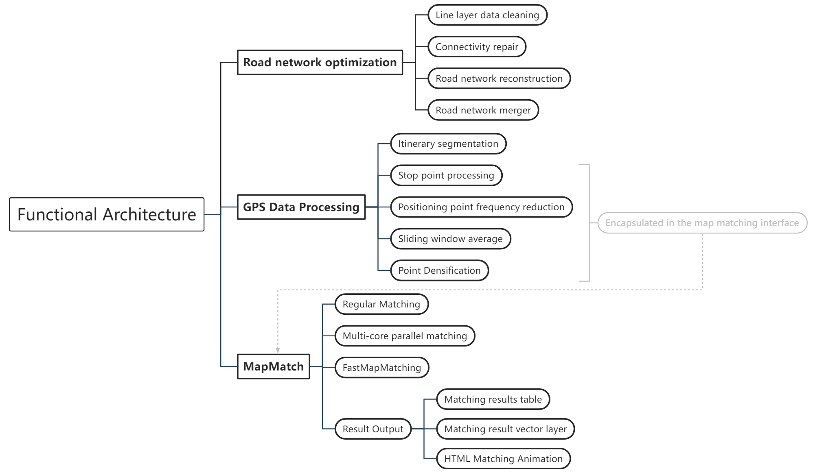

**Read this in other languages: [Chinese](README.md) or [English](README.md).**

<div align="center">
    
</div>

<br>

<div align=center>

[](https://gotrackit.readthedocs.io/en/latest/?badge=latest)


[](https://pepy.tech/project/gotrackit)


💪One package helps you do it: road network acquisition, road network optimization, macro and micro map matching💪

👻Developed by TangKai, Email: 794568794@qq.com👻

🔑gotrackit iterates and updates quickly, remember to pay attention to version update information🔑

**❗❗❗Do not download the code from the GitHub repository to use!!! Just pip install gotrackit as a third-party library and use it❗❗❗**

😆😁👉[Gotrackit User Manual](https://gotrackitdocs.readthedocs.io/en/latest/)👈😝😉
</div>
<br>


**💬version status：09.04 Updated: v0.3.10**

update command：pip install --upgrade  -i https://pypi.org/simple/ gotrackit

- fix bug for html export

<div align=center>
~ Functional Architecture of GoTrackIt ~
</div>

<div align="center">
    
</div>


<div align=center>
~ Sparse trajectory matching and path completion ~
</div>


<br>

Sparse trajectory gps point example：
<div align="center">
    
</div>


<div align="center">
    
</div>


<br>

<div align=center>
~ regular match example ~
</div>

<br>

<div align="center">
    
</div>

<div align="center">
    
</div>


<div align="center">
    
</div>

<div align="center">
    
</div>

<br>

<br>


## 1. Introduction
This map matching package implements probabilistic modeling of continuous GPS points based on Hidden Markov Model (HMM). This package can be used to easily perform map matching on GPS data. The main features of this open source package are：

**😻Comprehensive data preprocessing tools**
- Provide road network processing optimization tools；
- Provide GPS sample data production module to solve the problem of no GPS data;
- Provides GPS data cleaning interface, including itinerary segmentation, sliding window noise reduction, data frequency reduction, stop point identification, and point density enhancement.


**☑️Complete documentation**
- Chinese and English documents with detailed operation instructions;
- The explanation of the algorithm principle does not involve complex formula derivation, and uses animation to analyze the algorithm principle, which is concise and clear.


**🚀Matching algorithm optimization**
- Support FastMapMatching based on path pre-calculation, support multi-core parallel matching, and support grid parameter search;
- The preliminary path based on HMM matching is optimized, and the disconnected locations will be automatically searched and completed. For the locations that are disconnected in the actual road network, warning messages will be output to facilitate users to trace back the problems.


**🌈Matching results support animation visualization**
- The matching results are output in three forms: GPS point matching result table (csv), matching result vectorized layer, and vector layer matching animation (HTML file). HTML animation allows users to intuitively experience the matching results and improves the efficiency of troubleshooting.


### 1.1. How to install gotrackit

#### __Required pre-dependencies__

- geopy(2.4.1)
- gdal(3.4.3)
- shapely(2.0.3)
- fiona(1.9.5)
- pyproj(3.6.1)
- geopandas(0.14.3)
- networkx(3.2.1)
- pandas(2.0.3)
- numpy(1.26.2)
- keplergl(0.3.2)

The version used by the author (based on python3.11) is for reference only.

#### __Install using pip__

install:
``` shell
pip install -i https://pypi.org/simple/ gotrackit
```

renew:
``` shell
pip install --upgrade  -i https://pypi.org/simple/ gotrackit
```

### 1.2 How to use gotrackit

- [User manual](https://gotrackitdocs.readthedocs.io/en/latest/)

- [Animated version of map matching algorithm based on Hidden Markov Model (HMM)!](https://www.bilibili.com/video/BV1gQ4y1w7dC)

- [A python package handles road network acquisition + map matching!](https://www.bilibili.com/video/BV1nC411z7Vg)

- [Detailed explanation and troubleshooting of map matching package parameters](https://www.bilibili.com/video/BV1qK421Y7hV)

- [QGIS road network topology display, base map loading, style reuse, and map saving](https://www.bilibili.com/video/BV1Sq421F7QX)


### 1.3. How to cite gotrackit

If you would like to cite gotrackit in your article, please include the following link：

``` shell
https://github.com/zdsjjtTLG/TrackIt
```

### 1.4. BUG submission

If it is determined to be a BUG, please submit it on the following page:

[BUG submission page](https://github.com/zdsjjtTLG/TrackIt/issues)