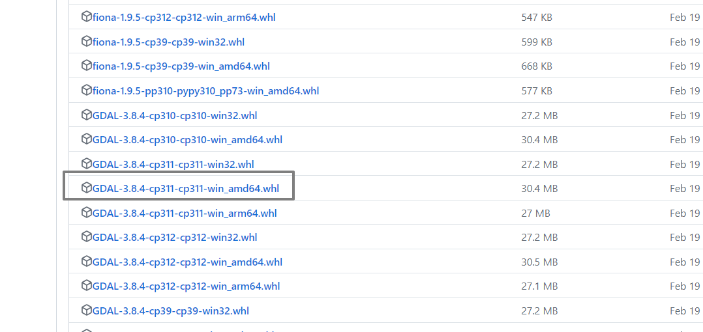

# 如何下载

[Anaconda]: https://www.anaconda.com/download
[GDAL-whl文件]: https://github.com/cgohlke/geospatial-wheels/releases

## 前置依赖库
gotrackit依赖于以下库，括号中为作者使用版本(基于python3.11)，仅供参考

安装上述依赖推荐使用[Anaconda]，使用python3.11版本

- geopy(2.4.1)
- gdal(3.4.3 或者 3.8.4)
- shapely(2.0.3)
- fiona(1.9.5)
- pyproj(3.6.1)
- geopandas(0.14.3)
- networkx(3.2.1)
- pandas(2.0.3)
- numpy(1.26.2)
- keplergl(0.3.2)
- pykalman

GDAL若安装失败，推荐直接安装 [GDAL-whl文件]

<div class="gdal-whl" markdown>
{ align=center }
</div>

!!! note "选择与自己系统和python版本对应的文件"

    这里的演示环境是python3.11的环境，操作系统是win_amd64
    所以选择GDAL-3.8.4-cp311-cp311-win_amd64.whl，大家依据自己的py版本和操作系统进行选择


## 一行命令快速安装

使用pip安装:

``` py title="使用pip安装"
pip install -i https://pypi.org/simple/ gotrackit
```

一般情况下，使用上述命令后，pip会自动先安装gotrackit的前置依赖库，如果安装失败，[请尝试从0开始配置新环境](#从0开始配置新环境)，再安装gotrackit

``` py title="已经安装好gotrackit，升级版本可以使用以下命令"
pip install --upgrade  -i https://pypi.org/simple/ gotrackit
```

<a id="从0开始配置新环境"></a>
## 从0开始配置新环境

=== "widows"

    ``` python
    # 先手动配置这些库
    pip install pandas -i https://pypi.tuna.tsinghua.edu.cn/simple
    pip install networkx -i https://pypi.tuna.tsinghua.edu.cn/simple
    pip install shapely==2.0.3 -i https://pypi.tuna.tsinghua.edu.cn/simple
    pip install fiona==1.9.5 -i https://pypi.tuna.tsinghua.edu.cn/simple
    pip install pyproj==3.6.1 -i https://pypi.tuna.tsinghua.edu.cn/simple
    
    # 然后使用whl配置GDAL, 直接把下载好的whl文件拖到install命令行即可 
    pip install GDAL-3.8.4-cp311-cp311-win_amd64.whl
    pip install geopandas -i https://pypi.tuna.tsinghua.edu.cn/simple
    pip install geopy -i https://pypi.tuna.tsinghua.edu.cn/simple
    pip install keplergl==0.3.2 -i https://pypi.tuna.tsinghua.edu.cn/simple
    pip install pykalman -i https://pypi.tuna.tsinghua.edu.cn/simple
    
    # pip继续配置，完成安装
    pip install -i  https://pypi.org/simple/ gotrackit
    ```

=== "linux"

    ``` python
    pip install pandas -i https://pypi.tuna.tsinghua.edu.cn/simple
    pip install networkx -i https://pypi.tuna.tsinghua.edu.cn/simple
    pip install shapely==2.0.3 -i https://pypi.tuna.tsinghua.edu.cn/simple
    pip install fiona==1.9.5 -i https://pypi.tuna.tsinghua.edu.cn/simple
    pip install pyproj==3.6.1 -i https://pypi.tuna.tsinghua.edu.cn/simple
    pip install GDAL-3.8.4-cp311-cp311-win_amd64.whl
    pip install geopandas -i https://pypi.tuna.tsinghua.edu.cn/simple
    pip install geopy -i https://pypi.tuna.tsinghua.edu.cn/simple
    pip install keplergl==0.3.2 -i https://pypi.tuna.tsinghua.edu.cn/simple
    pip install pykalman -i https://pypi.tuna.tsinghua.edu.cn/simple
    pip install -i  https://pypi.org/simple/ gotrackit
    ```

=== "mac"

    ``` python
    pip install pandas -i https://pypi.tuna.tsinghua.edu.cn/simple
    pip install networkx -i https://pypi.tuna.tsinghua.edu.cn/simple
    pip install shapely==2.0.3 -i https://pypi.tuna.tsinghua.edu.cn/simple
    pip install fiona==1.9.5 -i https://pypi.tuna.tsinghua.edu.cn/simple
    pip install pyproj==3.6.1 -i https://pypi.tuna.tsinghua.edu.cn/simple
    pip install GDAL-3.8.4-cp311-cp311-win_amd64.whl
    pip install geopandas -i https://pypi.tuna.tsinghua.edu.cn/simple
    pip install geopy -i https://pypi.tuna.tsinghua.edu.cn/simple
    pip install keplergl==0.3.2 -i https://pypi.tuna.tsinghua.edu.cn/simple
    pip install pykalman -i https://pypi.tuna.tsinghua.edu.cn/simple
    pip install -i  https://pypi.org/simple/ gotrackit
    ```


