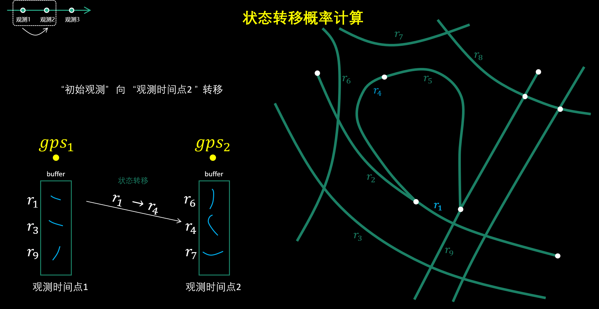
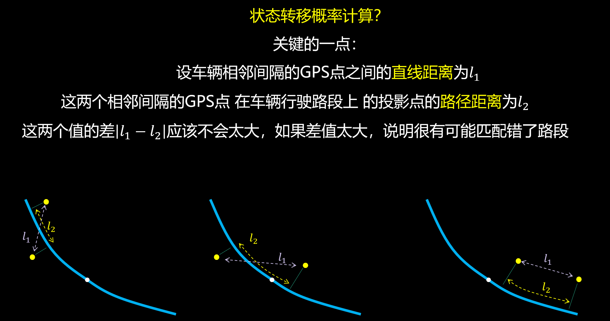
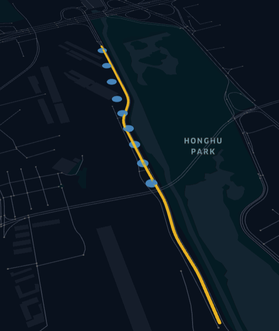

---
date:
  created: 2025-02-07
categories:
  - 版本迭代
tags:
  - StMatch
  - 对数概率优化
  - GoTrackIt
authors:
  - GoTrackIt
---

[MapMatch]: https://gotrackit.readthedocs.io/en/latest/Func%26API/MapMatch/
[st-match]: http://127.0.0.1:8000/UserGuide/路径匹配/#st-match0318

# v0.3.18更新内容

0.3.18版本的更新，除了部分BUG修复外，主要是对路径匹配模块的对数概率进行了优化，以及增加了考虑速度的匹配参数(考虑速度后可以称之为st-match)
<!-- more -->

## 新增st-match选项

什么是[st-match]？可以简单理解为：既考虑空间因素又考虑时间因素的路径匹配方法。要启用st-match，只需在[MapMatch]接口指定`use_st=True`

在`gotrackit<=0.3.17`历史版本中，路段的转移过程中只考虑了空间因素，即转移概率的计算只和长度差(路径长度与定位点球面距离的差的绝对值)有关

<figure markdown="span">
  
  <figcaption>转移概率计算1</figcaption>
</figure>

<figure markdown="span">
  
  <figcaption>转移概率计算2</figcaption>
</figure>

只考虑空间因素的转移概率计算公式为：

$$
p_{transfer} = \frac{1}{\beta}e^{\frac{-\lvert l_1-l_2\rvert}{\beta}}
$$

式中： $l_1$表示相邻GPS点的球面距离，$l_2$表示相邻GPS点在候选路段上的投影点的路径距离，$\beta$表示概率参数

上面的转移概率计算只考了路径距离和点位球面距离，只反映了空间的相似性，**如果在前后两个定位点之间有两条几乎平行的路径，比如高架道路和地面道路，此时只靠空间因素可能难以区分**，为了应对这种极端情况我们需要引入速度来修正这个转移概率，从而提升我们找到车辆真实路径的概率。 因此v0.3.18引入了速度特征。

如果启用了速度修正，即指定[MapMatch]参数`use_st=True`，转移概率将会被修正为：

$$
p_{transfer} =  \phi(v_{gps},v_{route}) \cdot \frac{1}{\beta}e^{\frac{-\lvert l_1-l_2\rvert}{\beta}}
$$

$$
\phi(v_{gps},v_{route}) = st\_main\_coe * \max(\min(1 - \frac{v_{gps} - v_{route}}{v_{route}}, 1) , st\_min\_factor)
$$

其中：$v_{gps}$代表转移过程中定位点的平均速度，$v_{route}$代表转移过程中路径的平均限速。

依据$\phi(v_{gps},v_{route})$的计算公式可以发现，我们只对超过路段限速的情况进行概率折减计算。

## 对数概率优化

!!! note 

    对数概率部分的更新对用户来说是无感的

在经典的HMM模型中需要对各观测时刻的概率进行连续的累乘，在长序列的场景下可能导致浮点数的精度溢出，因此gotrackit采用的方案是：是对概率进行对数运算，然后将对数概率的累乘转换为累加。但是在之前的版本仍然存在概率计算这一步，然后又需要多做一次对数运算，此次更新直接改动了概率的计算方式，直接返回对数概率

在历史版本：gotrackit<=v0.3.17中，转移概率和发射概率的计算公式如下：

$$
p_{transfer} = \phi(v_{gps},v_{route}) \cdot e^{\frac{-dis_{para}\lvert l_1-l_2\rvert}{\beta}}
$$

$$
p_{emission} = \omega(\theta) \cdot e^{-\frac{(dis_{para} \cdot x)^{2}}{2\sigma^2}}
$$

式中： $x$为GPS点到候选路段的最短距离，$\sigma$为概率参数，$\omega(\cdot)$为方向修正函数，$\theta$为GPS点方向向量和候选路段投影点方向的夹角
，$dis_{para}$为距离缩放系数(gotrackit中一般取0.1)

这和经典的HMM路径匹配模型的概率计算有些许出入，我去掉了一些常数项和一些系数，在发射概率上加入了方向修正系数，在转移概率上加入了速度修正系数，实践证明，采用这样的计算公式效果不错。

从v0.3.18开始，所有的概率计算都将直接计算对数概率，不需要先计算指数后再取对数：

$$
p_{transfer} = np.log(\phi(v_{gps},v_{route})) - \frac{dis_{para}\lvert l_1-l_2\rvert}{\beta}
$$

$$
p_{emission} = np.log(\omega(\theta)) - \frac{(dis_{para} \cdot x)^{2}}{2\sigma^2}
$$

## 修复颜色显示BUG

在0.3.17版本中，匹配结束后，若定位点类型**不存在后补点**，则会导致颜色显示混乱，且无法正常区分不同类型的定位点：

=== "错误颜色显示"
    
    <figure markdown="span">
      
    </figure>

=== "正确颜色显示"
    
    <figure markdown="span">
      
    </figure>

## 修复返回值类型BUG

该BUG详见[issue#31](https://github.com/zdsjjtTLG/TrackIt/issues/31)

## 修复途径点数目BUG

该BUG详见[issue#29](https://github.com/zdsjjtTLG/TrackIt/issues/29)