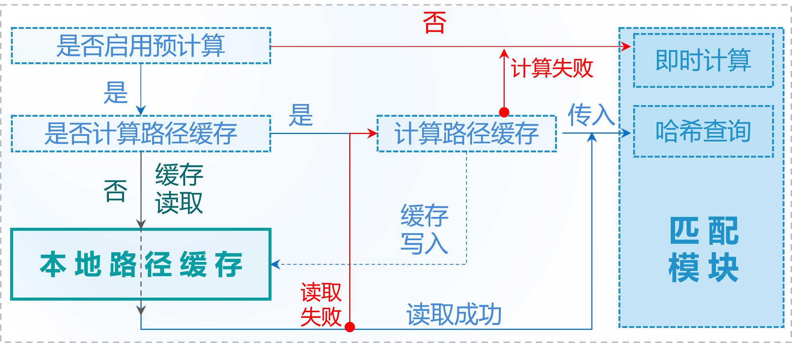
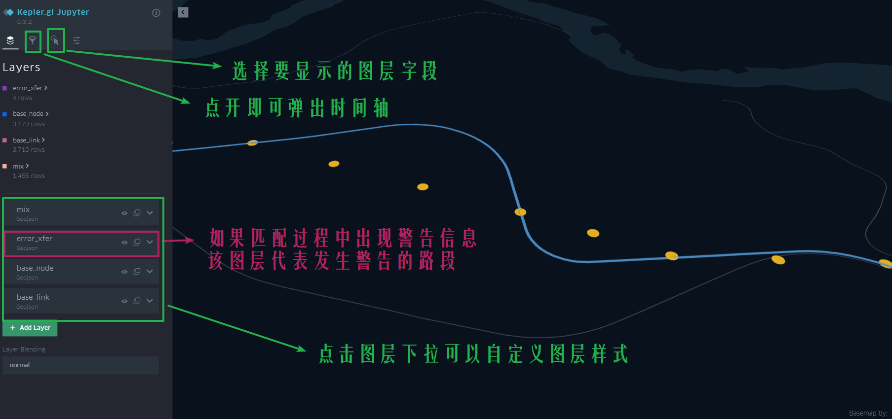
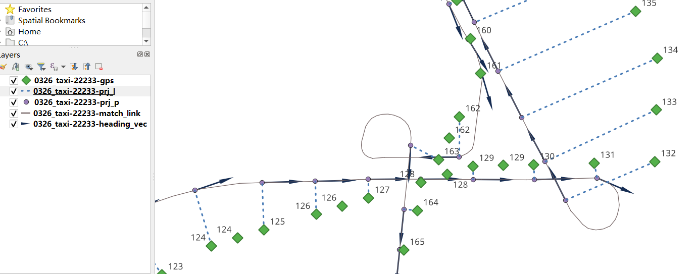
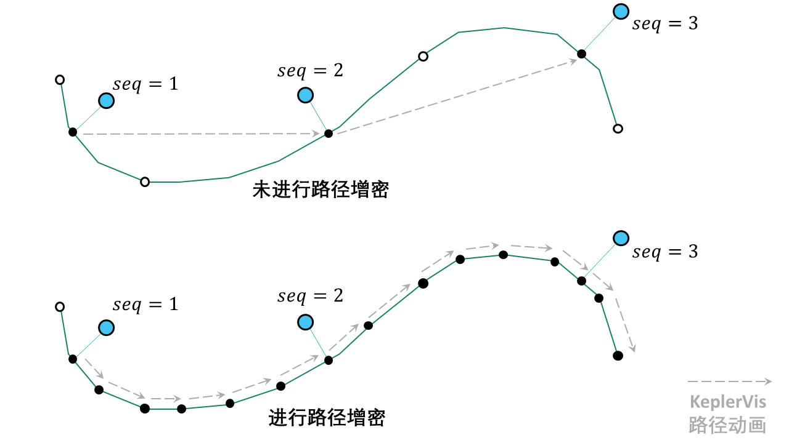
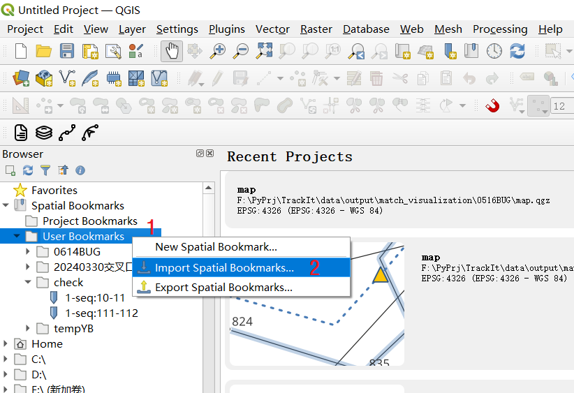
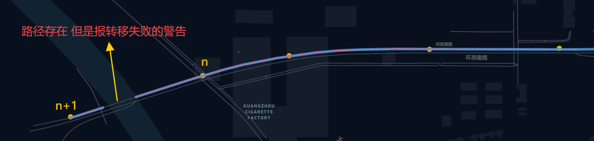
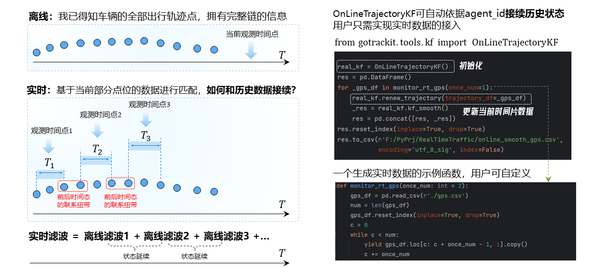
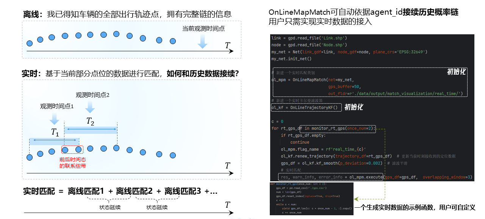

🗺️ 地图匹配
===================================

离线地图匹配
-------------------------------------------------


所需数据
`````````````

使用地图匹配接口，你需要准备路网数据和GPS数据。

路网数据要求和GPS数据要求见 :doc:`数据要求`


.. _地图匹配参数解释:
地图匹配的参数由两大部分构成：构建Net的参数、MapMatch函数参数

.. _构建Net的相关参数:

匹配接口参数解释 - 构建Net
``````````````````````````````````````

路网参数
:::::::::::::::::::

* link_gdf
    路网线层数据GeoDataFrame，与link_path只能指定其中一个, 推荐采用传入link_gdf的方式

* node_gdf
    路网点层数据GeoDataFrame，与node_path只能指定其中一个, 推荐采用传入node_gdf的方式

* link_path
    路网线层数据的文件路径

* node_path
    路网点层数据的文件路径


截断搜索参数
:::::::::::::::::::::::
* cut_off
    路径搜索截断长度, 米, 默认1200.0m

* not_conn_cost
    不连通路径的开销，默认1000.0m


路径预计算参数
:::::::::::::::::::::::

* fmm_cache
    是否启用预计算，若启用后，预计算结果会缓存在fmm_cache_fldr下，默认False

* fmm_cache_fldr
    存储预计算结果的目录，默认./

* recalc_cache
    是否重新预计算，默认True。取值False时，gotrackit会去fmm_cache_fldr下读取缓存，若读取不到则会自动重新计算

* cache_cn
    大于0的整数，使用几个核进行路径预计算, 默认2

* cache_slice
    大于0的整数，表示使用将路径结果切分为cache_slice部分进行数据标准化(大规模路网下增大该值可以防止内存溢出)


分层空间索引参数
:::::::::::::::::::::::

* is_hierarchical
    是否启用层次关联，在超大路网、较长GPS轨迹的情况下开启为True，可以显著提升自子网络的空间关联效率，默认False

* grid_len
    层次关联中的栅格边长(m)，默认2000m，一般默认即可

平面投影系参数
:::::::::::::::::::::::
* plain_crs
    要使用的平面投影坐标系，默认None，用户若不指定，程序会依据路网的经纬度范围自动进行6度投影带的选择, 推荐使用程序自动

    若要手动指定：参见: 见 :doc:`数据要求`中的平面投影坐标系解释


截止v0.3.5，用户只可以自行指定以上14个参数，其他的参数为内置参数(部分参数还未启用)，用户不可自行指定！


.. _MapMatch参数解释:

匹配接口参数解释 - MapMatch类
```````````````````````````````````````````````

项目标记参数
::::::::::::::::::::::::::::::::::::::::::::::::

* flag_name
    标记字符名称, 会用于标记输出的可视化文件, 默认"test"


基础参数(必须指定)
::::::::::::::::::::::::::::::::::::::::::::::::

* net
    gotrackit路网对象, 必须指定

* use_sub_net
    bool，是否在子网络上进行计算, 默认True


时间列构建参数
::::::::::::::::::::::::::::::::::::::::::::::::

.. _时间列构建参数:

* time_format
    GPS数据中时间列的格式化字符串模板, 默认"%Y-%m-%d %H:%M:%S"，可以参照pandas中pd.to_datetime()函数的format参数

    参考：`pd.to_datetime解释 <https://pandas.pydata.org/pandas-docs/version/0.20/generated/pandas.to_datetime.html#>`_、`ISO_8601 <https://en.wikipedia.org/wiki/ISO_8601>`_

* time_unit
    GPS数据中时间列的单位, 如果时间列是数值(秒或者毫秒,s 或者 ms), 系统会自动按照该参数构建时间列, 默认's'。Gotrackit会先尝试使用time_format进行时间列构建，如果失败会再次尝试使用time_unit进行时间列构建

候选范围参数
::::::::::::::::::::::::::::::::::::::::::::::::

* gps_buffer
    GPS的搜索半径, 单位米, 意为只选取每个gps点附近gps_buffer米范围内的路段作为初步候选路段, 默认200.0m

* gps_route_buffer_gap
    半径增量, gps_buffer + gps_route_buffer_gap 的半径范围用于计算子网络, 默认15.0m

* top_k
    选取每个GPS点buffer范围内的最近的top_k个路段，默认20。每个GPS点依据指定的gps_buffer建立圆形缓冲区，缓冲区关联的路段为该GPS点的初步候选路段，然后依据top_k参数选取离该GPS点最近的top_k个路段作为最终候选路段

    注意：对于dir为0的路段，实际会被拆分为两条拓扑相反的路段，如果某GPS的buffer范围内关联到了20条双向路段，top_k至少为40才能将这20条双向路段选为最终候选

* use_node_restrict
    是否开启节点限制， 该参数用于限定指定GPS点的候选路段，默认False.

    如果指定为True，用户需要在输入的GPS定位数据表中增加一列node_id列用于限定该GPS点的候选路段集，如下表GPS数据所示：node_id列有值的行，代表 该定位点 所属的候选路段集 是受到限制的，该定位点的候选路段集合的确定不依赖于gps_buffer和top_k参数，而是依赖于node_id的值。

.. csv-table:: 带节点限制的定位数据样例
    :header: "agent_id", "lng", "lat", "time", "node_id"
    :widths: 5,10,10,10,10

    "22413","113.8580665","22.7740407","2024-01-15 16:00:29",""
    "22413","113.8581652","22.7742416","2024-01-15 16:00:59",""
    "22413","113.8601596","22.7771383","2024-01-15 16:01:29","5639"
    "22413","113.8637522","22.7793344","2024-01-15 16:02:00",""
    "22413","113.8641483","22.7795319","2024-01-15 16:02:29",""
    "22413","113.8601526","22.7771383","2024-01-15 16:02:59",""
    "22413","113.8637532","22.7793344","2024-01-15 16:03:20","2113"
    "22413","113.8641413","22.7795319","2024-01-15 16:03:39",""

第3行的定位点：node_id值为5639，即该定位点的候选路段集合为：直接连接在5639节点上的link集合

第7行的定位点：node_id值为2113，即该定位点的候选路段集合为：直接连接在2113节点上的link集合

其他node_id列值为空的定位点，其候选路段集合的确定基于gps_buffer和top_k两个参数


发射概率、状态转移概率参数
::::::::::::::::::::::::::::::::::::::::::::::::

* beta
    大于0的值, 默认6.0m；该值越大, 状态转移概率对于距离差(米, 相邻投影点路径长度 与 相邻GPS点球面距离 的距离差)越不敏感

* gps_sigma
    大于0的值, 默认30.0m；该值越大, 发射概率对距离(米, GPS点到候选路段的距离)越不敏感

* dis_para
    距离(m)的缩放系数, 大于0的值, 默认0.1


发射概率修正 - 航向角修正
::::::::::::::::::::::::::::::::::::::::::::::::

* use_heading_inf
    是否利用GPS的差分方向向量修正发射概率(利用GPS前后点位大致估计航向角), 适用于: 低定位误差 GPS数据 或者 低频定位数据(配合加密参数), 默认False

* heading_para_array
    差分方向修正参数, 默认np.array([1.0, 1.0, 1.0, 0.9, 0.8, 0.7, 0.6, 0.6, 0.5])

* omitted_l
    单位米，如果前后序GPS点的平均距离小于该值，则认为该GPS点的航向角不准确，不会在该点应用航向角限制，默认6.0m

对方向修正系数的解释：

.. image:: _static/images/heading_para_1.png
    :align: center

----------------------------------------

.. image:: _static/images/heading_para_2.png
    :align: center

----------------------------------------


GPS预处理参数 - 停留点处理
::::::::::::::::::::::::::::::::::::::::::::::::

* del_dwell
    是否进行停留点识别并且删除停留点，默认True

* dwell_l_length
    停留点识别距离阈值, 默认10m

* dwell_n
    超过连续dwell_n个相邻GPS点的距离小于dwell_l_length，那么这一组点就会被识别为停留点，默认2


GPS预处理参数 - 点位降频
::::::::::::::::::::::::::::::::::::::::::::::::


* is_lower_f
    是否对GPS数据进行数据降频, 适用于: 高频-高定位误差 GPS数据, 默认False

* lower_n
    降频倍率, 默认2


GPS预处理参数 - 滑动窗口平均
::::::::::::::::::::::::::::::::::::::::::::::::

* is_rolling_average
    是否启用滑动窗口平均对GPS数据进行降噪, 默认False

* window
    滑动窗口大小, 默认2


GPS预处理参数 - 点位增密
::::::::::::::::::::::::::::::::::::::::::::::::

* dense_gps
    是否对GPS数据进行增密, 默认True

* dense_interval
    当相邻GPS点的球面距离L超过dense_interval即进行增密, 进行 int(L / dense_interval) + 1  等分加密, 默认100.0

.. image:: _static/images/gps_process.jpg
    :align: center

----------------------------------------


结果输出设置参数
::::::::::::::::::::::::::::::::::::::::::::::::

* instant_output
    是否每匹配完一条轨迹就存储csv匹配结果, 默认False。如果待匹配的agent数量较多，该参数指定为False可能会导致匹配结果淤积在内存中，有内存溢出的风险，指定为True后，每匹配完一个agent就对匹配结果表进行存储，避免淤积在内存中

* visualization_cache_times
    每匹配完visualization_cache_times个agent再进行结果(html、geojson可视化结果)的统一存储(可并发存储), 默认50

* out_fldr
    保存匹配结果的文件(html文件、geojson文件、csv文件)目录, 默认当前目录

* user_field_list
    GPS数据表中可以随匹配结果一同输出的字段列表， 例如:['gps_speed', 'origin_agent']，若启用了滑动窗口平均，该参数自动失效，默认None

    这些字段必须在gps表中实际存在


可视化输出参数
::::::::::::::::::::::::::::::::::::::::::::::::

* export_html
    是否输出网页可视化结果html文件, 默认True

* use_gps_source
    是否在HTML可视化结果中使用GPS源数据进行展示, 默认False

* export_all_agents
    是否将所有agent的可视化存储于一个html文件中

* gps_radius
    HTML可视化中GPS点的半径大小，单位米，默认8米

* export_geo_res
    是否输出匹配结果的geojson几何可视化文件, 默认False

* heading_vec_len
    geojson几何可视化文件中航向向量的长度，默认15m


网格参数搜索设置
::::::::::::::::::::::::::::::::::::::::::::::::
* use_para_grid
    是否启用网格参数搜索

* para_grid
    网格参数对象


匹配接口参数解释 - execute函数
```````````````````````````````````````````````

* gps_df
    待匹配的gps数据


.. _地图匹配代码示例:

常规匹配代码示例
````````````````````````

用到的数据文件从Git仓库获取：`QuickStart-Match-1 <https://github.com/zdsjjtTLG/TrackIt/tree/main/data/input/QuickStart-Match-1>`_

.. code-block:: python
    :linenos:

    # 1. 从gotrackit导入相关模块Net, MapMatch
    import pandas as pd
    import geopandas as gpd
    from gotrackit.map.Net import Net
    from gotrackit.MapMatch import MapMatch


    if __name__ == '__main__':

        # 1.读取GPS数据
        # 这是一个有10辆车的GPS数据的文件, 已经做过了数据清洗以及行程切分
        # 用于地图匹配的GPS数据需要用户自己进行清洗以及行程切分
        gps_df = pd.read_csv(r'./data/output/gps/sample/example_gps.csv')
        print(gps_df)

        # 2.构建一个net, 要求路网线层和路网点层必须是WGS-84, EPSG:4326 地理坐标系
        # 请留意shp文件的编码，可以显示指定encoding，确保字段没有乱码
        link = gpd.read_file(r'./data/input/net/xian/modifiedConn_link.shp')
        node = gpd.read_file(r'./data/input/net/xian/modifiedConn_node.shp')
        my_net = Net(link_gdf=link,
                     node_gdf=node)
        my_net.init_net()  # net初始化

        # 3. 匹配
        mpm = MapMatch(net=my_net, gps_buffer=100, flag_name='xa_sample',
               use_sub_net=True, use_heading_inf=True, omitted_l=6.0,
               del_dwell=True, dwell_l_length=50.0, dwell_n=0,
               export_html=True, export_geo_res=True, use_gps_source=True,
               export_all_agents=False,
               out_fldr=r'./data/output/match_visualization/xa_sample', dense_gps=False,
               gps_radius=15.0)

        # 第一个返回结果是匹配结果表
        # 第二个是发生警告的相关信息
        # 第三个是匹配错误的agent的id编号列表
        match_res, may_error_info, error_info = mpm.execute(gps_df=gps_df)
        print(match_res)
        match_res.to_csv(r'./data/output/match_visualization/xa_sample/match_res.csv', encoding='utf_8_sig', index=False)


匹配结果表(match_res)字段含义
::::::::::::::::::::::::::::::::::::::::::::::::

.. csv-table:: 地图匹配结果表字段说明
    :header: "字段名称", "字段含义", "字段类型"
    :widths: 15, 15, 40

    "agent_id","gps点所属agent_id","string"
    "seq","gps点的序列ID","int"
    "sub_seq","gps点的子序列ID, 如果子序列>0, 说明该点是在匹配后补出来的点, 称之为后补点, 不会去计算其在目标路段上的投影点","int"
    "time","gps定位时间","datetime"
    "loc_type","gps点类型, 三类: s：源GPS点、d：增密点、c：后补点","string"
    "link_id","gps匹配路段的link_id，对应路网的link_id字段","int"
    "from_node","gps匹配路段的起始节点(表征行车方向起点)","int"
    "to_node","gps匹配路段的终到节点(表征行车方向终点)","int"
    "lng","gps点的经度, EPSG:4326","float"
    "lat","gps点的纬度, EPSG:4326","float"
    "prj_lng","gps点在匹配路段上对应匹配点的经度, EPSG:4326, 后补点的该值为空","float"
    "prj_lat","gps点在匹配路段上对应匹配点的纬度, EPSG:4326, 后补点的该值为空","float"
    "match_heading","gps匹配点的航向角(从正北方向开始顺时针扫过的角度, 0~360度), 后补点的该值为空","float"
    "dis_to_next","gps投影点与后序相邻gps投影点的路径距离(不考虑后补点), 后补点的该值为空","float"
    "route_dis","gps匹配点在匹配路段上与路段起点的路径距离, 后补点的该值为空","float"
    "其他用户指定输出的字段", "参照参数user_field_list", "user diy"


关于sub_seq(sub_seq >= 1的即为后补点，无实际意义，仅为了输出格式的工整)：

.. image:: _static/images/gps_segmentize.png
    :align: center

--------------------------------------------------------------------------------


.. note::

   对于dir为0的双向路段，例：link_id=12, from_node=2, to_node=3，匹配结果中匹配到link_id为12时，其(from_node, to_node) 可能为(2, 3) 也可能为 (3, 2), 这个由GPS的实际行车方向决定


警告信息和错误信息含义
::::::::::::::::::::::::::::::::::::::::::::::::

地图匹配接口会返回三个结果，第一个是匹配结果表，第二个是警告的相关信息，第三个是匹配发生错误的agent_id编号列表

* 警告信息
    发生警告的agent，其匹配结果，连同没有任何警告的agent，会一起会输出在match_res中

    警告信息may_error_info的数据结构是字典：键表示agent_id，值是一个表，记录了当前agent在匹配过程中发生警告的路段信息(可在HTML中可视化查看)

    对值(一个DataFrame)的示例解释，以下图第一行为例，一行代表了一次警告，我们只用关心from_ft列、to_ft列值的第2~3个元素(路段的起始节点)，匹配link(605186, 596721) 到 匹配link(98359, 258807) 之间不连通，表明了可能存在路段缺失


.. code-block:: python
    :linenos:

    UserWarning: gps seq: 10 -> 11 状态转移出现问题, from_link:(605186, 596721) -> to_link:(98359, 258807)
    UserWarning: gps seq: 111 -> 112 状态转移出现问题, from_link:(150627, 38018) -> to_link:(78195, 26627)


.. image:: _static/images/warn_info.jpg
    :align: center

-----------------------------------------------------


* 错误信息
    error_info的数据结构是列表，记录的是匹配发生错误的agent_id，一般是GPS数据关联不到任何路网、或者GPS数据点不足两个、或者路网线层有重叠折点，对于这些错误gotrackit都会输出报错信息然后跳过该次匹配


加速匹配-启用预计算
````````````````````````````````````````

.. note::

   启用预计算，如果网络较大，则对电脑的内存大小有较高的要求，如果计算过程中内存溢出，请尝试提高初始化Net时的cache_cn、cahce_slice，或者降低cut_off


在地图匹配的过程中, 在以下两个计算过程中开销较大：

* GPS点到邻近候选路段的投影参数的计算

* 候选路段到候选路段之间最短路径的计算

然而，这部分的计算，在不同的agents车辆匹配过程中，很多部分都是重复计算项，那么我们能否基于一种预计算的思想，先将所有可能的最短路、投影参数预先计算出来呢？我们可能仅仅只需要在匹配前稍微多花一点时间来进行预计算，然后将这些预计算的结果存储在磁盘上，以后在每次匹配前，只需要读取一次预计算结果，并将其加载到内存中, 我们即可以O(1)的时间复杂度获得这些最短路结果以及投影参数结果，gotrackit实现了这一过程，以下代码为使用预计算的匹配方式：




-----------------------------------------------------


.. note::

   只要路网发生了任何变化,请重新计算路径缓存


.. note::

   计算路径缓存,请确保你的路段线型没有重复点,你可以使用 `清洗路网线层数据`_

.. code-block:: python
    :linenos:

    if __name__ == '__main__':
        # 构建net时指定fmm_cache参数为True, 表示在这次构建net对象时进行预计算
        # 请留意shp文件的编码，可以显示指定encoding，确保字段没有乱码
        link = gpd.read_file(r'./data/input/net/xian/modifiedConn_link.shp')
        node = gpd.read_file(r'./data/input/net/xian/modifiedConn_node.shp')
        my_net = Net(link_gdf=link,
                     node_gdf=node,
                     fmm_cache=True, fmm_cache_fldr=r'./data/input/net/xian/', recalc_cache=True,
                     cut_off=800.0,
                     cache_slice=6)
        my_net.init_net()  # net初始化

        # fmm_cache_fldr用于指定存储预计算结果的文件目录
        # cut_off为800m, 表示最短路径搜索过程中, 只计算最短路径距离小于800.0m的路径(考虑到相邻GPS点距离跨度不会太大)
        # cache_slice=6, 表示使用将路径结果切分为6部分进行数据标准化(大规模路网防止内存溢出)


以上的路网构建的代码执行结束后, 会在r'./data/input/net/xian/'下生成两个预计算结果文件, 笔者用深圳的路网(9w条link, 8w个节点), 预计算的时间大概为两分钟, 在使用的路网没有任何变化的情况下，下次使用该路网进行匹配可以直接指定预计算结果的路径即可, 此时直接指定recalc_cache=False, 意思为直接从fmm_cache_fldr中读取预计算结果, 不再重复预计算的过程


.. code-block:: python
    :linenos:

    if __name__ == '__main__':
        # 构建net时指定fmm_cache参数为True, 表示在这次构建net对象时进行预计算
        # 请留意shp文件的编码，可以显示指定encoding，确保字段没有乱码
        link = gpd.read_file(r'./data/input/net/xian/modifiedConn_link.shp')
        node = gpd.read_file(r'./data/input/net/xian/modifiedConn_node.shp')
        my_net = Net(link_gdf=link,
                     node_gdf=node,
                     fmm_cache=True, fmm_cache_fldr=r'./data/input/net/xian/', recalc_cache=False)
        my_net.init_net()  # net初始化

        # recalc_cache=False意思为直接从fmm_cache_fldr中读取预计算结果, 不再重复预计算的过程

        # 此时传入的net就带有预计算的结果, 匹配速度会提升
        mpm = MapMatch(net=my_net, gps_buffer=100, flag_name='xa_sample',
               use_sub_net=True, use_heading_inf=True, omitted_l=6.0,
               del_dwell=True, dwell_l_length=50.0, dwell_n=0,
               export_html=True, export_geo_res=True, use_gps_source=True,
               export_all_agents=False,
               out_fldr=r'./data/output/match_visualization/xa_sample', dense_gps=False,
               gps_radius=15.0)
        match_res, may_error_info, error_info = mpm.execute(gps_df=gps_df)
        print(match_res)


构建Net时预计算相关的参数含义如下：

* fmm_cache
    是否启用路径缓存预计算, 默认False

* cache_cn
    使用几个核进行路径预计算, 默认2

* fmm_cache_fldr
    存储路径预计算结果的文件目录, 默认./

* recalc_cache
    是否重新计算路径缓存, 默认True

* cut_off
    路径搜索截断长度, 米, 默认1200.0m

* cache_name
    路径预存储的标志名称, 默认cache, 两个缓存文件的名称: {cache_name}_path_cache, {cache_name}_prj

* cache_slice
    对缓存进行切片(切为cache_slice份)后转换格式, 进行存储(防止大规模路网导致内存溢出), 默认2 * cache_cn, 如果内存溢出可以增大该值


加速匹配-启用多核进行并行匹配
`````````````````````````````````````

若想在多条轨迹上开启并行匹配,请将mpm.execute()替换为mpm.multi_core_execute(core_num=x),当您的agent数目大于50时,多核的效率提升才会较为明显

.. code-block:: python
    :linenos:

    # 1. 从gotrackit导入相关模块Net, MapMatch
    import pandas as pd
    import geopandas as gpd
    from gotrackit.map.Net import Net
    from gotrackit.MapMatch import MapMatch


    if __name__ == '__main__':

        # 1.读取GPS数据
        # 这是一个有150辆车的GPS数据的文件
        gps_df = pd.read_csv(r'./data/output/gps/150_agents.csv')
        print(gps_df)

        # 2.构建一个net, 要求路网线层和路网点层必须是WGS-84, EPSG:4326 地理坐标系
        # 请留意shp文件的编码，可以显示指定encoding，确保字段没有乱码
        link = gpd.read_file(r'./data/input/net/xian/modifiedConn_link.shp')
        node = gpd.read_file(r'./data/input/net/xian/modifiedConn_node.shp')
        my_net = Net(link_gdf=link,
                     node_gdf=node,
                     fmm_cache=True, fmm_cache_fldr=r'./data/input/net/xian/', recalc_cache=False)
        my_net.init_net()  # net初始化

        # 3. 匹配
        mpm = MapMatch(net=my_net, gps_buffer=100, flag_name='xa_sample',
               use_sub_net=True, use_heading_inf=True,
               omitted_l=6.0, del_dwell=True, dwell_l_length=25.0, dwell_n=1,
               lower_n=2, is_lower_f=True,
               is_rolling_average=True, window=3,
               dense_gps=False,
               export_html=False, export_geo_res=False, use_gps_source=False,
               out_fldr=r'./data/output/match_visualization/xa_sample',
               gps_radius=10.0)

        match_res, may_error_info, error_info = mpm.multi_core_execute(gps_df=gps_df, core_num=6)
        print(match_res)
        match_res.to_csv(r'./data/output/match_visualization/xa_sample/match_res.csv', encoding='utf_8_sig', index=False)


* core_num
    用几个核进行匹配, 默认1


加速匹配-简化路网线型
``````````````````````````````

可以使用如下方法对路网线层的几何进行简化

.. code-block:: python
    :linenos:

    # 1. 从gotrackit导入相关模块Net, MapMatch
    import pandas as pd
    import geopandas as gpd
    from gotrackit.map.Net import Net
    from gotrackit.MapMatch import MapMatch


    if __name__ == '__main__':

        # 请留意shp文件的编码，可以显示指定encoding，确保字段没有乱码
        link = gpd.read_file(r'./data/input/net/xian/modifiedConn_link.shp')
        node = gpd.read_file(r'./data/input/net/xian/modifiedConn_node.shp')

        # 适当简化线型，simplify(x)中的x单位为m，该接口会使用道格拉斯-普克算法对线型进行简化，该值如选取的过大会导致所有link都退化为直线
        link = link.to_crs('你选定的平面投影坐标系')
        link['geometry'] = link['geometry'].simplify(1.0)  # 切记不可在地理(经纬度)坐标系下按照1.0个单位进行simplify，1个经纬度单位的实际距离为110km左右
        link = link.to_crs('EPSG:4326')
        my_net = Net(link_gdf=link,
                     node_gdf=node)
        my_net.init_net()  # net初始化

        # 匹配
        mpm = MapMatch(net=my_net, gps_buffer=100, flag_name='xa_sample',
               use_sub_net=True, use_heading_inf=True,
               omitted_l=6.0, del_dwell=True, dwell_l_length=25.0, dwell_n=1,
               lower_n=2, is_lower_f=True,
               is_rolling_average=True, window=3,
               dense_gps=False,
               export_html=False, export_geo_res=False, use_gps_source=False,
               out_fldr=r'./data/output/match_visualization/xa_sample',
               gps_radius=10.0)

        match_res, may_error_info, error_info = mpm.execute(gps_df=gps_df)
        print(match_res)
        match_res.to_csv(r'./data/output/match_visualization/xa_sample/match_res.csv', encoding='utf_8_sig', index=False)


加速匹配-利用分层索引加速空间关联效率
``````````````````````````````````````````````

适用于超大规模网络下的长轨迹匹配，可以减少子网络的空间关联时间开销，初始化Net时指定is_hierarchical为True即可开启空间分层索引


使用网格参数确定合理的匹配参数
```````````````````````````````````````

本包支持对地图匹配接口中的下面四个参数执行网格搜索：

beta、gps_sigma、omitted_l、use_heading_inf

即：遍历这四个参数可能的组合，直到匹配结果没有警告，如果所有的参数组合都有警告，那么将输出最后一次参数组合的匹配结果，匹配结果还将返回参数组合对应的匹配警告数量

使用网格参数搜索，你只需要构建一个网格参数类，并且指定各参数的取值列表即可


.. code-block:: python
    :linenos:

    # 1. 从gotrackit导入相关模块Net, MapMatch
    import pandas as pd
    import geopandas as gpd
    from gotrackit.map.Net import Net
    from gotrackit.MapMatch import MapMatch
    from gotrackit.model.Para import ParaGrid


    if __name__ == '__main__':

        gps_df = gpd.read_file(r'./data/output/gps/dense_example/test999.geojson')

        # 请留意shp文件的编码，可以显示指定encoding，确保字段没有乱码
        link = gpd.read_file(r'./data/input/net/xian/modifiedConn_link.shp')
        node = gpd.read_file(r'./data/input/net/xian/modifiedConn_node.shp')
        my_net = Net(link_gdf=link, node_gdf=node, fmm_cache=True,
                 recalc_cache=False, fmm_cache_fldr=r'./data/input/net/xian')
        my_net.init_net()


        # 3. 新建一个网格参数对象
        # 指定参数的取值范围列表
        # 可指定四个参数列表
        # beta_list: list[float] = None，gps_sigma_list: list[float] = None
        # use_heading_inf_list: list[bool] = None，omitted_l_list: list[float] = None
        pgd = ParaGrid(use_heading_inf_list=[False, True], beta_list=[0.1, 1.0], gps_sigma_list=[1.0, 5.0])

        # 4. 匹配
        # 传入网格参数：use_para_grid=True, para_grid=pgd
         mpm = MapMatch(net=my_net, is_rolling_average=True, window=2, flag_name='dense_example',
                   export_html=True, export_geo_res=True,
                   gps_buffer=400,
                   out_fldr=r'./data/output/match_visualization/dense_example',
                   dense_gps=True,
                   use_sub_net=True, dense_interval=50.0, use_gps_source=False, use_heading_inf=True,
                   gps_radius=15.0, use_para_grid=True, para_grid=pgd)
        res, warn_info, error_info = mpm.execute(gps_df=gps_df)
        print(res)
        print(warn_info)
        print(error_info)
        print(pd.DataFrame(pgd.search_res))
        res.to_csv(r'./data/output/match_visualization/dense_example/match_res.csv', encoding='utf_8_sig', index=False)

        # 可以查看不同的参数组合下，匹配过程中的警告数量
        print(pd.DataFrame(pgd.search_res))

使用参数网格进行匹配，系统会自动组合参数，并且输出不同参数组合下的警告数：

.. image:: _static/images/para_grid.jpg
    :align: center
-------------------------------------------------


匹配结果可视化
``````````````````````````````

HTML动画可视化
:::::::::::::::::::::::::::::::::::::::::

地图匹配接口中的参数export_html控制是否输出HTML动画(较为耗时)

HTML可视化需要连接网络(中国境内可能需要科学上网)，使用浏览器打开生成的html文件，按照下图点开时间轴播放器

.. image:: _static/images/可视化操作.gif
    :align: center
-----------------------------------------------



-----------------------------------------------


html可视化文件是我们对匹配结果进行排查的重要文件，它可以清晰的展示匹配过程：

 `gotrackit地图匹配包参数详解与问题排查 <https://www.bilibili.com/video/BV1qK421Y7hV>`_


geojson矢量文件可视化
:::::::::::::::::::::::::::::::::::::::::

地图匹配接口中的参数export_geo_res控制是否输出匹配结果geojson矢量图层(较为耗时)，一个agent的匹配矢量结果由四个文件组成：

{flag_name}-{agent_id}-gps.geojson：gps点矢量图层

{flag_name}-{agent_id}-match_link.geojson：匹配link矢量图层

{flag_name}-{agent_id}-prj_l.geojson：投影线矢量图层

{flag_name}-{agent_id}-prj_p.geojson：路段匹配点矢量图层

{flag_name}-{agent_id}-heading_vec.geojson：路段匹配点航向向量

可使用GIS软件可视化，如QGIS



-----------------------------------------------


对匹配结果进行路径增密
``````````````````````````````
.. note::
    该功能从v0.3.11开始推出

由于GPS数据的走向并不会严格和匹配路段的走向一模一样，当我们使用匹配结果的投影点去构造路径动画时，路径动画不能严格贴合路段线型(参见下图-未进行路径增密)

gotrackit提供了路径增密函数，依据匹配结果表中的agent_id、seq、sub_seq、link_id、from_node、to_node、prj_lng、prj_lat、time字段对匹配结果按照路段进行增密，增密后的数据所生成的轨迹和路段线型的贴合度大大提升，可以提升展示效果(参见下图-进行路径增密)




使用dense_res_based_on_net函数可进行路径增密：

    >>> from gotrackit.MatchResAna import dense_res_based_on_net
    >>> dense_match_res = dense_res_based_on_net(net=my_net, match_res_df=match_res_df)

dense_res_based_on_net相关函数解释为：

* net
    gotrackit路网对象，必填参数

* match_res_df
    地图匹配接口返回的匹配结果，必填参数

* dis_threshold
    点合并阈值，默认1e-5

* time_format
    参见 `时间列构建参数`_

* time_unit
    参见 `时间列构建参数`_


将地图匹配警告信息转化为空间书签文件
````````````````````````````````````````````````````````````

.. note::
    该功能从v0.3.11开始推出

一般来说，匹配接口返回的warn_info(即execute函数返回的第二个信息)意味着状态转移的失败，大概率说明你的路网存在不连通的位置，如何将这样的信息快速导入GIS软件中进行便捷查看、核实，从而对路网进行手动修复呢？

你可以使用gotrackit的generate_check_file函数，这个函数接收warn_info和net对象后帮你输出一个空间书签文件(xml文件)和警告路段shp文件，你可以使用QGIS对问题路段进行快速的排查

.. code-block:: python
    :linenos:

    from gotrackit.MatchResAna import generate_check_file

    if __name__ == '__main__':

        # 做完匹配后 #
        match_res, warn_info, error_info = mpm.execute(gps_df=gps_df)

        # my_net是net路网对象
        generate_check_file(my_net, warn_info_dict=warn_info,
                            out_fldr=r'./data/output/match_visualization/0614BUG/',
                            file_name='check_net')


使用QGIS的空间书签请参见：



如图所示，在QGIS的左侧浏览窗口 - Spatial Bookmarks - User Bookmarks右键 - 新建空间书签后，选择.xml空间书签文件导入，即可看到书签文件夹，展开书签文件夹后通过点击书签可以快速定位问题路段


匹配结果不正确的调参方法
``````````````````````````````

程序提示-预处理后GPS点不足两个,无法匹配
:::::::::::::::::::::::::::::::::::::::::::::::::::::::::::


* 可能停留点识别参数不合理
    可能你的GPS数据是高频定位数据, 相邻点的间距小于dwell_l_length, 此时恰好你开了停留点识别功能, 所有的GPS数据被当作停留点删除了, 你需要关掉停留点识别的开关, 再打开数据降频, 宏观路网匹配不需要这么高频的GPS定位


* 可能是gps_buffer设置的太小
    大部分GPS数据在gps_buffer内没有关联到任何路网, 那么这部分GPS数据会被删除


* 可能是源数据问题
    可能是此辆车的GPS数据点本身就不足两个


在html可视化结果中看到匹配路径不连续
:::::::::::::::::::::::::::::::::::::::::::::::::::::::::::


* 可能是gps_buffer和top_k的值小了(70%的错误可能是这个原因)
    每个GPS点依据指定的gps_buffer建立圆形缓冲区，缓冲区内关联到的路段为该GPS点的初步候选路段，然后依据top_k参数，从初步候选路段中选取离该GPS点最近的top_k个路段作为最终候选路段，
    如果GPS本身定位误差较大，且这两个值设定的比较小，可能会导致正确的路段没有被选为最终候选路段, 从而导致匹配路径不连续

    如果启用了增密参数，一般来讲，最好要增大gps_buffer和top_k的值

* 可能是源轨迹点较为稀疏(相邻GPS点间距大于1000m), 但是没有启用轨迹点自动增密
    增密轨迹点: dense_gps指定为True；dense_interval 推荐100 ~ 500，表示相邻GPS点的距离只要超过dense_interval，就会在这两个点之间进行增密


* 可能是cut_off选小了
    cut_off是路径搜索截断值, 默认1200m


* 可能是路网本身不连通
    检查在路径断开的位置, 路网是否联通, 检查联通性要检查线层文件的from_node、to_node字段值


* 可能是GPS数据的时间列问题
    可能是你的GPS数据定位时间精度不够，如前后两个点的定位时间都是2023-11-12 17:30，或者都是2023-11-12 17:30:55，本包在构建GPS对象时，会按照时间列排序，相同的定位时间可能导致两个点的实际前后顺序颠倒，从而影响匹配，所以确保你的GPS数据的定位时间没有相同值


* 可能是停留点识别参数设置不合理
    导致一些正常定位点被识别为停留点，然后被删除了


* 可能是gps_sigma、beta设定不合理
    我们将GPS点到候选路段的距离称为prj_dis

    beta表征的是对匹配路径不连续的惩罚力度，这个值越大，惩罚力度越小， 在GPS数据误差较大时，有可能出现路径不连续的情况，此时可以调小beta，增加对不连续情况的惩罚，调大gps_sigma(gps_sigma表征的是对prj_dis的惩罚，gps_sigma值越小，对prj_dis的惩罚力度越大)，弱化GPS点定位误差的影响

    调小beta, 调大gps_sigma，即增加 gps_sigma/beta：直观意义在于更加看重路径的连续性，可以容忍较大的prj_dis(即较大的定位误差)

    调大beta, 调小gps_sigma，即减小 gps_sigma/beta：直观意义在于算法倾向于选择prj_dis小的路段作为匹配结果，而不看重匹配结果的路径连续性，当gps_sigma趋近于0，beta趋近于无穷大时，匹配算法就退化为最近邻匹配

    注意：gps_sigma、beta的大小是相对的，一般情况默认的gps_sigma、beta是合理的，beta不宜小于3，gps_sigma不宜小于15


* 可能是初始化net时的not_conn_cost值小了
    这个表征的是对于路径不连续的惩罚力度, 值越大, 惩罚力度越大, 越不可能转移到不连续的路段上


* 路径缓存未更新
    启用了路径缓存，在路网结构变化后，没有重新计算路径缓存，实际使用的是旧版路网的缓存


* 可能是没有开启方向限制
    没开using_heading_inf, 或者heading_para_array设置不合理

    heading_para_array的默认值是np.array([1.0, 1.0, 1.0, 0.9, 0.8, 0.7, 0.6, 0.6, 0.5])


* 开了方向限制但是没有选择合理的停留点删除参数以及降频参数
    开了using_heading_inf, 但是差分航向角的计算在路口受到了停留点的影响导致差分航向角计算失真


如果您仍然无法解决问题，请进群交流：


-------------------------------------------------


确定合理参数的思路
::::::::::::::::::::::::::::::::::

* 首先，我们要对GPS数据的质量有一定的认识，通过使用GIS软件将GPS点打在地图上，同时叠加路网，此时可以利用距离测量工具大概得到GPS点到路段的距离，那么你的gps_buffer参数的选取就可以参考这个距离，如果绝大多数GPS点到匹配路段的距离都是x米左右，那么gps_buffer一定要大于x，偏向于保守的估计，我们可以取 x + 100为gps_buffer

------------------------------------------------------------------------------------------------------------------------------------------------------------------------------------------------------------------------------------------------------------------------------------------

* top_k参数含义为：选取GPS定位点圆形(半径为gps_buffer)范围内最近的top_k个路段作为候选路段，默认20，在gps_buffer很大的情况下，继续增加gps_buffer的值意义不大，因为你的gps_buffer再大，最近的top_k个路段也不会发生改变

* 对于top_k，特别注意：
    对于dir为0的路段，实际会被拆分为两条拓扑相反的路段，如果某GPS的buffer范围内关联到了20条双向路段，top_k至少为40才能将这20条双向路段选为最终候选

-------------------------------------------------------------------------------------------------------------------------------------------------------------------------------------------------------------------------------------------

* 最短路搜索截断半径cut_off：这个值的选取也和GPS数据形态有关，默认1200m，如果你的GPS本身就是低频的数据，相邻GPS点的直线距离超过了1200米，那么建议cut_off也要调大一些。尤其是在对GPS数据做了降频的情况下，相邻GPS点的距离变的更大了

-------------------------------------------------------------------------------------------------------------------------------------------------------------------------------------------------------------------------------------------

* gps_sigma和beta可以使用网格参数进行搜索确定一组合适的参数值


匹配路径不连续典型场景
``````````````````````````````

场景1
::::::::::::::::::::::::::::::::::

该种场景的特征：在路径断开的路段位置(伴随着匹配警告)，前序GPS点匹配到的link的长度特别长，其值接近或者超过了cut_off的值



* 如图：
    seq编号为n的GPS点匹配到了link_x，但是其长度很长，seq编号为n+1的GPS点匹配到了link_y，但是link_x和link_y并不直接相邻，因此gotrackit准备搜索从link_x的起点节点到link_y的起点节点的路径，但是由于link_x的长度很大，可能已经超出了cut_off，因此无法搜索到从link_x的起点节点到link_y的起点节点的路径

* 解决方案：
    增加cut_off 或者 编辑路网对超长link进行打断操作


关于匹配速度
``````````````````````````````

关于匹配速度，影响匹配速度的参数有：

1. MapMatch接口参数：gps_buffer，top_k，use_sub_net，gps点的数量(GPS预处理参数也会影响点数：增密、降频)

2. Net初始化接口：is_hierarchical、cut_off

（1）如何看匹配速度？如果启用了子网络（use_sub），匹配的时间就是__generate_st  + create_computational_net 两个函数所花的时间，控制台会输出，如果没有启用子网络，那就是__generate_st所花的时间

（2）路网初始化可能花费的时间会长一点，但是这个计算是一次性的，初始化完后，它可以提供给之后的每一次匹配去使用，不需要重复初始化，因为传入MapMatch的gps_df里面可以包含多个agent，每个agent匹配都是基于已经初始化好的路网

（3）可视化输出的时间如HTML输出、geojson输出，花费的时间可能比匹配过程还要长，控制台输出的export_visualization costs 指的就是可视化文件的计算以及存储的耗时，如果经过一些测试，你得到了较好的参数组合，已经不需要去输出可视化文件来排错，那么你可以关掉可视化的输出

（4）use_sub=True还是False，如何选择？如果是大网络，建议开启为True；大规模路网、长轨迹的情况下开启is_hierarchical为True，可以减少计算子路网的时间

（5）gps_buffer和top_k直接影响到候选路段的数量，候选路段数量越多，计算越耗时，gps_buffer决定的是你的初始搜索范围，top_k决定的是搜索范围内的前top_k个路段会进入最终匹配计算，如果在当前gps_buffer的搜索范围内，初始候选路段数量已经超过了top_k，那么继续增大gps_buffer意义不大

（6）gps点的数量和间距：如果你100个点花费的时间很长，有可能是因为你的GPS点是非常稀疏的点，比如说平均相邻间隔超过了3km，由于在相邻间隔大于100米时，匹配接口是会默认增密的，那么实际的GPS点数会增加，所以匹配速度会增加，当然你可以通过调节增密临界值dense_interval来控制增密的程度

（7）cut_off，是路径搜索截断长度，如果你的GPS点很密，这个值可以降低一些，匹配速度会快一些，如果你的点很稀疏，且没有开启增密，那么这个值就要调大一些，不然有些路径搜索不出来

（8）某种程度来说：GPS数据的定位误差也直接影响速度，因为由于高定位误差，迫使你不得不启用大范围gps_buffer和较大的top_k，因为正确的路段离GPS点太远了，那些离GPS点近的路段都不是正确的匹配路段


实时地图匹配
-------------------------------------------------

实时与离线的区别
``````````````````````````````

实时卡尔曼滤波：


--------------------------------------------------------


实时匹配：


--------------------------------------------------------


实时卡尔曼滤波器
``````````````````````````````

实时卡尔曼滤波器的使用，需要引入OnLineTrajectoryKF类，该类将agent_id一样的车辆定位点视为同一条概率链，示例代码如下

.. code-block:: python
    :linenos:

    # 1. 从gotrackit导入相关模块
    import pandas as pd
    from gotrackit.tools.kf import OnLineTrajectoryKF

    # 这是一个接入实时GPS数据的示例函数，用户需要自己依据实际情况去实现他
    def monitor_rt_gps(once_num: int = 2):
        gps_df = pd.read_csv(r'./gps.csv')
        num = len(gps_df)
        gps_df.reset_index(inplace=True, drop=True)
        c = 0
        while c < num:
            yield gps_df.loc[c: c + once_num - 1, :].copy()
            c += once_num

    if __name__ == '__main__':

        ol_kf = OnLineTrajectoryKF()
        res = pd.DataFrame()
        for _gps_df in monitor_rt_gps(once_num=1):
            if rt_gps_df.empty:
                continue
            ol_kf.renew_trajectory(trajectory_df=_gps_df)
            _res = ol_kf.kf_smooth()
            res = pd.concat([res, _res])
        res.reset_index(inplace=True, drop=True)
        res.to_csv(r'./online_smooth_gps.csv', encoding='utf_8_sig', index=False)


实时匹配接口
``````````````````````````````
实时地图匹配的使用，需要引入OnLineMapMatch类，该类将agent_id一样的车辆定位点视为同一条概率链，示例代码如下

.. code-block:: python
    :linenos:

    # 1. 从gotrackit导入相关模块
    import pandas as pd
    import geopandas as gpd
    from gotrackit.map.Net import Net
    from gotrackit.MapMatch import OnLineMapMatch
    from gotrackit.tools.kf import OnLineTrajectoryKF

    # 这是一个接入实时GPS数据的示例函数，用户需要自己依据实际情况去实现它
    def monitor_rt_gps(once_num: int = 2):
        gps_df = pd.read_csv(r'./gps.csv')
        num = len(gps_df)
        gps_df.reset_index(inplace=True, drop=True)
        c = 0
        while c < num:
            yield gps_df.loc[c: c + once_num - 1, :].copy()
            c += once_num

    if __name__ == '__main__':

        link = gpd.read_file('Link.shp')
        node = gpd.read_file('Node.shp')
        my_net = Net(link_gdf=link, node_gdf=node)
        my_net.init_net()

        # 新建一个实时匹配类别
        ol_mpm = OnLineMapMatch(net=my_net, gps_buffer=50,
                                out_fldr=r'./data/output/match_visualization/real_time/')

        # 新建一个实时卡尔曼滤波器
        ol_kf = OnLineTrajectoryKF()

        c = 0
        for rt_gps_df in monitor_rt_gps(once_num=2):
            if rt_gps_df.empty:
                continue
            ol_mpm.flag_name = rf'real_time_{c}'

            # 更新当前时刻接收到的定位数据
            ol_kf.renew_trajectory(trajectory_df=rt_gps_df)

            # 滤波平滑
            gps_df = ol_kf.kf_smooth(p_deviation=0.002)

            # 实时匹配
            res, warn_info, error_info = ol_mpm.execute(gps_df=gps_df,  overlapping_window=3)


实时地图匹配的execute函数参数解释如下：

* gps_df
    gps数据

* time_gap_threshold
    时间阈值，默认1800.0s，如果某agent的 当前GPS数据的最早定位时间 和 上批次GPS数据的最晚定位时间 的差值超过该值，则不参考历史概率链进行匹配计算

* dis_gap_threshold
    距离阈值，默认600.0m，如果某agent的 当前GPS数据的最早定位点 和 上批次GPS数据的最晚定位点 的距离超过该值，则不参考历史概率链进行匹配计算

* overlapping_window: int = 3
    重叠窗口长度，默认3，和历史GPS数据的重叠窗口