🚀 如何使用
===================================


1. 安装gotrackit
--------------------

安装前确保python环境中有以下前置依赖库，括号中为作者使用版本(基于python3.11)，仅供参考

* geopy(2.4.1)

* gdal(3.4.3)

* shapely(2.0.3)

* fiona(1.9.5)

* pyproj(3.6.1)

* geopandas(0.14.3)

* networkx(3.2.1)

* pandas(2.0.3)

* numpy(1.26.2)

* keplergl(0.3.2)


使用pip安装 ::

    pip install -i https://pypi.org/simple/ gotrackit


已经安装，可以升级已有版本 ::

    pip install --upgrade  -i https://pypi.org/simple/ gotrackit


2. 算法包概览
--------------------

2.1. 模块概览
````````````````

包括了五个模块：`路网生产`_ 、`GPS数据生产`_ 、`GPS数据行程切分`_ 、`地图匹配`_ 以及 `匹配过程可视化`_ 。


.. _路网生产:

2.1.1. 路网生产
::::::::::::::::::::::::::

.. note::

   通过该方式获取的路网严禁用于商业行为，仅限于教育以及科学研究。


路网生产工具用于帮助用户获取路网数据，以及对路网数据进行各种检查与优化，你只需寥寥几行代码便可以获得路网数据。

路网生产的主要流程为：依据研究区域范围构造OD --> 基于OD请求路径规划 --> 基于路径规划结果执行空间优化实现路网逆向

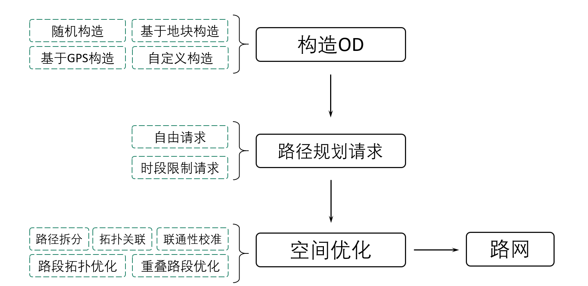

--------------------------------------------------------------------------------

本开源包将相关的方法都封装为了标准函数接口，您只用提供一个key便可以进行中国境内任意区域路网的获取。


* 构造OD
    提供基于任意形状区域随机构造OD的方法；

    提供基于地块构造形心出行OD的方法；

    提供基于GPS数据精准构造带途径点OD的方法；

    支持自定义构造OD。

.. _od_type:

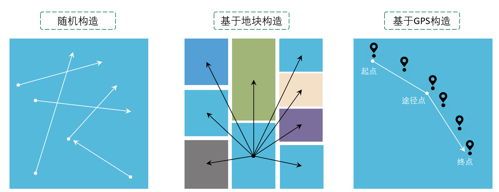

--------------------------------------------------------------------------------

三张图分别对应od_type参数为rand_od、region_od、gps_based

构造OD非常重要，因为OD构造的越精准，路径规划所覆盖的道路路段就越全面，我们得到的路网覆盖率就越高。

.. _OD表要求:

如果您需要使用自定义OD，请提供以下字段要求的OD表：

.. csv-table:: OD表字段说明
    :header: "字段名称", "字段类型", "字段说明"
    :widths: 15, 5, 40

    "od_id","int","OD唯一编码，不允许为空"
    "o_x","float","起点经度，不允许为空，GCJ-02坐标系"
    "o_y","float","起点纬度，不允许为空，GCJ-02坐标系"
    "d_x","float","终点经度，不允许为空，GCJ-02坐标系"
    "d_y","float","终点纬度，不允许为空，GCJ-02坐标系"
    "hh","int","请求时段(0~23)，如果对每个OD有具体的请求时段限制，请确保有该列，且将ignore_hh置为False，不允许有空值；如果没有时段限制, 该列可以不提供"
    "way_points","string","途径点坐标串，最多支持10个途径点，允许为空值"

样例OD数据如下：

.. csv-table:: OD样例数据
    :header: "od_id", "o_x", "o_y", "d_x", "d_y", "way_points"
    :widths: 3, 5, 5, 5, 5, 10

    "1","120.73054930354505","31.672649340942495","120.73338512634608","31.667515168299673","120.73176445980103,31.6705214428833"
    "2","120.73050669059927","31.666431974714015","120.74717247617396","31.669917988588765","120.73119124695165,31.666929583950083;120.7380010705855,31.66916745090122"
    "3", "120.74229535581601","31.660716341555","120.74250979515529","31.652820575113125",""

--------------------------------------------------------------------------------


* 路径规划请求
    您只需要申请一个 `开发者key <https://lbs.amap.com>`_ ；

    支持自由请求、按照时段请求。


* 空间优化
    路径拆分：基于路径拓扑点拆分最小路段；

    拓扑关联：生产点层，添加拓扑关系；

    路段拓扑优化：以一定的限制规则将路段进行合并，支持属性限制、累计长度限制、最大转角限制、环检测；

    重叠路段识别：部分路径距离非常近，但是却没有完全重合，本包可以进行识别与优化；

    联通性校准：识别路网中潜在的不连通节点并进行处理。


空间优化的相关类参数可见：:doc:`类方法汇总`


空间优化的具体内容可以查看我的这篇博客：`从路径规划接口逆向路网的一种方法 <https://juejin.cn/post/7268187099526152247>`_


具体的代码实操见 `路网生产代码示例`_


.. _GPS数据生产:

2.1.2. GPS数据生产
::::::::::::::::::::::::::

该模块依托路网文件模拟车辆行驶并且产生GPS数据，当用户没有实际GPS数据时可以借助该模块生产GPS数据。


基本流程为：

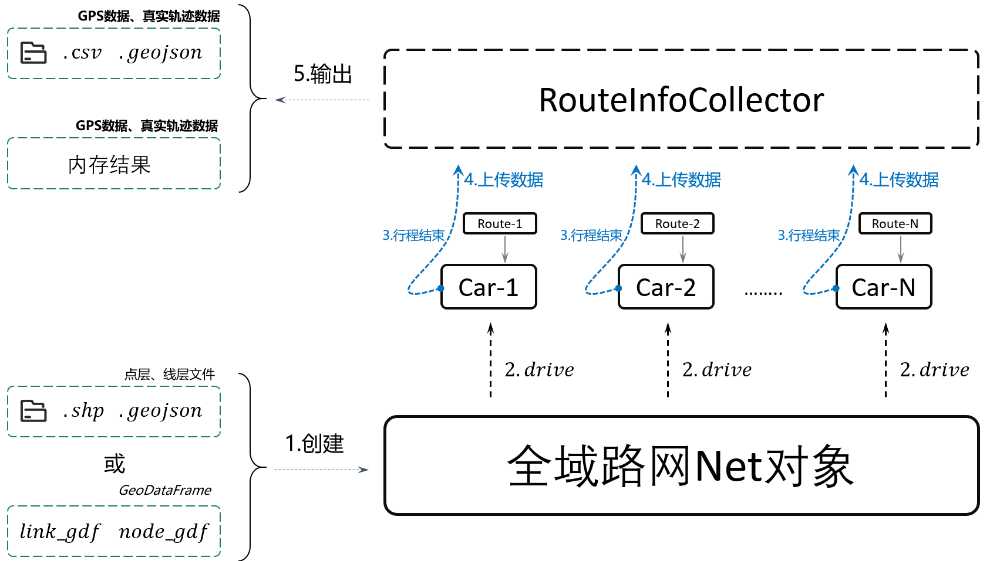

----------------------------------------

具体的代码实操见 `GPS数据生产代码示例`_ 。


.. _GPS数据行程切分:

2.1.3. GPS数据行程切分
::::::::::::::::::::::::::

主行程举例： 一辆车从家出发到达公司，将车辆停在车库，熄火后，车辆不再产生GPS数据，下班后再次启动，GPS数据重新产生，早上到达公司的最后一个定位点和下班后启动车辆的第一个定位点，其时间差超过group_gap_threshold，则在此处切分主行程

子行程举例： 一辆车从家出发到达公司，在到达公司之前，在加油站加油，GPS点持续产生，但是定位点集中在加油站附近，产生了停留，那么从家-加油站就是一段子行程

具体的代码实操见 `行程切分代码示例`_


.. _地图匹配:

2.1.4. 地图匹配
::::::::::::::::::::::::::

依托路网文件、GPS数据，对GPS数据进行地图匹配，匹配结果给出每个GPS点实际的匹配路段信息。

基本流程为：

.. image:: _static/images/MatchGraph.png
    :align: center

----------------------------------------

具体的代码实操见 `地图匹配代码示例`_ 。


.. _匹配过程可视化:

2.1.5. kepler可视化
::::::::::::::::::::::::::


将匹配结果统一输出到HTML文件，用户可以使用浏览器打开该文件播放匹配动画。

基本流程为：

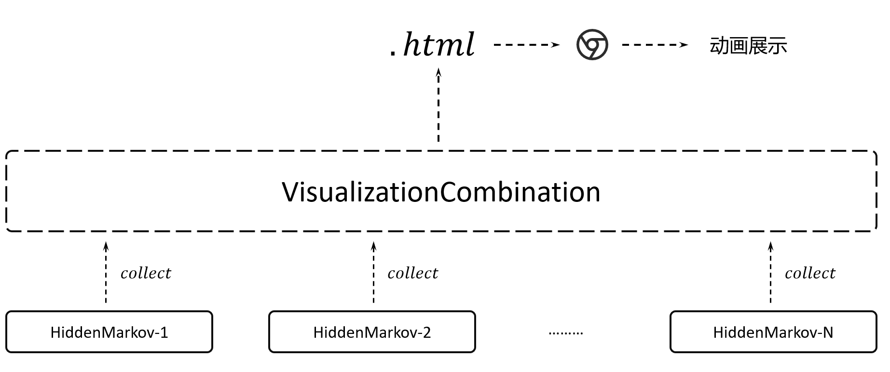

----------------------------------------


具体的代码实操见下文示例代码。


2.2. 数据要求
````````````````

这三个模块所涉及的数据说明如下：

2.2.1. 路网数据
::::::::::::::::::::::::::

.. _路网数据要求:

路网由线层文件和点层文件组成，两个文件存在关联关系。`西安样例路网 <https://github.com/zdsjjtTLG/TrackIt/tree/main/data/input/net/xian>`_


(1) 路网-点层
'''''''''''''

一般是shp文件或者geojson文件，路网点层文件字段要求如下：

.. csv-table:: 节点层字段说明
    :header: "字段名称", "字段类型", "字段说明"
    :widths: 15, 15, 40

    "node_id","int","节点唯一编码, 一定是大于0的正整数"
    "geometry","geometry","节点坐标几何列"
    "其他非必需字段","...","..."

样例数据如下：

.. csv-table:: 节点样例数据
    :header: "node_id", "geometry"
    :widths: 3, 20

    "4290","POINT (108.84059274796762 34.20380728755708)"
    "7449","POINT (108.83996876020116 34.20398312458892)"
    "19893","POINT (108.8410333043887 34.20538952458989)"
    "22765","POINT (108.8396462868452 34.20358068920948)"
    "29974","POINT (108.84304743483109 34.20477124733548)"
    "31762","POINT (108.84007099594207 34.20303962600771)"
    "34152","POINT (108.84337595161946 34.20450390550994)"
    "44441","POINT (108.8435151462407 34.204686083275455)"
    "63637","POINT (108.8415703783543 34.20233450491169)"
    "68869","POINT (108.842021912175 34.20431362229388)"
    "82793","POINT (108.84178453991281 34.204420171642816)"
    "91199","POINT (108.84129068661863 34.20558291058989)"
    "92706","POINT (108.84207500541686 34.2041637658475)"
    "118381","POINT (108.84208596575294 34.20486654570958)"
    "122487","POINT (108.84210722600966 34.20202954576994)"
    "124862","POINT (108.83952308374874 34.20369843029777)"
    "145105","POINT (108.84239758378014 34.20309169152201)"
    "166381","POINT (108.84139277469502 34.20644679433629)"
    "169462","POINT (108.84160833213731 34.20363712972413)"
    "170508","POINT (108.841425074665 34.203330912749905)"
    "177594","POINT (108.84176365682967 34.202564765029564)"
    "181808","POINT (108.84049555540867 34.20432194107051)"
    "191714","POINT (108.84048418194278 34.208751404812496)"
    "198856","POINT (108.84627615033686 34.205495498912406)"
    "199563","POINT (108.84081270761097 34.208564048548254)"

.. note::

   点层表的geometry字段中不允许出现MultiPoint类型，不支持三维坐标。


(2) 路网-线层
'''''''''''''

一般是shp文件或者geojson文件，路网线层文件字段要求如下：

.. csv-table:: 线层字段说明
    :header: "字段名称", "字段类型", "字段说明"
    :widths: 10, 10, 30

    "link_id","int","路段唯一编码, 一定是大于0的正整数"
    "from_node","int","路段拓扑起点节点编号, 一定是大于0的正整数"
    "to_node","int","路段拓扑终点节点编号, 一定是大于0的正整数"
    "dir","int","路段方向，取值为0或者1， 0代表双向通行，1代表通行方向为路段拓扑正向"
    "length","float","路段长度，单位米"
    "geometry","geometry","路段几何线型"
    "其他非必需字段","...","..."


样例数据如下：

.. csv-table:: 线层样例数据
    :header: "link_id", "dir", "length", "from_node", "to_node", "road_name", "geometry"
    :widths: 5, 5,5,5,5,5,40

    "50542","1","379.03","191714","19893","西三环入口","LINESTRING (108.84048418194278 34.208751404812496, 108.8410333043887 34.20538952458989)"
    "50545","1","112.13","170508","63637","西三环入口","LINESTRING (108.841425074665 34.203330912749905, 108.8415703783543 34.20233450491169)"
    "91646","1","120.66","177594","169462","西太公路","LINESTRING (108.84176365682967 34.202564765029564, 108.84160833213731 34.20363712972413)"
    "117776","1","91.19","22765","4290","科技八路","LINESTRING (108.8396462868452 34.20358068920947, 108.84059274796762 34.20380728755708)"
    "117777","1","142.87","4290","92706","科技八路","LINESTRING (108.84059274796762 34.20380728755708, 108.84207500541686 34.2041637658475)"
    "225724","1","126.28","92706","34152","科技八路","LINESTRING (108.84207500541686 34.2041637658475, 108.84337595161946 34.20450390550994)"
    "353809","1","309.67","198856","29974","科技八路辅路","LINESTRING (108.84627615033686 34.205495498912406, 108.84304743483109 34.20477124733548)"
    "353810","1","123.30","29974","82793","科技八路辅路","LINESTRING (108.84304743483109 34.20477124733548, 108.84178453991281 34.204420171642816)"
    "50543","1","232.85","19893","170508","西三环入口","LINESTRING (108.8410333043887 34.20538952458989, 108.84113550636526 34.204842890573545, 108.841425074665 34.203330912749905)"
    "60333","1","131.43","19893","181808","丈八立交","LINESTRING (108.8410333043887 34.20538952458989, 108.84097922452833 34.2053414459058, 108.8409571929787 34.20530941808315, 108.84094718092301 34.205266415141416, 108.84093116775695 34.205121436415766, 108.84088210545373 34.20495040838689, 108.84082903440334 34.20481036268511, 108.84074291369149 34.204649265874245, 108.84062975122784 34.20448312297699, 108.84049555540867 34.20432194107051)"
    "60342","1","114.48","181808","124862","丈八立交","LINESTRING (108.84049555540867 34.20432194107051, 108.84036636411828 34.20419775516095, 108.84024318008004 34.20409657182006, 108.84004387862637 34.203972261359624, 108.83952308374874 34.20369843029777)"
    "72528","1","144.36","44441","68869","科技八路","LINESTRING (108.8435151462407 34.204686083275455, 108.84276803395724 34.20449685714005, 108.842021912175 34.20431362229388)"
    "72530","1","241.31","68869","124862","科技八路","LINESTRING (108.842021912175 34.20431362229388, 108.84045752847501 34.20392001061749, 108.83999080892261 34.20380622377766, 108.83952308374874 34.20369843029777)"
    "91647","1","219.39","169462","91199","西太公路","LINESTRING (108.84160833213731 34.20363712972413, 108.84159129993026 34.20371207446149, 108.84158127801764 34.20379302941826, 108.84129068661863 34.20558291058989)"
    "91650","1","336.01","91199","199563","西太公路","LINESTRING (108.84129068661863 34.20558291058989, 108.8412796652767 34.20563687282872, 108.8412686439326 34.205690835063145, 108.84115642068461 34.20631242560034, 108.84081270761097 34.208564048548254)"
    "117778","1","210.78","92706","145105","丈八立交","LINESTRING (108.84207500541686 34.2041637658475, 108.84246760555624 34.204148454345315, 108.84259079504238 34.204121677386546, 108.84270897833433 34.204073898662514, 108.84278409570048 34.20403104344158, 108.84285420666204 34.203972184904536, 108.84290829376307 34.20390730060347, 108.84296138178485 34.20381142505641, 108.84298842958638 34.20372550103973, 108.84300445983821 34.203650554222975, 108.8430044667493 34.203564583429824, 108.84298844855175 34.20348958118876, 108.84295640699884 34.20340355495798, 108.84291334698771 34.20333950217767, 108.84283823977152 34.203258399651446, 108.84274109807303 34.203189254785585, 108.84262893217804 34.20313507862982, 108.84249973838324 34.20310286525956, 108.84239758378014 34.20309169152201)"
    "117796","1","101.54","145105","169462","丈八立交","LINESTRING (108.84239758378014 34.20309169152201, 108.84226337833424 34.20310245441332, 108.84214018818257 34.20312823114287, 108.84201599437151 34.20317699810311, 108.84191984203596 34.20324080868778, 108.84186074674892 34.20329968553512, 108.84168846217199 34.20355129904852, 108.84166642567236 34.203584249318894, 108.84160833213731 34.20363712972413)"
    "142834","1","137.18","44441","118381","丈八立交","LINESTRING (108.8435151462407 34.204686083275455, 108.84286516861593 34.20465297225673, 108.84270392291693 34.20466868749383, 108.84255369259174 34.20469541771726, 108.8423543849143 34.204749053102546, 108.84220415103883 34.204807771645406, 108.84208596575294 34.20486654570958)"
    "142840","1","109.65","118381","91199","丈八立交","LINESTRING (108.84208596575294 34.20486654570958, 108.84193572856508 34.20495725275265, 108.84187062536941 34.20500012448543, 108.84174241973271 34.205111862398475, 108.84152206339351 34.2053314019811, 108.84138183320681 34.205508095978935, 108.84129068661863 34.20558291058989)"
    "313011","1","185.48","170508","31762","丈八立交","LINESTRING (108.841425074665 34.203330912749905, 108.84138201087228 34.20329884814687, 108.8413549721588 34.20326181330508, 108.84133394278078 34.20322378932678, 108.84130691144021 34.20309478566952, 108.84126886083386 34.20299375316963, 108.84121578539629 34.2029126874992, 108.84113566851988 34.20282657599954, 108.84107557946284 34.2027784867213, 108.84098444236022 34.20272934315392, 108.84090432074107 34.20269821275392, 108.84078013032108 34.202671003329115, 108.84065193124133 34.202670777488386, 108.84052272903759 34.202686544240095, 108.8404205674005 34.20271835309855, 108.84031840430188 34.20276615639653, 108.84024328324365 34.202814007367984, 108.84015714222738 34.20289482758925, 108.8401090614738 34.20296471879859, 108.84007099594207 34.20303962600771)"
    "313030","1","107.96","31762","4290","丈八立交","LINESTRING (108.84007099594207 34.20303962600771, 108.84004995701892 34.20311456333897, 108.84003893335381 34.20319451669712, 108.84004393467363 34.203275498082384, 108.8400609552723 34.203350502775116, 108.8401090222339 34.20345255324469, 108.8401681085395 34.20352763233158, 108.8402271964761 34.2035817184994, 108.84032334095258 34.20365086500884, 108.84044152120677 34.20370005708676, 108.84059274796762 34.20380728755708)"
    "336493","1","268.77","122487","82793","西三环辅路","LINESTRING (108.84210722600966 34.20202954576994, 108.84186570306134 34.20393847725639, 108.84178453991281 34.204420171642816)"
    "336495","1","229.43","82793","166381","西三环辅路","LINESTRING (108.84178453991281 34.204420171642816, 108.84169935963888 34.205036812701614, 108.84162421311767 34.20542354934598, 108.84139277469502 34.20644679433629)"
    "353811","1","175.06","82793","7449","科技八路辅路","LINESTRING (108.84178453991281 34.204420171642816, 108.8409632885549 34.20423679420731, 108.83996876020116 34.20398312458892)"


.. note::

   线层表的geometry字段中不允许出现MultiLineString类型，只允许LineString类型，不支持三维坐标。


(3) 点层、线层关联关系
''''''''''''''''''''''''''

按照以上样例数据准备路网文件，shp、geojson等格式都可以。

样例数据在QGIS(或者TransCAD等其他GIS软件)中进行可视化，大概是这个样子：

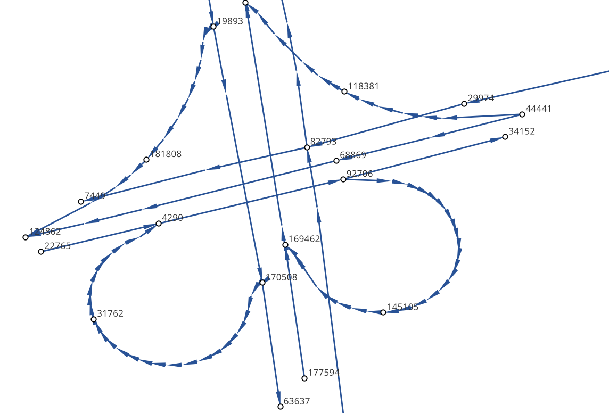

* 线层dir字段与拓扑方向
    线层的箭头方向为拓扑方向(即link层geometry中的折点行进方向)，dir字段所描述的行车方向就是与之关联的，dir为1代表该条link是单向路段，行车方向与拓扑方向一致，dir为0代表该条link是双向路段


* 点层node_id与线层from_node、to_node关联
    Link层中：一条link的from_node、to_node属性对应节点层的node_id

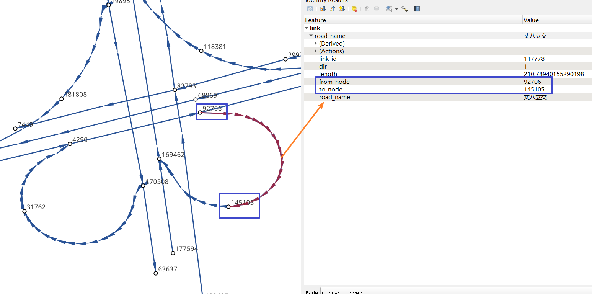


-------------------------------------

在本地图匹配包中，使用Net对象来管理路网，用户需要指定Link层和Node层文件路径或者传入link层和node层的GeoDataFrame，便可以创建一个Net对象，这个Net对象是我们开展GPS数据生产、地图匹配的基准Net，这个Net对象提供了很多操作路网的方法，方便我们对路网进行操作。


-------------------------------------


如果您没有路网数据，请参考 `路网生产`_ 。


2.2.2. GPS定位数据
::::::::::::::::::::::::::

.. _GPS定位数据字段要求:

GPS数据字段要求如下：

.. csv-table:: GPS数据字段说明
    :header: "字段名称", "字段类型", "字段说明"
    :widths: 15, 15, 40

    "agent_id","string","车辆唯一编码,准确来说这个字段标注的是车辆的某一次完整出行"
    "lng","float","经度"
    "lat","float","纬度"
    "time","string","定位时间戳"
    "其他非必需字段","...","..."

GPS数据表中不可出现以下内置字段：gv_dx、gv_dy、gvl，这些字段为gotrackit的内置计算字段

样例数据如下：

.. csv-table:: GPS样例数据
    :header: "agent_id", "lng", "lat", "time"
    :widths: 5,10,10,10

    "22413","113.8580665194923","22.774040768110932","2024-01-15 16:00:29"
    "22413","113.85816528930164","22.774241671596673","2024-01-15 16:00:59"
    "22413","113.86015961029372","22.77713838336715","2024-01-15 16:01:29"
    "22413","113.86375221173896","22.779334473598812","2024-01-15 16:02:00"
    "22413","113.864148301839","22.77953193554016","2024-01-15 16:02:29"
    "22413","113.86793876830578","22.78092681645836","2024-01-15 16:02:59"

在本地图匹配包中，使用GpsPointsGdf对象来管理一辆车的一次出行轨迹数据，用户在构建GpsPointsGdf之前应该先对GPS数据做预处理如行程切分，然后使用一个车辆唯一编码agent_id来标注这次出行，GpsPointsGdf提供了很多操作GPS数据的方法


----------------------------------------


3. 路网模块
-------------------------

该模块提供了一系列的方法帮助您生产gotrackit标准路网，亦或是 帮助您 将 其他数据来源的路网 转化为gotrackit标准路网。gotrackit的标准路网数据结构见：`路网数据要求`_

.. _路网生产代码示例:

使用路网生产工具，先从gotrackit导入相关模块 ::

    import gotrackit.netreverse.NetGen as ng


3.1. 路网生产
```````````````````````


.. note::

   通过该方式获取的路网严禁用于商业行为，仅限于教育以及科学研究。


.. note::

   请注意：通过该方式获取的路网的坐标系是GCJ-02，一般的GPS数据坐标系都是WGS-84。

路网生产的相关函数不需要您提供任何的空间地理信息文件，只需指定范围、和申请 `开发者key <https://lbs.amap.com>`_ 即可获取路网。


3.1.1. 基于矩形区域随机构造OD请求路径, 获取路网
:::::::::::::::::::::::::::::::::::::::::::::::::::::

* 初始化NetReverse类
    flag_name：项目名称，必须指定；

    net_out_fldr：最终路网的存储目录，必须指定

    plain_crs：要使用的平面投影坐标系，必须指定，参见: `6度带划分规则`_

* 请求参数
    key_list：开发者key值列表，必须指定

    binary_path_fldr：请求路径源文件的存储目录，必须指定

    save_log_file：是否保存日志文件，非必须指定，默认False

    log_fldr：日志的存储目录，非必须指定，默认None

    min_lng，min_lat：矩形区域左下角经纬度坐标(GCJ-02坐标)，必须指定

    w，h：矩形区域的宽度和高度(米)，必须指定，默认值2000，2000

    od_type：生成OD的类型，必须指定，含义见：`od_type`_

    od_num，gap_n，min_od_length：生成的od数、划分网格数、最小的od直线距离限制，非必须指定，默认100，1000，1200

    指定矩形区域的左下点经纬度坐标(GCJ-02坐标系)，以及矩形区域的宽度和长度(单位米)，必须指定


所有参数解释见 :doc:`类方法汇总`


示例代码如下：


.. code-block:: python
    :linenos:

    if __name__ == '__main__':
        nv = ng.NetReverse(flag_name='test_rectangle', net_out_fldr=r'./data/output/reverse/test_rectangle/',
                       plain_prj='EPSG:32650', save_tpr_link=True, angle_threshold=40)

        nv.generate_net_from_request(key_list=['你的Key'],
                                     log_fldr=r'./', save_log_file=True,
                                     binary_path_fldr=r'./data/output/request/test_rectangle/',
                                     w=1500, h=1500, min_lng=126.665019, min_lat=45.747539, od_type='rand_od',
                                     od_num=200, gap_n=1000, min_od_length=800)

运行该代码后，先在目录./data/output/request/test_rectangle/下生成路径源文件，然后在目录./data/output/reverse/test_rectangle/下生成FinalLink.shp和FinalNode.shp文件


3.1.2. 基于自定义区域随机构造OD请求路径, 获取路网
::::::::::::::::::::::::::::::::::::::::::::::::::::::::::

我们通过读取diy_region.shp来指定我们构造随机OD的区域范围：

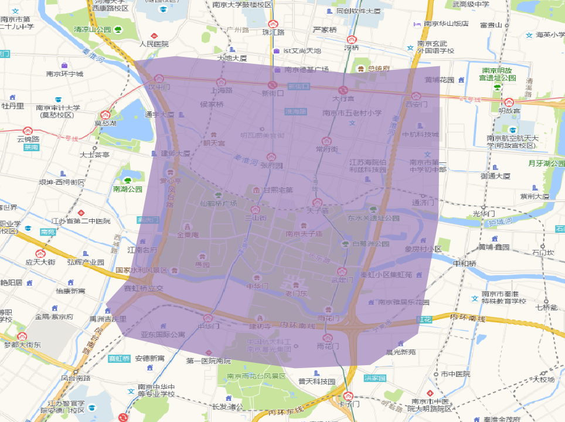

-------------------------------------------------------

示例代码如下：

.. code-block:: python
    :linenos:

    if __name__ == '__main__':
        nv = ng.NetReverse(flag_name='test_diy_region', net_out_fldr=r'./data/output/reverse/test_diy_region/',
                           plain_prj='EPSG:32650', save_tpr_link=True, angle_threshold=20)
        target_region_gdf = gpd.read_file(r'./data/input/region/diy_region.shp')
        print(target_region_gdf)
        nv.generate_net_from_request(key_list=['你的Key'],
                                     log_fldr=r'./', save_log_file=True,
                                     binary_path_fldr=r'./data/output/request/test_diy_region/',
                                     region_gdf=target_region_gdf, od_type='rand_od', gap_n=1000,
                                     min_od_length=1200, od_num=20)


3.1.3. 基于区域-区域OD请求路径, 获取路网
::::::::::::::::::::::::::::::::::::::::::::::::::::::::::::::::

读取交通小区文件，指定od_type为region_od，会自动构造两两地块形心之间的OD。使用该方法构造OD，需要确保面域文件中包含region_id字段。


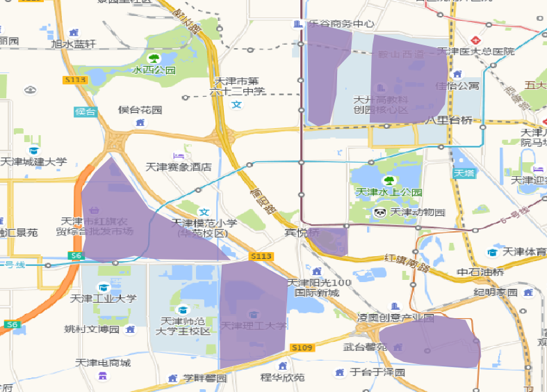

-------------------------------------------------------


示例代码如下：

.. code-block:: python
    :linenos:

    if __name__ == '__main__':
        nv = ng.NetReverse(flag_name='test_taz', net_out_fldr=r'./data/output/reverse/test_taz/',
                           plain_prj='EPSG:32650', save_tpr_link=True, angle_threshold=20)
        target_region_gdf = gpd.read_file(r'./data/input/region/simple_taz.shp')
        print(target_region_gdf)
        nv.generate_net_from_request(key_list=['你的Key'],
                                     log_fldr=r'./', save_log_file=True,
                                     binary_path_fldr=r'./data/output/request/test_taz/',
                                     region_gdf=target_region_gdf, od_type='region_od')


3.1.4. 基于自定义OD请求路径，获取路网
::::::::::::::::::::::::::::::::::::::::::::::::::::::::::::::::

你可以通过自己的相关算法去构造OD，确保OD表符合 `OD表要求`_ ，然后可以使用自定义OD去请求路径、构造路网

示例代码如下：

.. code-block:: python
    :linenos:

    if __name__ == '__main__':
        nv = ng.NetReverse(flag_name='test_diy_od', net_out_fldr=r'./data/output/reverse/test_diy_od/',
                           plain_prj='EPSG:32651', save_tpr_link=True, angle_threshold=20)
        nv.generate_net_from_request(binary_path_fldr=r'./data/output/request/test_diy_od/',
                                     key_list=['你的Key'],
                                     od_file_path=r'./data/output/od/苏州市.csv', od_type='diy_od')

        # 或者
        # diy_od_df = pd.read_csv(r'./data/output/od/苏州市.csv')
        # nv.generate_net_from_request(binary_path_fldr=r'./data/output/request/test_diy_od/',
        #                              key_list=['你的Key'],
        #                              od_df=diy_od_df,
        #                              od_type='diy_od')


本算法包提供了一个依据GPS数据来生产自定义OD的接口，参见 `途径点OD计算`_


3.1.5. 解析路径源文件, 获取路网
::::::::::::::::::::::::::::::::::::::::::::::::::::::::::::::::

如果已经有了请求好的路径源文件，可以直接从路径源文件中创建路网，只需要指定路径源文件目录和路径源文件名称列表

示例代码如下：

.. code-block:: python
    :linenos:

    if __name__ == '__main__':
        nv = ng.NetReverse(flag_name='test_pickle', net_out_fldr=r'./data/output/reverse/test_pickle/',
                           plain_prj='EPSG:32650', save_tpr_link=True, angle_threshold=20)
        nv.generate_net_from_pickle(binary_path_fldr=r'./data/output/request/test_taz/',
                                    pickle_file_name_list=['14_test_taz_gd_path_1'])


3.1.6. 基于已有路网线层, 生产点层
:::::::::::::::::::::::::::::::::::::::::

如果你已经有了路网线层(从osm或者其他任何途径获取的)，缺少拓扑关联关系以及点层，你可以使用以下方式构建点层以及添加点层、线层的关联关系


示例代码如下：

.. code-block:: python
    :linenos:

    if __name__ == '__main__':
        # 对link.shp的要求: 只需要有geometry字段即可, 但是geometry字段的几何对象必须为LineString类型(不允许Z坐标)
        nv = ng.NetReverse()
        link_gdf = gpd.read_file(r'./data/output/create_node/link.shp')
        print(link_gdf)
        # update_link_field_list是需要更新的路网基本属性字段：link_id，from_node，to_node，length，dir
        # 示例中：link_gdf本身已有dir字段，所以没有指定更新dir
        new_link_gdf, new_node_gdf, node_group_status_gdf = nv.create_node_from_link(link_gdf=link_gdf, using_from_to=False,
                                                                                     update_link_field_list=['link_id',
                                                                                                             'from_node',
                                                                                                             'to_node',
                                                                                                             'length'],
                                                                                     plain_prj='EPSG:32651',
                                                                                     modify_minimum_buffer=0.7,
                                                                                     execute_modify=True,
                                                                                     ignore_merge_rule=True,
                                                                                     out_fldr=r'./data/output/create_node/')


3.1.7. 启用多核并行逆向路网
:::::::::::::::::::::::::::::::::::::::::

若需要获取大范围的路网，我们推荐使用多核并行请求，即在初始化NetReverse类时，指定multi_core_reverse=True，reverse_core_num=x

程序会自动将路网划分为x个子区域，在每个子区域内进行并行计算，计算结束后，在net_out_fldr下会生成x个子文件夹，分别存放最终的子区域路网，如果你想将这些路网进行合并，请使用路网合并接口


3.1.8. 合并gotrackit标准路网
:::::::::::::::::::::::::::::::::::::::::

合并多个地区的标准路网，示例代码如下：

.. code-block:: python
    :linenos:

    if __name__ == '__main__':
        fldr = r'F:\PyPrj\TrackIt\data\input\net\test\all_sichuan_path\net'
        net_list = []
        for i in range(0,6):
            net_list.append([gpd.read_file(os.path.join(fldr, f'region-{i}', 'FinalLink.shp')),
                             gpd.read_file(os.path.join(fldr, f'region-{i}', 'FinalNode.shp'))])

        l, n = ng.NetReverse.merge_net(net_list=net_list, conn_buffer=0.2,
                                       out_fldr=r'F:\PyPrj\TrackIt\data\input\net\test\all_sichuan_path\net\merge')
        l.to_file(r'F:\PyPrj\TrackIt\data\input\net\test\all_sichuan_path\net\merge\link.shp', encoding='gbk')
        n.to_file(r'F:\PyPrj\TrackIt\data\input\net\test\all_sichuan_path\net\merge\node.shp', encoding='gbk')


3.2. 路网优化
```````````````````````

以下优化操作不是必须要做的，大家依据自己的路网情况选择使用即可

.. _清洗路网线层数据:

3.2.1. 清洗你的路网线层数据
::::::::::::::::::::::::::::::::::::::::::::::::::::::::::::::::

如果你已经有了路网线层数据(从osm或者其他任何途径获取的), 你可能想使用nv.create_node_from_link函数来生产点层以及生产拓扑关联以得到标准的路网数据，但是nv.create_node_from_link可能会报错，因为你的路网线层数据可能包含了Multi类型或者是带有z坐标或者是线对象中含有大量的重叠点，你可以使用nv类的静态方法clean_link_geo来消除z坐标以及multi类型


示例代码如下：

.. code-block:: python
    :linenos:

    if __name__ == '__main__':

        # 读取数据
        df = gpd.read_file(r'./data/output/request/0304/道路双线20230131_84.shp')

        # 处理geometry
        # l_threshold表示将线型中距离小于l_threshold米的折点进行合并，简化路网，同时消除重叠折点
        # l_threshold推荐 1m ~ 5m，过大会导致线型细节失真
        # plain_crs是要使用的平面投影坐标系
        link_gdf = ng.NetReverse.clean_link_geo(gdf=df, plain_crs='EPSG:32649', l_threshold=1.0)


3.2.2. 基于已有标准路网, 检查路网的联通性并进行修复
::::::::::::::::::::::::::::::::::::::::::::::::::::::::::::::::

如果你已经有了路网线层和点层(且字段和拓扑关联关系满足本算法包的要求)，你可以使用以下方式来检查路网的联通性

示例代码如下：

.. code-block:: python
    :linenos:

    if __name__ == '__main__':
        link_gdf = gpd.read_file(r'./data/input/net/test/sz/FinalLink.shp')
        node_gdf = gpd.read_file(r'./data/input/net/test/sz/FinalNode.shp')

        # net_file_type指的是输出路网文件的类型
        nv = ng.NetReverse(net_file_type='shp', conn_buffer=0.8, net_out_fldr=r'./data/input/net/test/sz/')
        new_link_gdf, new_node_gdf = nv.modify_conn(link_gdf=link_gdf, node_gdf=node_gdf, book_mark_name='sz_conn_test', generate_mark=True)

        print(new_link_gdf)
        print(new_node_gdf)

在net_out_fldr下会生成联通性修复完成后的路网文件以及xml空间书签文件，将xml文件导入到QGIS可以查看修复的点位情况以便排查是否所有修复都是合理的


什么是联通性修复？

.. image:: _static/images/conn_1.png
    :align: center

--------------------------------------------------------------------------------

.. image:: _static/images/conn_2.png
    :align: center

--------------------------------------------------------------------------------


3.2.3. 路段划分
::::::::::::::::::::::::::::::::::::::::::::::::::::::::::::::::

你已经有了一套link和node文件, 你希望对link层进行路段重塑，即将长度大于L(m)的路段都进打断，同时点层数据也会随之自动变化


划分前：

.. image:: _static/images/before_divide.png
    :align: center

--------------------------------------------------------------------------------

划分后：

.. image:: _static/images/after_divide.png
    :align: center

--------------------------------------------------------------------------------

从gotrackit导入相关模块 ::

    import gotrackit.netreverse.NetGen as ng


.. code-block:: python
    :linenos:

    if __name__ == '__main__':
        link = gpd.read_file(r'./data/input/net/test/0317/link1.geojson')
        node = gpd.read_file(r'./data/input/net/test/0317/node1.geojson')

        nv = ng.NetReverse()
        # 执行划分路网
        # divide_l: 所有长度大于divide_l的路段都将按照divide_l进行划分
        # min_l: 划分后如果剩下的路段长度小于min_l, 那么此次划分将不被允许
        new_link, new_node = nv.divide_links(link_gdf=link, node_gdf=node, divide_l=50, min_l=5.0)

        new_link.to_file(r'./data/input/net/test/0317/divide_link.geojson', driver='GeoJSON', encoding='gbk')
        new_node.to_file(r'./data/input/net/test/0317/divide_node.geojson', driver='GeoJSON', encoding='gbk')


3.2.4. id重映射
::::::::::::::::::::::::::::::::::::::::::::::::::::::::::::::::

从gotrackit导入相关模块 ::

    import gotrackit.netreverse.NetGen as ng

如果你的link表的link_id或者node表的node_id是一个非常大的整数, 使用这样的路网存在风险，你可以使用下面的函数进行ID重映射

.. code-block:: python
    :linenos:

    if __name__ == '__main__':
        l = gpd.read_file(r'./data/input/net/xian/modifiedConn_link.shp')
        n = gpd.read_file(r'./data/input/net/xian/modifiedConn_node.shp')
        print(l[['link_id', 'from_node', 'to_node']])
        print(n[['node_id']])
        nv = ng.NetReverse()
        nv.remapping_link_node_id(l, n)
        print(l[['link_id', 'from_node', 'to_node']])
        print(n[['node_id']])


3.2.5. 路网路段、节点重塑
::::::::::::::::::::::::::::::::::::::::::::::::::::::::::::::::

你已经有了一套link文件，但是其存在折点联通性问题，如下图：

.. image:: _static/images/before_redivide.jpg
    :align: center

--------------------------------------------------------------------------------


可以使用该接口进行路段和节点的重塑以及联通性的优化，你只需要输入一个线层，该函数会帮你重塑节点划分以及路段划分，并且修复联通性

.. code-block:: python
    :linenos:

    if __name__ == '__main__':
        # 读取数据
        origin_link = gpd.read_file(r'./data/input/net/test/0402BUG/load/test_link.geojson')
        print(origin_link)

        # 为防止线层线型有重复点，先做清洗
        origin_link = ng.NetReverse.clean_link_geo(gdf=origin_link, l_threshold=1.0, plain_crs='EPSG:32650')

        # multi_core_merge=True表示启用多进程进行拓扑优化
        # merge_core_num表示启用两个核
        nv = ng.NetReverse(net_out_fldr=r'./data/input/net/test/0402BUG/redivide',
                           plain_prj='EPSG:32650', flag_name='new_divide', multi_core_merge=True,
                           merge_core_num=2)

        # 路段、节点重新划分、联通性修复，新的网络文件在net_out_fldr下生成
        nv.redivide_link_node(link_gdf=origin_link)


重塑修复后：

.. image:: _static/images/after_redivide.jpg
    :align: center

--------------------------------------------------------------------------------


3.2.6. 处理环路和相同(from_node，to_node)的路段
::::::::::::::::::::::::::::::::::::::::::::::::::::::::::::::::

gotrackit不允许路网出现环路以及(from_node，to_node)相同的link存在(如下图), 在构建Net时会自动识别这些link并且进行删除, 如果你想保留这些link请使用circle_process进行路网处理

.. image:: _static/images/circle_before.jpg
    :align: center

--------------------------------------------------------------------------------

.. image:: _static/images/same_ft_before.jpg
    :align: center

--------------------------------------------------------------------------------


.. code-block:: python
    :linenos:

    import gotrackit.netreverse.NetGen as ng

    if __name__ == '__main__':
        l = gpd.read_file('./data/input/net/test/0506yg/link.shp')
        n = gpd.read_file('./data/input/net/test/0506yg/node.shp')

        # 处理环路和相同from_node - to_node的link
        new_link, new_node = ng.NetReverse.circle_process(link_gdf=l, node_gdf=n)

        # circle_process处理后输出的路网是平面投影坐标系, 需要转化为EPSG:4326
        new_link = new_link.to_crs('EPSG:4326')
        new_node = new_node.to_crs('EPSG:4326')

        new_link.to_file('./data/input/net/test/0506yg/new_link.shp')
        new_node.to_file('./data/input/net/test/0506yg/new_node.shp')


circle_process处理后如图

.. image:: _static/images/circle_after.jpg
    :align: center

--------------------------------------------------------------------------------

.. image:: _static/images/same_ft_after.jpg
    :align: center

--------------------------------------------------------------------------------


3.2.7. 坐标转换(如有需要)
::::::::::::::::::::::::::::::::::::::::::::::::::::::::::::::::

提供了 GCJ-02、wgs84、百度 坐标系之间的相互转换接口


.. code-block:: python
    :linenos:

    from gotrackit.tools.coord_trans import LngLatTransfer
    from shapely.geometry import LineString

    if __name__ == '__main__':

        trans = LngLatTransfer()
        # 单个坐标点转换
        # con_type含义: gc-84: GCJ-02向WGS84转换, 84-bd: WGS84向百度转换, 其他同理...
        trans_x, trans_y = trans.loc_convert(lng=114.361, lat=22.362, con_type='gc-84')

        # 几何对象转换
        # 支持shapely的点、线、面对象转换
        trans_line = trans.obj_convert(geo_obj=LineString([(114.325, 22.36), (114.66, 22.365), (114.321, 22.452)]),
                                       con_type='gc-84')
        print(trans_line)


函数方法的相关参数见 :doc:`类方法汇总`


4. GPS数据生产
-----------------------------

本模块提供了一个接口，你只需要指定一个路网，该模块可以模拟行车并且生成轨迹数据、GPS数据，示例代码和参数解释如下：

路网的数据要求见：`路网数据要求`_

.. _GPS数据生产代码示例:

.. code-block:: python
    :linenos:

    # 从gotrackit导入相关模块：Net和TripGeneration
    from gotrackit.map.Net import Net
    from gotrackit.generation.SampleTrip import TripGeneration


    if __name__ == '__main__':
        # 1.构建一个net, 要求路网线层和路网点层必须是WGS-84, EPSG:4326 地理坐标系
        my_net = Net(link_path=r'data/input/net/xian/modifiedConn_link.shp',
                     node_path=r'data/input/net/xian/modifiedConn_node.shp')
        # 路网对象初始化
        my_net.init_net()

        # 新建一个行程生成类
        ts = TripGeneration(net=my_net, loc_error_sigma=50.0, loc_frequency=30, time_step=0.1)

        # 随机生成行程并且输出GPS数据
        ts.generate_rand_trips(trip_num=5, out_fldr=r'./data/output/sample_gps',
                               agent_flag='0527-agent', instant_output=True)


Net构建参数见：`构建Net的相关参数`_


4.1. TripGeneration初始化参数
`````````````````````````````````

* net
    路网对象，必须指定

* time_step
    仿真步长(s)，默认0.1s

* speed_miu
    仿真速度均值(m/s)，默认12.0

* speed_sigma
    仿真速度标准差(m/s)，默认3.6

* save_gap
    每多少仿真步保存一次真实轨迹数据，整数，默认1

* loc_frequency
    每多少s进行一次GPS定位，默认2.0，该值必须大于仿真步长

* loc_error_sigma
    定位误差标准差(m)，默认40.0

* loc_error_miu
    定位误差均值(m)，默认0.0


4.2. generate_rand_trips相关参数
`````````````````````````````````

* trip_num
    行程数，整数，一共输出多少次行程，默认10

* instant_output
    是否即时输出，即是否每计算完一次行程就存储GPS数据文件、逐帧轨迹文件，默认False

* out_fldr
    存储输出文件的目录，默认当前目录

* time_format
    输出GPS数据的时间列的格式，默认"%Y-%m-%d %H:%M:%S"，可以参照pandas中pd.to_datetime()函数的format参数

    参考：`pd.to_datetime解释 <https://pandas.pydata.org/pandas-docs/version/0.20/generated/pandas.to_datetime.html#>`_、`ISO_8601 <https://en.wikipedia.org/wiki/ISO_8601>`_

* start_year、start_month、start_day
    起始年月日，默认2022、5、15

* start_hour、start_minute、start_second
    起始时分秒，默认10、20、12

* agent_flag
    标志字符，默认agent


5. GPS数据行程切分
-----------------------------

原始的GPS数据包含了一辆车的多次出行，我们需要对车辆的出行进行划分，GpsPreProcess提供了行程切分、带途径点信息的OD抽取这两大功能，你只需要传入GPS表数据即可。

确保GPS数据满足 `GPS定位数据字段要求`_ 。

.. _行程切分代码示例:

5.1. 行程切分
`````````````````````````````````````````````````````

该接口函数提供了主行程和子行程的划分功能，示例代码如下：


.. code-block:: python
    :linenos:

    import pandas as pd
    from gotrackit.gps.GpsTrip import GpsPreProcess

    if __name__ == '__main__':
        # 读取GPS数据
        gps_gdf = pd.read_csv(r'data/output/gps/example/origin_gps.cssv')

        # 新建一个GpsPreProcess示例
        grp = GpsPreProcess(gps_df=gps_gdf, use_multi_core=False)

        # 调用trip_segmentations方法进行行程切分
        # 切分后的数据会更新agent_id字段用以区分不同的出行旅程，原GPS表的agent_id会存储在origin_agent_id字段中
        gps_trip = grp.trip_segmentations(group_gap_threshold=1800, plain_crs='EPSG:32650', min_distance_threshold=10.0)

        gps_trip.to_csv(r'./data/output/gps/example/gps_trip.csv', encoding='utf_8_sig', index=False)


5.1.1. 初始化GpsPreProcess的相关参数
::::::::::::::::::::::::::::::::::::::::::::::::

* gps_df
    gps数据表，类型：pd.DataFrame，必须指定

* use_multi_core
    是否启用多核并行，默认False，数据量较大时可以启用

* used_core_num
    启用的核数，默认2

5.1.2. 类方法trip_segmentations相关参数
::::::::::::::::::::::::::::::::::::::::::::::::

* time_unit、time_format
    GPS数据相关参数，参见：`地图匹配参数解释`_ 中的time_unit、time_format

* plain_crs
    要使用的平面投影坐标系

    坐标系相关参数查询可以参考：`epsg.io <https://epsg.io/>`_、坐标系的相关知识讲解可以参考：`坐标系简介 <https://mp.weixin.qq.com/s/Ot_Vo4CEtGYRblTMjMQYiw>`_

    .. _6度带划分规则:
    平面投影坐标系有很多种，这里仅仅列出6度带的划分，按照经度，每6度对应一个平面投影坐标系，可以按照研究范围的中心点经纬度参照下表选取

    如果你的研究区域是世界范围，那么你可以使用EPSG:3857，这个平面投影坐标系适用于全球任何地区


.. csv-table:: 6度带划分
    :header: "经度范围", "-180 ~ -174", "-174 ~ -168", "-168 ~ -162", "...", "108 ~ 114", "114 ~ 120", "120 ~ 126", "...", "174 ~ 180"
    :widths: 15, 15, 15, 15, 15, 15, 15, 15, 15, 15

    "6度带平面投影CRS名称", "EPSG:32601", "EPSG:32602", "EPSG:32603", "...", "EPSG:32649", "EPSG:32650", "EPSG:32651", "...", "EPSG:32660"


* group_gap_threshold
    时间阈值，主行程划分参数，单位秒，如果前后GPS点的定位时间超过该阈值，则在该点切分主行程，默认1800s(30分钟)

* min_distance_threshold
    子行程切分距离阈值，单位米，默认10.0m

* dwell_accu_time
    子行程切分时间阈值，秒，默认60秒

* n
    子行程切分参数，整数，如果超过连续n个gps点的距离小于min_distance_threshold 且 持续时间超过dwell_accu_time，那么该处被识别为停留点，从该处切分子行程，默认5


5.1.3. 如何理解主行程和子行程？
::::::::::::::::::::::::::::::::::::::::::::::::

主行程举例： 一辆车从家出发到达公司，将车辆停在车库，熄火后，车辆不再产生GPS数据，下班后再次启动，GPS数据重新产生，早上到达公司的最后一个定位点和下班后启动车辆的第一个定位点，其时间差超过group_gap_threshold，则在此处切分主行程

子行程举例： 一辆车从家出发到达公司，在到达公司之前，在加油站加油，GPS点持续产生，但是定位点集中在加油站附近，产生了停留，那么从家-加油站就是一段子行程

每一个段主行程、子行程，均拥有一个全局唯一的agent_id

如果你只想划分主行程，则指定min_distance_threshold为负数即可


.. _途径点OD计算:

5.2. 从GPS数据计算途径点OD
`````````````````````````````````````````````````````
如果你的GPS数据已经完成了行程切分，且已经按照agent_id、time两个字段升序排列，那么你可以直接使用该接口进行途径点的抽样，得到带途径点的OD数据, 其数据格式满足 `OD表要求`_

示例代码如下：

.. code-block:: python
    :linenos:

    import pandas as pd
    from gotrackit.gps.GpsTrip import GpsPreProcess

    if __name__ == '__main__':
        # 读取GPS数据
        gps_gdf = pd.read_csv(r'data/output/gps/example/gps_trip.cssv')

        # 新建一个GpsPreProcess示例
        grp = GpsPreProcess(gps_df=gps_gdf, use_multi_core=False)

        # 返回的第一个数据是OD表(pd.DataFrame)，第二个数据是OD线(gpd.GeoDataFrame)
        gps_od, od_line = grp.sampling_waypoints_od(way_points_num=2)
        gps_od.to_csv(r'./data/output/gps_od.csv', encoding='utf_8_sig', index=False)
        od_line.to_file(r'./data/output/gps_od.shp')


5.2.1. sampling_waypoints_od相关参数
::::::::::::::::::::::::::::::::::::::::::::::::

* way_points_num
    整数，OD的途径点数目，必须≤10，默认5个途径点


6. 地图匹配
-------------------------------------------------

6.1. 所需数据
`````````````

使用地图匹配接口，你需要准备路网数据和GPS数据。

基本流程如下：


.. image:: _static/images/MatchGraph.png
    :align: center

----------------------------------------


.. _地图匹配代码示例:

6.2. 常规匹配代码示例
````````````````````````

用到的数据文件从Git仓库获取：`0327test.zip <https://github.com/zdsjjtTLG/TrackIt/tree/main/data>`_

.. code-block:: python
    :linenos:

    # 1. 从gotrackit导入相关模块Net, MapMatch
    import pandas as pd
    import geopandas as gpd
    from gotrackit.map.Net import Net
    from gotrackit.MapMatch import MapMatch


    if __name__ == '__main__':

        # 1.读取GPS数据
        # 这是一个有10辆车的GPS数据的文件, 已经做过了数据清洗以及行程切分
        # 用于地图匹配的GPS数据需要用户自己进行清洗以及行程切分
        gps_df = pd.read_csv(r'./data/output/gps/sample/0327sample.csv')
        print(gps_df)
        # gps_df = gps_df[gps_df['agent_id'] == 'xa_car_4']

        # 2.构建一个net, 要求路网线层和路网点层必须是WGS-84, EPSG:4326 地理坐标系
        # 请留意shp文件的编码，可以显示指定encoding，确保字段没有乱码
        link = gpd.read_file(r'./data/input/net/xian/modifiedConn_link.shp')
        node = gpd.read_file(r'./data/input/net/xian/modifiedConn_node.shp')
        my_net = Net(link_gdf=link,
                     node_gdf=node)
        my_net.init_net()  # net初始化

        # 3. 匹配
        mpm = MapMatch(net=my_net, gps_df=gps_df, gps_buffer=100, flag_name='xa_sample',
               use_sub_net=True, use_heading_inf=True,
               omitted_l=6.0, del_dwell=True, dwell_l_length=25.0, dwell_n=1,
               lower_n=2, is_lower_f=True,
               is_rolling_average=True, window=3,
               dense_gps=False,
               export_html=True, export_geo_res=True, use_gps_source=False,
               out_fldr=r'./data/output/match_visualization/xa_sample',
               gps_radius=10.0)

        # 第一个返回结果是匹配结果表
        # 第二个是发生警告的相关信息
        # 第三个是匹配错误的agent的id编号列表
        match_res, may_error_info, error_info = mpm.execute()
        print(match_res)
        match_res.to_csv(r'./data/output/match_visualization/xa_sample/match_res.csv', encoding='utf_8_sig', index=False)


6.2.1. 匹配结果表(match_res)字段含义
::::::::::::::::::::::::::::::::::::::::::::::::

.. csv-table:: 地图匹配结果表字段说明
    :header: "字段名称", "字段含义", "字段类型"
    :widths: 15, 15, 40

    "agent_id","gps点所属agent_id","string"
    "seq","gps点的序列ID","int"
    "sub_seq","gps点的子序列ID, 如果子序列>0, 说明该点是在匹配后补出来的点, 称之为后补点, 不会去计算其在目标路段上的投影点","int"
    "time","gps定位时间","datetime"
    "loc_type","gps点类型, 三类: s：源GPS点、d：增密点、c：后补点","string"
    "link_id","gps匹配路段的link_id，对应路网的link_id字段","int"
    "from_node","gps匹配路段的起始节点(表征行车方向起点)","int"
    "to_node","gps匹配路段的终到节点(表征行车方向终点)","int"
    "lng","gps点的经度, EPSG:4326","float"
    "lat","gps点的纬度, EPSG:4326","float"
    "prj_lng","gps点在匹配路段上对应匹配点的经度, EPSG:4326, 后补点的该值为空","float"
    "prj_lat","gps点在匹配路段上对应匹配点的纬度, EPSG:4326, 后补点的该值为空","float"
    "dis_to_next","gps投影点与后序相邻gps投影点的路径距离(不考虑后补点), 后补点的该值为空","float"
    "其他字段用户指定输出的字段", "参照参数user_field_list", ""


关于sub_seq：

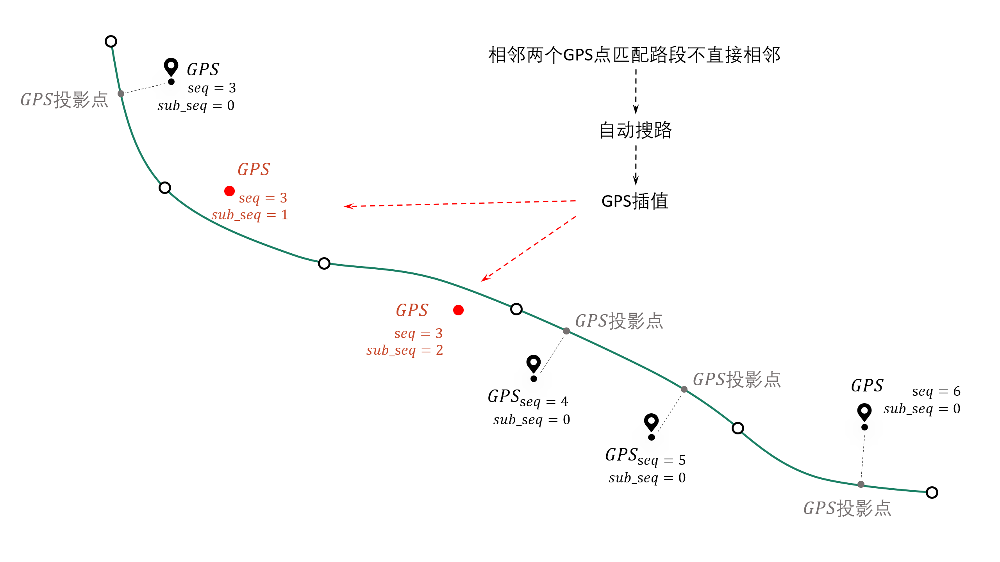

--------------------------------------------------------------------------------


.. note::

   对于dir为0的双向路段，例：link_id=12, from_node=2, to_node=3，匹配结果中匹配到link_id为12时，其(from_node, to_node) 可能为(2, 3) 也可能为 (3, 2), 这个由GPS的实际行车方向决定


6.2.2. 警告信息和错误信息含义
::::::::::::::::::::::::::::::::::::::::::::::::

地图匹配接口会返回三个结果，第一个是匹配结果表，第二个是警告的相关信息，第三个是匹配发生错误的agent_id编号列表

* 警告信息
    发生警告的agent，其匹配结果，连同没有任何警告的agent，会一起会输出在match_res中

    警告信息may_error_info的数据结构是字典：键表示agent_id，值是一个表，记录了当前agent在匹配过程中发生警告的路段信息(可在HTML中可视化查看)

    对值(一个DataFrame)的示例解释，以下图第一行为例，一行代表了一次警告，我们只用关心from_ft列、to_ft列值的第2~3个元素(路段的起始节点)，匹配link(605186, 596721) 到 匹配link(98359, 258807) 之间不连通，表明了可能存在路段缺失


.. code-block:: python
    :linenos:

    UserWarning: gps seq: 10 -> 11 状态转移出现问题, from_link:(605186, 596721) -> to_link:(98359, 258807)
    UserWarning: gps seq: 111 -> 112 状态转移出现问题, from_link:(150627, 38018) -> to_link:(78195, 26627)


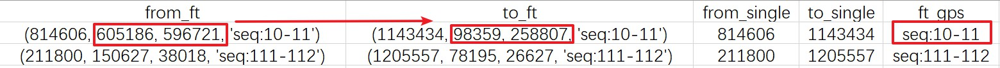

----------------------------------------


* 错误信息
    error_info的数据结构是列表，记录的是匹配发生错误的agent_id，一般是GPS数据关联不到任何路网、或者GPS数据点不足两个、或者路网线层有重叠折点，对于这些错误gotrackit都会输出报错信息然后跳过该次匹配


.. _地图匹配参数解释:

6.2.3. 地图匹配接口MapMatch参数解释
::::::::::::::::::::::::::::::::::::::::::::::::

* flag_name
    标记字符名称, 会用于标记输出的可视化文件, 默认"test"

* net
    gotrackit路网对象, 必须指定

* use_sub_net
    是否在子网络上进行计算, 默认True

* gps_df
    GPS数据, 必须指定

* time_format
    GPS数据中时间列的格式化字符串模板, 默认"%Y-%m-%d %H:%M:%S"，可以参照pandas中pd.to_datetime()函数的format参数

    参考：`pd.to_datetime解释 <https://pandas.pydata.org/pandas-docs/version/0.20/generated/pandas.to_datetime.html#>`_、`ISO_8601 <https://en.wikipedia.org/wiki/ISO_8601>`_

* time_unit
    GPS数据中时间列的单位, 如果时间列是数值(秒或者毫秒,s 或者 ms), 系统会自动按照该参数构建时间列, 默认's'。Gotrackit会先尝试使用time_format进行时间列构建，如果失败会再次尝试使用time_unit进行时间列构建

* gps_buffer
    GPS的搜索半径, 单位米, 意为只选取每个gps点附近gps_buffer米范围内的路段作为初步候选路段, 默认200.0m

* gps_route_buffer_gap
    半径增量, gps_buffer + gps_route_buffer_gap 的半径范围用于计算子网络, 默认15.0m

* top_k
    选取每个GPS点buffer范围内的最近的top_k个路段，默认20。每个GPS点依据指定的gps_buffer建立圆形缓冲区，缓冲区关联的路段为该GPS点的初步候选路段，然后依据top_k参数选取离该GPS点最近的top_k个路段作为最终候选路段

    注意：对于dir为0的路段，实际会被拆分为两条拓扑相反的路段，如果某GPS的buffer范围内关联到了20条双向路段，top_k至少为40才能将这20条双向路段选为最终候选

* beta
    该值越大, 状态转移概率对于距离差(米, 相邻投影点路径长度 与 相邻GPS点球面距离 的距离差)越不敏感, 大于0的值, 默认6.0m

* gps_sigma
    该值越大, 发射概率对距离(米, GPS点到候选路段的距离)越不敏感, 大于0的值, 默认30.0m

* dis_para
    距离(m)的缩放系数, 大于0的值, 默认0.1

* del_dwell
    是否进行停留点识别并且删除停留点，默认True

* dwell_l_length
    停留点识别距离阈值, 默认10m

* dwell_n
    超过连续dwell_n个相邻GPS点的距离小于dwell_l_length，那么这一组点就会被识别为停留点，默认2

* is_lower_f
    是否对GPS数据进行数据降频, 适用于: 高频-高定位误差 GPS数据, 默认False

* lower_n
    降频倍率, 默认2

* is_rolling_average
    是否启用滑动窗口平均对GPS数据进行降噪, 默认False

* window
    滑动窗口大小, 默认2

* dense_gps
    是否对GPS数据进行增密, 默认True

* dense_interval
    当相邻GPS点的球面距离L超过dense_interval即进行增密, 进行 int(L / dense_interval) + 1  等分加密, 默认100.0

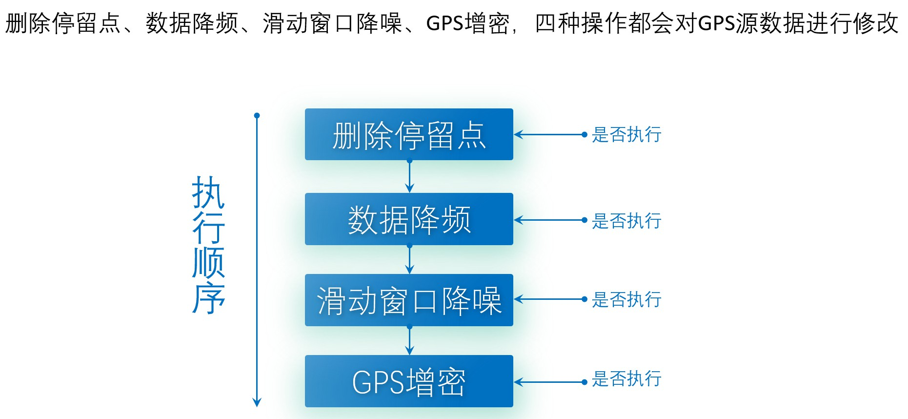

----------------------------------------

* use_heading_inf
    是否利用GPS的差分方向向量修正发射概率(利用GPS前后点位大致估计航向角), 适用于: 低定位误差 GPS数据 或者 低频定位数据(配合加密参数), 默认False

* heading_para_array
    差分方向修正参数, 默认np.array([1.0, 1.0, 1.0, 0.1, 0.0001, 0.0001, 0.00001, 0.000001, 0.000001])

* omitted_l
    单位米，如果前后序GPS点的平均距离小于该值，则认为该GPS点的航向角不准确，不会在该点应用航向角限制，默认6.0m

对方向修正系数的解释：

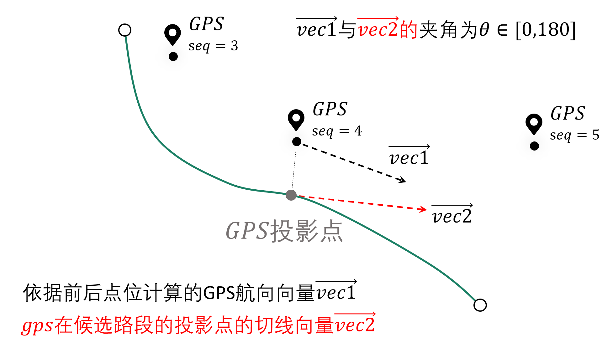

----------------------------------------

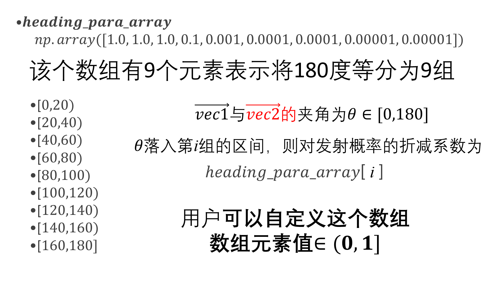

----------------------------------------

* instant_output
    是否每匹配完一条轨迹就存储csv匹配结果, 默认False

* export_html
    是否输出网页可视化结果html文件, 默认True

* use_gps_source
    是否在HTML可视化结果中使用GPS源数据进行展示, 默认False

* export_all_agents
    是否将所有agent的可视化存储于一个html文件中

* gps_radius
    HTML可视化中GPS点的半径大小，单位米，默认8米

* export_geo_res
    是否输出匹配结果的geojson几何可视化文件, 默认False

* visualization_cache_times
    每匹配完visualization_cache_times辆车再进行结果(html、geojson可视化结果)的统一存储(可并发存储), 默认50

* out_fldr
    保存匹配结果的文件(html文件、geojson文件、csv文件)目录, 默认当前目录

* user_filed_list(v0.3.2新增)
    GPS数据表中可以随匹配结果一同输出的字段列表， 例如:['gps_speed', 'origin_agent']，若启用了滑动窗口平均，该参数自动失效，默认None

    这些字段必须在gps表中实际存在, 且名不能与以下内置字段相同：agent_id、seq、sub_seq、time、loc_type、link_id、dir、from_node、to_node、lng、lat、prj_lng、prj_lat、dis_to_next、geometry、prj_p


* use_para_grid
    是否启用网格参数搜索

* para_grid
    网格参数对象

.. _构建Net的相关参数:
6.2.4. 构建Net时相关的参数
::::::::::::::::::::::::::::::::::::::::::::::::

* link_path
    线层数据的文件路径

* node_path
    点层数据的文件路径

* link_gdf
    线层数据GeoDataFrame，与link_path只能指定其中一个, 推荐采用传入link_gdf的方式

* node_gdf
    点层数据GeoDataFrame，与node_path只能指定其中一个, 推荐采用传入node_gdf的方式

* cut_off
    路径搜索截断长度, 米, 默认1200.0m

* not_conn_cost
    不连通路径的开销，默认1000.0m

* fmm_cache
    是否启用预计算，若启用后，预计算结果会缓存在fmm_cache_fldr下，默认False

* fmm_cache_fldr
    存储预计算结果的目录，默认./

* recalc_cache
    是否重新预计算，默认True。取值False时，gotrackit会去fmm_cache_fldr下读取缓存，若读取不到则会自动重新计算

* cache_slice
    大于0的整数，表示使用将路径结果切分为cache_slice部分进行数据标准化(大规模路网下增大该值可以防止内存溢出)

* is_hierarchical
    是否启用层次关联，在超大路网、较长GPS轨迹的情况下开启为True，可以显著提升自子网络的空间关联效率，默认False

* grid_len
    层次关联中的栅格边长(m)，默认2000m


截止v0.3.1，用户只可以自行指定以上12个参数，其他的参数为内置参数(部分参数还未启用)，用户不可自行指定！


6.3. 启用路径预存储进行加速
``````````````````````````````

在地图匹配的过程中, 在以下两个计算过程中开销较大：

* GPS点到邻近候选路段的投影参数

* 候选路段到候选路段之间的最短路径计算开销

然而，这部分的计算，在不同的agents车辆匹配过程中，很多部分都是重复计算项，那么我们能否基于一种预计算的思想，先将所有可能的最短路计算、投影参数计算预先计算出来呢？我们可能仅仅只需要在匹配前稍微多花一点时间来进行预计算，然后将这些预计算的结果存储在磁盘上，以后每次匹配只需要读取指定路径的预计算结果将其加载到内存, 我们即可以O(1)的时间复杂度获得这些最短路结果以及投影参数结果，gotrackit实现了这一过程，以下代码为使用预计算的匹配方式：

.. note::

   只要路网发生了任何变化,请重新计算路径缓存


.. note::

   计算路径缓存,请确保你的路段线型没有重复点,你可以使用 `清洗路网线层数据`_

.. code-block:: python
    :linenos:

    if __name__ == '__main__':
        # 构建net时指定fmm_cache参数为True, 表示在这次构建net对象时进行预计算
        # 请留意shp文件的编码，可以显示指定encoding，确保字段没有乱码
        link = gpd.read_file(r'./data/input/net/xian/modifiedConn_link.shp')
        node = gpd.read_file(r'./data/input/net/xian/modifiedConn_node.shp')
        my_net = Net(link_gdf=link,
                     node_gdf=node,
                     fmm_cache=True, fmm_cache_fldr=r'./data/input/net/xian/', recalc_cache=True,
                     cut_off=800.0,
                     cache_slice=6)
        my_net.init_net()  # net初始化

        # fmm_cache_fldr用于指定存储预计算结果的文件目录
        # cut_off为800m, 表示最短路径搜索过程中, 只计算最短路径距离小于800.0m的路径(考虑到相邻GPS点距离跨度不会太大)
        # cache_slice=6, 表示使用将路径结果切分为6部分进行数据标准化(大规模路网防止内存溢出)


以上的路网构建的代码执行结束后, 会在r'./data/input/net/test/0402BUG/load/'下生成两个预计算结果文件, 笔者用深圳的路网(9w条link, 8w个节点), 预计算的时间大概为两分钟, 在使用的路网没有任何变化的情况下，下次使用该路网进行匹配可以直接指定预计算结果的路径即可, 此时直接指定recalc_cache=False, 意思为直接从fmm_cache_fldr中读取预计算结果, 不再重复预计算的过程


.. code-block:: python
    :linenos:

    if __name__ == '__main__':
        # 构建net时指定fmm_cache参数为True, 表示在这次构建net对象时进行预计算
        # 请留意shp文件的编码，可以显示指定encoding，确保字段没有乱码
        link = gpd.read_file(r'./data/input/net/xian/modifiedConn_link.shp')
        node = gpd.read_file(r'./data/input/net/xian/modifiedConn_node.shp')
        my_net = Net(link_gdf=link,
                     node_gdf=node,
                     fmm_cache=True, fmm_cache_fldr=r'./data/input/net/xian/', recalc_cache=False)
        my_net.init_net()  # net初始化

        # recalc_cache=False意思为直接从fmm_cache_fldr中读取预计算结果, 不再重复预计算的过程

        # 此时传入的net就带有预计算的结果, 匹配速度会提升
        mpm = MapMatch(net=my_net, gps_df=gps_df, gps_buffer=100, flag_name='xa_sample',
                   use_sub_net=False, use_heading_inf=True,
                   omitted_l=6.0, del_dwell=True, dwell_l_length=25.0, dwell_n=1,
                   lower_n=2, is_lower_f=True,
                   is_rolling_average=True, window=3,
                   export_html=False, export_geo_res=False, use_gps_source=False,
                   out_fldr=r'./data/output/match_visualization/xa_sample', dense_gps=False,
                   gps_radius=20.0)
        match_res, may_error_info, error_info = mpm.execute()
        print(match_res)


构建Net时预计算相关的参数含义如下：

* fmm_cache
    是否启用路径缓存预计算, 默认False

* cache_cn
    使用几个核进行路径预计算, 默认2

* fmm_cache_fldr
    存储路径预计算结果的文件目录, 默认./

* recalc_cache
    是否重新计算路径缓存, 默认True

* cut_off
    路径搜索截断长度, 米, 默认1200.0m

* cache_name
    路径预存储的标志名称, 默认cache, 两个缓存文件的名称: {cache_name}_path_cache, {cache_name}_prj

* cache_slice
    对缓存进行切片(切为cache_slice份)后转换格式, 进行存储(防止大规模路网导致内存溢出), 默认2 * cache_cn, 如果内存溢出可以增大该值


6.4. 启用多核进行并行匹配
``````````````````````````````

若想在多条轨迹上开启并行匹配,请将mpm.execute()替换为mpm.multi_core_execute(core_num=x),当您的agent数目大于50时,多核的效率提升才会较为明显

.. code-block:: python
    :linenos:

    # 1. 从gotrackit导入相关模块Net, MapMatch
    import pandas as pd
    import geopandas as gpd
    from gotrackit.map.Net import Net
    from gotrackit.MapMatch import MapMatch


    if __name__ == '__main__':

        # 1.读取GPS数据
        # 这是一个有150辆车的GPS数据的文件
        gps_df = pd.read_csv(r'./data/output/gps/150_agents.csv')
        print(gps_df)

        # 2.构建一个net, 要求路网线层和路网点层必须是WGS-84, EPSG:4326 地理坐标系
        # 请留意shp文件的编码，可以显示指定encoding，确保字段没有乱码
        link = gpd.read_file(r'./data/input/net/xian/modifiedConn_link.shp')
        node = gpd.read_file(r'./data/input/net/xian/modifiedConn_node.shp')
        my_net = Net(link_gdf=link,
                     node_gdf=node,
                     fmm_cache=True, fmm_cache_fldr=r'./data/input/net/xian/', recalc_cache=False)
        my_net.init_net()  # net初始化

        # 3. 匹配
        mpm = MapMatch(net=my_net, gps_df=gps_df, gps_buffer=100, flag_name='xa_sample',
               use_sub_net=True, use_heading_inf=True,
               omitted_l=6.0, del_dwell=True, dwell_l_length=25.0, dwell_n=1,
               lower_n=2, is_lower_f=True,
               is_rolling_average=True, window=3,
               dense_gps=False,
               export_html=False, export_geo_res=False, use_gps_source=False,
               out_fldr=r'./data/output/match_visualization/xa_sample',
               gps_radius=10.0)

        match_res, may_error_info, error_info = mpm.multi_core_execute(core_num=6)
        print(match_res)
        match_res.to_csv(r'./data/output/match_visualization/xa_sample/match_res.csv', encoding='utf_8_sig', index=False)


* core_num
    用几个核进行匹配, 默认1


6.5. 简化路网线型加速匹配
``````````````````````````````

可以使用如下方法对路网线层的几何进行简化

.. code-block:: python
    :linenos:

    # 1. 从gotrackit导入相关模块Net, MapMatch
    import pandas as pd
    import geopandas as gpd
    from gotrackit.map.Net import Net
    from gotrackit.MapMatch import MapMatch


    if __name__ == '__main__':

        # 请留意shp文件的编码，可以显示指定encoding，确保字段没有乱码
        link = gpd.read_file(r'./data/input/net/xian/modifiedConn_link.shp')
        node = gpd.read_file(r'./data/input/net/xian/modifiedConn_node.shp')

        # 适当简化线型，simplify(x)中的x单位为m，该接口会使用道格拉斯-普克算法对线型进行简化，该值如选取的过大会导致所有link都退化为直线
        link = link.to_crs('你选定的平面投影坐标系')
        link['geometry'] = link['geometry'].simplify(1.0)
        link = link.to_crs('EPSG:4326')
        my_net = Net(link_gdf=link,
                     node_gdf=node)
        my_net.init_net()  # net初始化

        # 匹配
        mpm = MapMatch(net=my_net, gps_df=gps_df, gps_buffer=100, flag_name='xa_sample',
               use_sub_net=True, use_heading_inf=True,
               omitted_l=6.0, del_dwell=True, dwell_l_length=25.0, dwell_n=1,
               lower_n=2, is_lower_f=True,
               is_rolling_average=True, window=3,
               dense_gps=False,
               export_html=False, export_geo_res=False, use_gps_source=False,
               out_fldr=r'./data/output/match_visualization/xa_sample',
               gps_radius=10.0)

        match_res, may_error_info, error_info = mpm.execute()
        print(match_res)
        match_res.to_csv(r'./data/output/match_visualization/xa_sample/match_res.csv', encoding='utf_8_sig', index=False)


6.6. 利用分层索引加速空间关联效率
```````````````````````````````````````

适用于超大规模网络下的长轨迹匹配，可以减少子网络的空间关联时间开销，初始化Net时指定is_hierarchical为True即可开启空间分层索引


6.7. 使用网格参数确定合理的匹配参数
```````````````````````````````````````

本包支持对地图匹配接口中的下面四个参数执行网格搜索：

beta、gps_sigma、omitted_l、use_heading_inf

即：遍历这四个参数可能的组合，直到匹配结果没有警告，如果所有的参数组合都有警告，那么将输出最后一次参数组合的匹配结果，匹配结果还将返回参数组合对应的匹配警告数量

使用网格参数搜索，你只需要构建一个网格参数类，并且指定各参数的取值列表即可


.. code-block:: python
    :linenos:

    # 1. 从gotrackit导入相关模块Net, MapMatch
    import pandas as pd
    import geopandas as gpd
    from gotrackit.map.Net import Net
    from gotrackit.MapMatch import MapMatch


    if __name__ == '__main__':

        gps_df = gpd.read_file(r'./data/output/gps/dense_example/test999.geojson')

        # 请留意shp文件的编码，可以显示指定encoding，确保字段没有乱码
        link = gpd.read_file(r'./data/input/net/xian/modifiedConn_link.shp')
        node = gpd.read_file(r'./data/input/net/xian/modifiedConn_node.shp')
        my_net = Net(link_gdf=link, node_gdf=node, fmm_cache=True,
                 recalc_cache=False, fmm_cache_fldr=r'./data/input/net/xian')
        my_net.init_net()


        # 3. 新建一个网格参数对象
        # 指定参数的取值范围列表
        # 可指定四个参数列表
        # beta_list: list[float] = None，gps_sigma_list: list[float] = None
        # use_heading_inf_list: list[bool] = None，omitted_l_list: list[float] = None
        pgd = ParaGrid(use_heading_inf_list=[False, True], beta_list=[0.1, 1.0], gps_sigma_list=[1.0, 5.0])

        # 4. 匹配
        # 传入网格参数：use_para_grid=True, para_grid=pgd
         mpm = MapMatch(net=my_net, gps_df=gps_df, is_rolling_average=True, window=2, flag_name='dense_example',
                   export_html=True, export_geo_res=True,
                   gps_buffer=400,
                   out_fldr=r'./data/output/match_visualization/dense_example',
                   dense_gps=True,
                   use_sub_net=True, dense_interval=50.0, use_gps_source=False, use_heading_inf=True,
                   gps_radius=15.0, use_para_grid=True, para_grid=pgd)
        res, warn_info, error_info = mpm.execute()
        print(res)
        print(warn_info)
        print(error_info)
        print(pd.DataFrame(pgd.search_res))
        res.to_csv(r'./data/output/match_visualization/dense_example/match_res.csv', encoding='utf_8_sig', index=False)

        # 可以查看不同的参数组合下，匹配过程中的警告数量
        print(pd.DataFrame(pgd.search_res))

使用参数网格进行匹配，系统会自动组合参数，并且输出不同参数组合下的警告数：

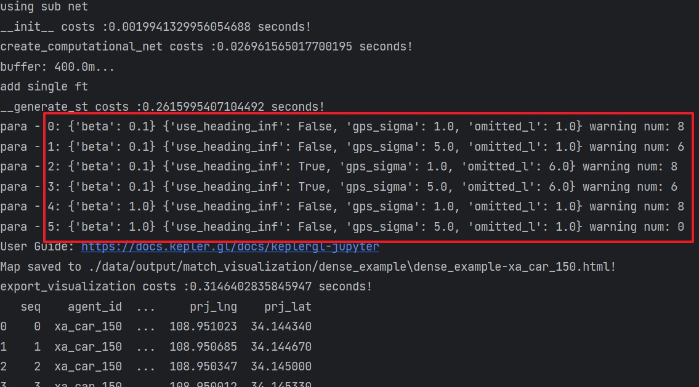
-------------------------------------------------


6.8. 匹配结果可视化
``````````````````````````````

6.8.1 HTML动画可视化
:::::::::::::::::::::::::::::::::::::::::

地图匹配接口中的参数export_html控制是否输出HTML动画(较为耗时)

HTML可视化需要连接网络(中国境内可能需要科学上网)，使用浏览器打开生成的html文件，按照下图点开时间轴播放器

.. image:: _static/images/可视化操作.gif
    :align: center
-----------------------------------------------


html可视化文件是我们对匹配结果进行排查的重要文件，它可以清晰的展示匹配过程：

 `gotrackit地图匹配包参数详解与问题排查 <https://www.bilibili.com/video/BV1qK421Y7hV>`_


6.8.2 geojson矢量文件可视化
:::::::::::::::::::::::::::::::::::::::::

地图匹配接口中的参数export_geo_res控制是否输出匹配结果geojson矢量图层(较为耗时)，一个agent的匹配矢量结果由四个文件组成：

{flag_name}-{agent_id}-gps.geojson：gps点矢量图层

{flag_name}-{agent_id}-match_link.geojson：匹配link矢量图层

{flag_name}-{agent_id}-prj_l.geojson：投影线矢量图层

{flag_name}-{agent_id}-prj_p.geojson：匹配路段投影点矢量图层

可使用GIS软件可视化，如QGIS


6.9. 匹配结果不正确的调参方法
``````````````````````````````

6.9.1. 程序提示-预处理后GPS点不足两个,无法匹配
:::::::::::::::::::::::::::::::::::::::::::::::::::::::::::


* 可能停留点识别参数不合理
    可能你的GPS数据是高频定位数据, 相邻点的间距小于dwell_l_length, 此时恰好你开了停留点识别功能, 所有的GPS数据被当作停留点删除了, 你需要关掉停留点识别的开关, 再打开数据降频, 宏观路网匹配不需要这么高频的GPS定位


* 可能是gps_buffer设置的太小
    大部分GPS数据在gps_buffer内没有关联到任何路网, 那么这部分GPS数据会被删除


* 可能是源数据问题
    可能是此辆车的GPS数据点本身就不足两个


6.9.2. 在html可视化结果中看到匹配路径不连续
:::::::::::::::::::::::::::::::::::::::::::::::::::::::::::


* 可能是gps_buffer和top_k的值小了(70%的错误可能是这个原因)
    每个GPS点依据指定的gps_buffer建立圆形缓冲区，缓冲区内关联到的路段为该GPS点的初步候选路段，然后依据top_k参数，从初步候选路段中选取离该GPS点最近的top_k个路段作为最终候选路段，
    如果GPS本身定位误差较大，且这两个值设定的比较小，可能会导致正确的路段没有被选为最终候选路段, 从而导致匹配路径不连续

    如果启用了增密参数，一般来讲，最好要增大gps_buffer和top_k的值

* 可能是源轨迹点较为稀疏(相邻GPS点间距大于1000m), 但是没有启用轨迹点自动增密
    增密轨迹点: dense_gps指定为True；dense_interval 推荐100 ~ 500，表示相邻GPS点的距离只要超过dense_interval，就会在这两个点之间进行增密


* 可能是cut_off选小了
    cut_off是路径搜索截断值, 默认1200m


* 可能是gps_sigma、beta设定不合理
    我们将GPS点到候选路段的距离称为prj_dis

    beta表征的是对匹配路径不连续的惩罚力度，这个值越大，惩罚力度越小， 在GPS数据误差较大时，有可能出现路径不连续的情况，此时可以调小beta，增加对不连续情况的惩罚，调大gps_sigma(gps_sigma表征的是对prj_dis的惩罚，gps_sigma值越小，对prj_dis的惩罚力度越大)，弱化GPS点定位误差的影响

    **调小beta, 调大gps_sigma**：直观意义在于更加看重路径的连续性，可以容忍较大的prj_dis(即较大的定位误差)

    **调大beta, 调小gps_sigma**：直观意义在于算法倾向于选择prj_dis小的路段作为匹配结果，而不看重匹配结果的路径连续性，当gps_sigma趋近于0，beta趋近于无穷大时，匹配算法就退化为最近邻匹配

    注意：gps_sigma、beta的大小是相对的


* 可能是初始化net时的not_conn_cost值小了
    这个表征的是对于路径不连续的惩罚力度, 值越大, 惩罚力度越大, 越不可能转移到不连续的路段上


* 可能是路网本身不连通
    检查在路径断开的位置, 路网是否联通


* 可能是GPS数据问题
    可能是你的GPS数据定位时间精度不够，如前后两个点的定位时间都是2023-11-12 17:30，或者都是2023-11-12 17:30:55，本包在构建GPS对象时，会按照时间列排序，相同的定位时间可能导致两个点的实际前后顺序颠倒，从而影响匹配，所以确保你的GPS数据的定位时间没有相同值

* 路径缓存未更新
    启用了路径缓存，在路网结构变化后，没有重新计算路径缓存，实际使用的是旧版路网的缓存


* 可能是没有开启方向限制
    没开using_heading_inf, 或者heading_para_array设置不合理


* 开了方向限制但是没有选择合理的停留点删除参数以及降频参数
    开了using_heading_inf, 但是差分航向角的计算在路口受到了停留点的影响导致差分航向角计算失真


如果您仍然无法解决问题，请进群交流：


-------------------------------------------------


6.9.3. 确定合理参数的思路
::::::::::::::::::::::::::::::::::

* 首先，我们要对GPS数据的质量有一定的认识，通过使用GIS软件将GPS点打在地图上，同时叠加路网，此时可以利用距离测量工具大概得到GPS点到路段的距离，那么你的gps_buffer参数的选取就可以参考这个距离，如果绝大多数GPS点到匹配路段的距离都是x米左右，那么gps_buffer一定要大于x，偏向于保守的估计，我们可以取 x + 100为gps_buffer

------------------------------------------------------------------------------------------------------------------------------------------------------------------------------------------------------------------------------------------------------------------------------------------

* top_k参数含义为：选取GPS定位点圆形(半径为gps_buffer)范围内最近的top_k个路段作为候选路段，默认20，在gps_buffer很大的情况下，继续增加gps_buffer的值意义不大，因为你的gps_buffer再大，最近的top_k个路段也不会发生改变

* 对于top_k，特别注意：
    对于dir为0的路段，实际会被拆分为两条拓扑相反的路段，如果某GPS的buffer范围内关联到了20条双向路段，top_k至少为40才能将这20条双向路段选为最终候选

-------------------------------------------------------------------------------------------------------------------------------------------------------------------------------------------------------------------------------------------

* 最短路搜索截断半径cut_off：这个值的选取也和GPS数据形态有关，默认1200m，如果你的GPS本身就是低频的数据，相邻GPS点的直线距离超过了1200米，那么建议cut_off也要调大一些。尤其是在对GPS数据做了降频的情况下，相邻GPS点的距离变的更大了

-------------------------------------------------------------------------------------------------------------------------------------------------------------------------------------------------------------------------------------------

* gps_sigma和beta可以使用网格参数进行搜索确定一组合适的参数值


相关类的参数和方法可参见：

- :doc:`类方法汇总`

7. 常见报错以及解决方案
----------------------------


7.1. 构建net对象错误报坐标系不匹配
``````````````````````````````````````````````

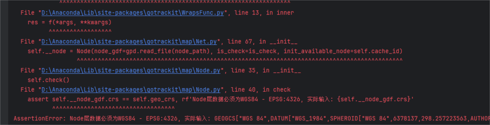

--------------------------------------------------------

解决方案：

.. code-block:: python
    :linenos:

    # 1. 从gotrackit导入相关模块Net, MapMatch
    import geopandas as gpd
    from gotrackit.map.Net import Net
    from gotrackit.MapMatch import MapMatch


    if __name__ == '__main__':
        link = gpd.read_file(r'./data/input/net/xian/modifiedConn_link.shp')
        node = gpd.read_file(r'./data/input/net/xian/modifiedConn_node.shp')

        link = link.to_crs('EPSG:4326')
        node = node.to_crs('EPSG:4326')

        # 如果还报错, 再加下面这个
        # link.crs.srs = 'EPSG:4326'
        # node.crs.srs = 'EPSG:4326'

        my_net = Net(link_gdf=link, node_gdf=node)
        my_net.init_net()  # net初始化


7.2. 使用jupyter报net对象无planar_crs属性
``````````````````````````````````````````````


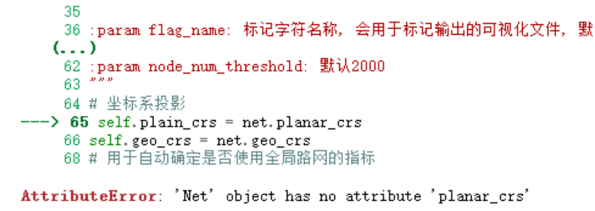

--------------------------------------------------------


解决方案：使用pycharm


7.3. pyogrio.errors.FieldError
``````````````````````````````````````````````

fiona版本或者GDAL版本不兼容

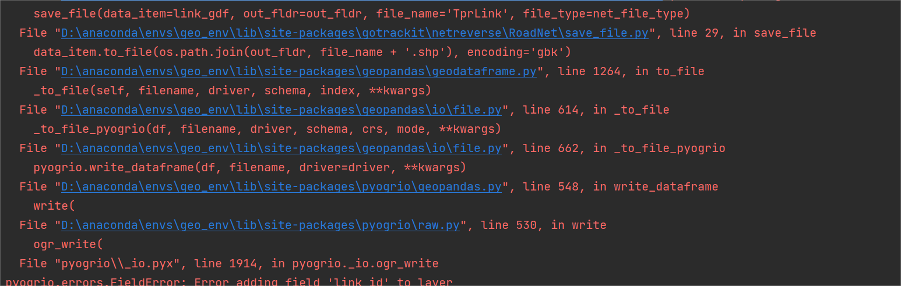

--------------------------------------------------------

解决方案：相关地理信息库推荐以下版本：

gdal(3.8.4)、shapely(2.0.3)、fiona(1.9.5)、pyproj(3.6.1)、geopandas(0.14.3)、keplergl(0.3.2)


7.4.  shapely库警告
````````````````````````````````````````````````````````````````````````````````````````````````````````````````
出现警告信息：RuntimeWarning:invalid value encountered in line locate pointreturn lib.line locate point(line, other)


该警告会影响匹配结果，出现该警告的原因是因为你的路网线层的几何中有重复点

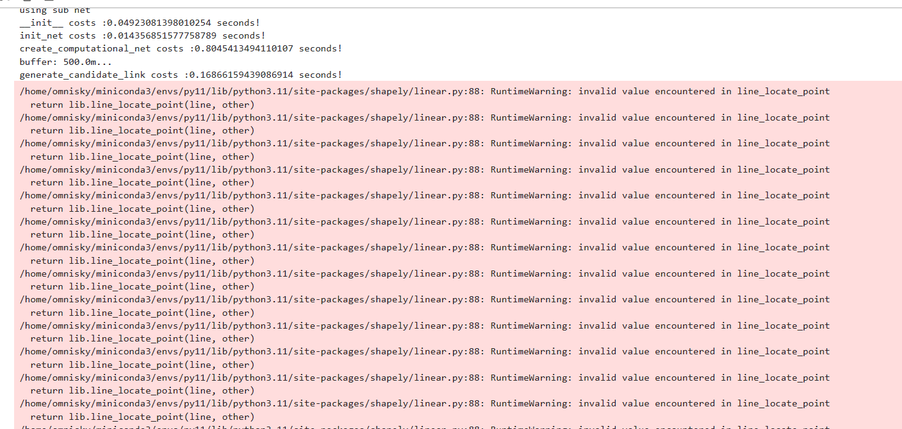

--------------------------------------------------------


解决方案-示例代码如下：

.. code-block:: python
    :linenos:

    if __name__ == '__main__':

        # 方案1：去除重复点后再构建Net
        link_gdf = gpd.read_file(r'./data/output/request/0304/道路双线20230131_84.shp')
        link_gdf['geometry'] = link_gdf['geometry'].remove_repeated_points(1e-6)


        # 方案2：使用清洗接口后再构建Net
        link_gdf = gpd.read_file(r'./data/output/request/0304/道路双线20230131_84.shp')
        link_gdf = ng.NetReverse.clean_link_geo(gdf=link_gdf, plain_crs='EPSG:32649', l_threshold=1.0)


7.5.  Invalid projection: EPSG:nan
````````````````````````````````````````````````````````````````````````````````````````````````````````````````

境外路网构建失败，是BUG，更新gotrackit到最新版本即可解决

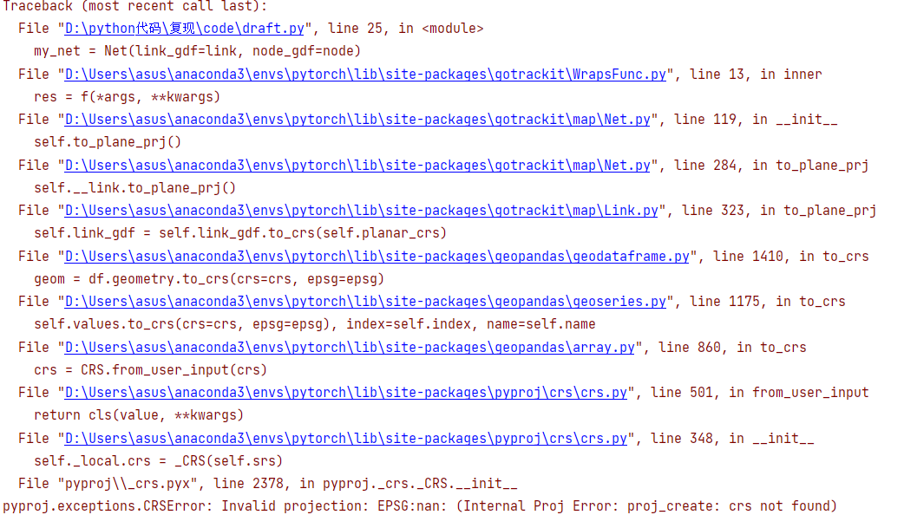

--------------------------------------------------------


7.6.  输出的路网文件字段中：中文变为乱码
````````````````````````````````````````````````````````````````````````````````````````````````````````````````
gotrackit存储路网文件时，默认编码为gbk，你需要检查你的原始路网文件的编码是否为gbk

--------------------------------------------------------------------------------------


7.7.  输出HTML失败： Object of type bytes is not JSON serializable
````````````````````````````````````````````````````````````````````````````````````````````````````````````````
可能是路网文件编码问题，比如下图的错误原因是：gpd.read_file()读取路网时没有指定合适的编码，导致road_name列是bytes类型，但是gotrackit在输出HTML时会默认将用户路网的所有字段进行输出，所以导致了输出失败

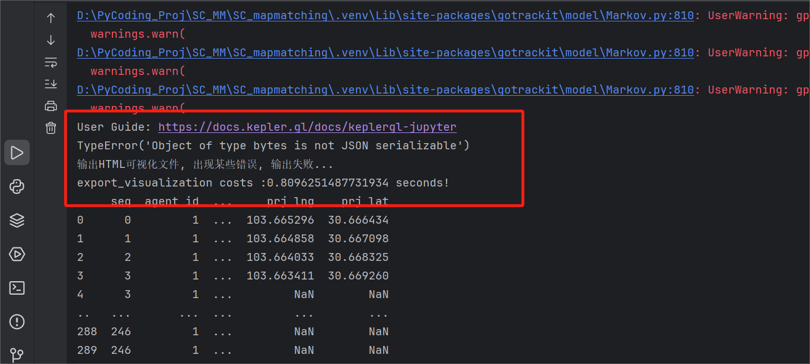
--------------------------------------------------------------------------------------

解决方案：读取shp文件时指定正确的编码 或者 删除有编码问题的字段再构建Net

gotrackit：v0.3.1会对输出HTML的路网字段进行限制，只输出关键拓扑字段


7.8.  计算发射矩阵出错:ValueError(cannot convert float NaN to integer )
````````````````````````````````````````````````````````````````````````````````````````````````````````````````
这个错误是因为路网线层中线型有重叠折点


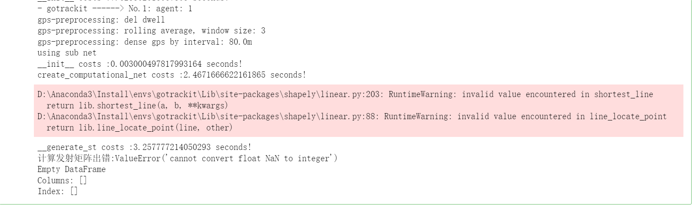
--------------------------------------------------------------------------------------

解决方案-示例代码如下：

.. code-block:: python
    :linenos:

    if __name__ == '__main__':

        # 方案1：去除重复点后再构建Net
        link_gdf = gpd.read_file(r'./data/output/request/0304/道路双线20230131_84.shp')
        link_gdf['geometry'] = link_gdf['geometry'].remove_repeated_points(1e-6)


        # 方案2：使用清洗接口后再构建Net
        link_gdf = gpd.read_file(r'./data/output/request/0304/道路双线20230131_84.shp')
        link_gdf = ng.NetReverse.clean_link_geo(gdf=link_gdf, plain_crs='EPSG:32649', l_threshold=1.0)
