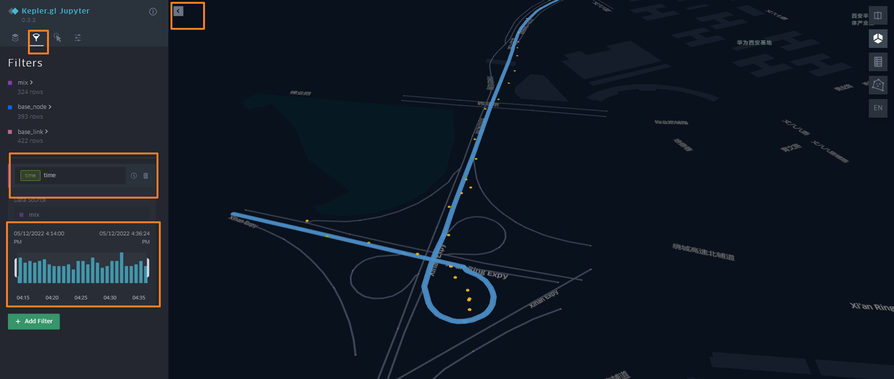

🚀 如何使用
===================================


1. 安装gotrackit
--------------------

安装前确保python环境中有以下前置依赖库，括号中为作者使用版本(基于python3.11)，仅供参考

* geopandas(0.14.1)

* geopy(2.4.1)

* gdal(3.4.3)

* networkx(3.2.1)

* shapely(2.0.2)

* pandas(2.0.3)

* numpy(1.26.2)

* pyproj(3.6.1)

* keplergl(0.3.2)


geopandas为最新版本, 如果不是最新版本可能会报错(有个函数旧版本没有)

使用pip安装 ::

    pip install -i https://pypi.org/simple/ gotrackit


已经安装，可以升级已有版本 ::

    pip install --upgrade  -i https://pypi.org/simple/ gotrackit


2. 算法包概览
--------------------

2.1. 模块概览
````````````````
包括了三个模块：`GPS数据生产`_ 、`路网生产`_ 、`地图匹配`_ 以及 `匹配过程可视化`_ 。


.. _GPS数据生产:

2.1.1. GPS数据生产
::::::::::::::::::::::::::
该模块依托路网文件模拟车辆行驶并且产生GPS数据，当用户没有实际的GPS数据时可以借助该模块生产数据。


基本流程为：

.. image:: _static/images/GpsGenGraph.png
    :align: center

----------------------------------------

具体的代码实操见 `GPS数据生产代码示例`_ 。

.. _路网生产:

2.1.2. 路网生产
::::::::::::::::::::::::::

.. note::

   通过该方式获取的路网严禁用于商业行为，仅限于教育以及科学研究。


路网生产工具用于帮助用户获取路网数据，以及对路网数据进行各种检查与优化，你只需寥寥几行代码便可以获得路网数据。

路网生产的主要流程为：依据研究区域范围构造OD --> 基于OD请求路径规划 --> 基于路径规划结果执行空间优化实现路网逆向

.. image:: _static/images/netreverse_tech_way.png
    :align: center

--------------------------------------------------------------------------------

本开源包将相关的方法都封装为了标准函数接口，您只用提供一个key便可以进行中国境内任意区域路网的获取。


* 构造OD
    提供基于任意形状区域随机构造OD的方法；

    提供基于地块构造形心出行OD的方法；

    提供基于GPS数据精准构造带途径点OD的方法；

    支持自定义构造OD。

.. _od_type:

.. image:: _static/images/od_gen.png
    :align: center

--------------------------------------------------------------------------------

三张图分别对应od_type参数为rand_od、region_od、gps_based

构造OD非常重要，因为OD构造的越精准，路径规划所覆盖的道路路段就越全面，我们得到的路网覆盖率就越高。

.. _OD表要求:

如果您需要使用自定义OD，请提供以下字段要求的OD表：

.. csv-table:: OD表字段说明
    :header: "字段名称", "字段类型", "字段说明"
    :widths: 15, 5, 40

    "od_id","int","OD唯一编码，不允许为空"
    "o_x","float","起点经度，不允许为空，GCJ-02坐标系"
    "o_y","float","起点纬度，不允许为空，GCJ-02坐标系"
    "d_x","float","终点经度，不允许为空，GCJ-02坐标系"
    "d_y","float","终点纬度，不允许为空，GCJ-02坐标系"
    "hh","int","请求时段(0~23)，如果对每个OD有具体的请求时段限制，请确保有该列，且将ignore_hh置为False，不允许有空值；如果没有时段限制, 该列可以不提供"
    "way_points","string","途径点坐标串，最多支持10个途径点，允许为空"

样例OD数据如下：

.. csv-table:: OD样例数据
    :header: "od_id", "o_x", "o_y", "d_x", "d_y", "way_points"
    :widths: 3, 5, 5, 5, 5, 10

    "1","120.73054930354505","31.672649340942495","120.73338512634608","31.667515168299673","120.73176445980103,31.6705214428833"
    "2","120.73050669059927","31.666431974714015","120.74717247617396","31.669917988588765","120.73119124695165,31.666929583950083;120.7380010705855,31.66916745090122"
    "3", "120.74229535581601","31.660716341555","120.74250979515529","31.652820575113125",""

--------------------------------------------------------------------------------


* 路径规划请求
    您只需要申请一个 `开发者key <https://lbs.amap.com>`_ ；

    支持自由请求、按照时段请求。


* 空间优化
    路径拆分：基于路径拓扑点拆分最小路段；

    拓扑关联：生产点层，添加拓扑关系；

    路段拓扑优化：以一定的限制规则将路段进行合并，支持属性限制、累计长度限制、最大转角限制、环检测；

    重叠路段识别：部分路径距离非常近，但是却没有完全重合，本包可以进行识别与优化；

    联通性校准：识别路网中潜在的不连通节点并进行处理。


空间优化的相关类参数可见：:doc:`类方法汇总`


空间优化的具体内容可以查看我的这篇博客：`从路径规划接口逆向路网的一种方法 <https://juejin.cn/post/7268187099526152247>`_


具体的代码实操见 `路网生产代码示例`_


.. _地图匹配:

2.1.3. 地图匹配
::::::::::::::::::::::::::

依托路网文件、GPS数据，对GPS数据进行地图匹配，匹配结果给出每个GPS点实际匹配路段信息。

基本流程为：

.. image:: _static/images/MatchGraph.png
    :align: center

----------------------------------------

具体的代码实操见 `地图匹配代码示例`_ 。


.. _匹配过程可视化:

2.1.4. kepler可视化
::::::::::::::::::::::::::


将匹配结果统一输出到HTML文件，用户可以使用浏览器打开该文件播放匹配动画。

基本流程为：

.. image:: _static/images/visualization.png
    :align: center

----------------------------------------


具体的代码实操见下文示例代码。


2.2. 数据要求
````````````````

这三个模块所涉及的数据说明如下：

2.2.1. 路网数据
::::::::::::::::::::::::::
路网由线层文件和点层文件组成，两个文件存在关联关系。`西安样例路网 <https://github.com/zdsjjtTLG/TrackIt/tree/main/data/input/net/xian>`_


(1) 路网-点层
'''''''''''''

路网点层文件字段要求如下：

.. csv-table:: 节点层字段说明
    :header: "字段名称", "字段类型", "字段说明"
    :widths: 15, 15, 40

    "node_id","int","节点唯一编码"
    "geometry","geometry","节点坐标几何列"
    "其他非必需字段","...","..."

样例数据如下：

.. csv-table:: 节点样例数据
    :header: "node_id", "geometry"
    :widths: 3, 20

    "4290","POINT (108.84059274796762 34.20380728755708)"
    "7449","POINT (108.83996876020116 34.20398312458892)"
    "19893","POINT (108.8410333043887 34.20538952458989)"
    "22765","POINT (108.8396462868452 34.20358068920948)"
    "29974","POINT (108.84304743483109 34.20477124733548)"
    "31762","POINT (108.84007099594207 34.20303962600771)"
    "34152","POINT (108.84337595161946 34.20450390550994)"
    "44441","POINT (108.8435151462407 34.204686083275455)"
    "63637","POINT (108.8415703783543 34.20233450491169)"
    "68869","POINT (108.842021912175 34.20431362229388)"
    "82793","POINT (108.84178453991281 34.204420171642816)"
    "91199","POINT (108.84129068661863 34.20558291058989)"
    "92706","POINT (108.84207500541686 34.2041637658475)"
    "118381","POINT (108.84208596575294 34.20486654570958)"
    "122487","POINT (108.84210722600966 34.20202954576994)"
    "124862","POINT (108.83952308374874 34.20369843029777)"
    "145105","POINT (108.84239758378014 34.20309169152201)"
    "166381","POINT (108.84139277469502 34.20644679433629)"
    "169462","POINT (108.84160833213731 34.20363712972413)"
    "170508","POINT (108.841425074665 34.203330912749905)"
    "177594","POINT (108.84176365682967 34.202564765029564)"
    "181808","POINT (108.84049555540867 34.20432194107051)"
    "191714","POINT (108.84048418194278 34.208751404812496)"
    "198856","POINT (108.84627615033686 34.205495498912406)"
    "199563","POINT (108.84081270761097 34.208564048548254)"

.. note::

   点层表的geometry字段中不允许出现MultiPoint类型，不支持三维坐标。


(2) 路网-线层
'''''''''''''

路网线层文件字段要求如下：

.. csv-table:: 线层字段说明
    :header: "字段名称", "字段类型", "字段说明"
    :widths: 10, 10, 30

    "link_id","int","路段唯一编码"
    "from_node","int","路段拓扑起点节点编号"
    "to_node","int","路段拓扑终点节点编号"
    "dir","int","路段方向，取值为0或者1， 0代表双向通行，1代表通行方向为路段拓扑正向"
    "length","float","路段长度，单位米"
    "geometry","geometry","路段几何线型"
    "其他非必需字段","...","..."


样例数据如下：

.. csv-table:: 线层样例数据
    :header: "link_id", "dir", "length", "from_node", "to_node", "road_name", "geometry"
    :widths: 5, 5,5,5,5,5,40

    "50542","1","379.03","191714","19893","西三环入口","LINESTRING (108.84048418194278 34.208751404812496, 108.8410333043887 34.20538952458989)"
    "50545","1","112.13","170508","63637","西三环入口","LINESTRING (108.841425074665 34.203330912749905, 108.8415703783543 34.20233450491169)"
    "91646","1","120.66","177594","169462","西太公路","LINESTRING (108.84176365682967 34.202564765029564, 108.84160833213731 34.20363712972413)"
    "117776","1","91.19","22765","4290","科技八路","LINESTRING (108.8396462868452 34.20358068920947, 108.84059274796762 34.20380728755708)"
    "117777","1","142.87","4290","92706","科技八路","LINESTRING (108.84059274796762 34.20380728755708, 108.84207500541686 34.2041637658475)"
    "225724","1","126.28","92706","34152","科技八路","LINESTRING (108.84207500541686 34.2041637658475, 108.84337595161946 34.20450390550994)"
    "353809","1","309.67","198856","29974","科技八路辅路","LINESTRING (108.84627615033686 34.205495498912406, 108.84304743483109 34.20477124733548)"
    "353810","1","123.30","29974","82793","科技八路辅路","LINESTRING (108.84304743483109 34.20477124733548, 108.84178453991281 34.204420171642816)"
    "50543","1","232.85","19893","170508","西三环入口","LINESTRING (108.8410333043887 34.20538952458989, 108.84113550636526 34.204842890573545, 108.841425074665 34.203330912749905)"
    "60333","1","131.43","19893","181808","丈八立交","LINESTRING (108.8410333043887 34.20538952458989, 108.84097922452833 34.2053414459058, 108.8409571929787 34.20530941808315, 108.84094718092301 34.205266415141416, 108.84093116775695 34.205121436415766, 108.84088210545373 34.20495040838689, 108.84082903440334 34.20481036268511, 108.84074291369149 34.204649265874245, 108.84062975122784 34.20448312297699, 108.84049555540867 34.20432194107051)"
    "60342","1","114.48","181808","124862","丈八立交","LINESTRING (108.84049555540867 34.20432194107051, 108.84036636411828 34.20419775516095, 108.84024318008004 34.20409657182006, 108.84004387862637 34.203972261359624, 108.83952308374874 34.20369843029777)"
    "72528","1","144.36","44441","68869","科技八路","LINESTRING (108.8435151462407 34.204686083275455, 108.84276803395724 34.20449685714005, 108.842021912175 34.20431362229388)"
    "72530","1","241.31","68869","124862","科技八路","LINESTRING (108.842021912175 34.20431362229388, 108.84045752847501 34.20392001061749, 108.83999080892261 34.20380622377766, 108.83952308374874 34.20369843029777)"
    "91647","1","219.39","169462","91199","西太公路","LINESTRING (108.84160833213731 34.20363712972413, 108.84159129993026 34.20371207446149, 108.84158127801764 34.20379302941826, 108.84129068661863 34.20558291058989)"
    "91650","1","336.01","91199","199563","西太公路","LINESTRING (108.84129068661863 34.20558291058989, 108.8412796652767 34.20563687282872, 108.8412686439326 34.205690835063145, 108.84115642068461 34.20631242560034, 108.84081270761097 34.208564048548254)"
    "117778","1","210.78","92706","145105","丈八立交","LINESTRING (108.84207500541686 34.2041637658475, 108.84246760555624 34.204148454345315, 108.84259079504238 34.204121677386546, 108.84270897833433 34.204073898662514, 108.84278409570048 34.20403104344158, 108.84285420666204 34.203972184904536, 108.84290829376307 34.20390730060347, 108.84296138178485 34.20381142505641, 108.84298842958638 34.20372550103973, 108.84300445983821 34.203650554222975, 108.8430044667493 34.203564583429824, 108.84298844855175 34.20348958118876, 108.84295640699884 34.20340355495798, 108.84291334698771 34.20333950217767, 108.84283823977152 34.203258399651446, 108.84274109807303 34.203189254785585, 108.84262893217804 34.20313507862982, 108.84249973838324 34.20310286525956, 108.84239758378014 34.20309169152201)"
    "117796","1","101.54","145105","169462","丈八立交","LINESTRING (108.84239758378014 34.20309169152201, 108.84226337833424 34.20310245441332, 108.84214018818257 34.20312823114287, 108.84201599437151 34.20317699810311, 108.84191984203596 34.20324080868778, 108.84186074674892 34.20329968553512, 108.84168846217199 34.20355129904852, 108.84166642567236 34.203584249318894, 108.84160833213731 34.20363712972413)"
    "142834","1","137.18","44441","118381","丈八立交","LINESTRING (108.8435151462407 34.204686083275455, 108.84286516861593 34.20465297225673, 108.84270392291693 34.20466868749383, 108.84255369259174 34.20469541771726, 108.8423543849143 34.204749053102546, 108.84220415103883 34.204807771645406, 108.84208596575294 34.20486654570958)"
    "142840","1","109.65","118381","91199","丈八立交","LINESTRING (108.84208596575294 34.20486654570958, 108.84193572856508 34.20495725275265, 108.84187062536941 34.20500012448543, 108.84174241973271 34.205111862398475, 108.84152206339351 34.2053314019811, 108.84138183320681 34.205508095978935, 108.84129068661863 34.20558291058989)"
    "313011","1","185.48","170508","31762","丈八立交","LINESTRING (108.841425074665 34.203330912749905, 108.84138201087228 34.20329884814687, 108.8413549721588 34.20326181330508, 108.84133394278078 34.20322378932678, 108.84130691144021 34.20309478566952, 108.84126886083386 34.20299375316963, 108.84121578539629 34.2029126874992, 108.84113566851988 34.20282657599954, 108.84107557946284 34.2027784867213, 108.84098444236022 34.20272934315392, 108.84090432074107 34.20269821275392, 108.84078013032108 34.202671003329115, 108.84065193124133 34.202670777488386, 108.84052272903759 34.202686544240095, 108.8404205674005 34.20271835309855, 108.84031840430188 34.20276615639653, 108.84024328324365 34.202814007367984, 108.84015714222738 34.20289482758925, 108.8401090614738 34.20296471879859, 108.84007099594207 34.20303962600771)"
    "313030","1","107.96","31762","4290","丈八立交","LINESTRING (108.84007099594207 34.20303962600771, 108.84004995701892 34.20311456333897, 108.84003893335381 34.20319451669712, 108.84004393467363 34.203275498082384, 108.8400609552723 34.203350502775116, 108.8401090222339 34.20345255324469, 108.8401681085395 34.20352763233158, 108.8402271964761 34.2035817184994, 108.84032334095258 34.20365086500884, 108.84044152120677 34.20370005708676, 108.84059274796762 34.20380728755708)"
    "336493","1","268.77","122487","82793","西三环辅路","LINESTRING (108.84210722600966 34.20202954576994, 108.84186570306134 34.20393847725639, 108.84178453991281 34.204420171642816)"
    "336495","1","229.43","82793","166381","西三环辅路","LINESTRING (108.84178453991281 34.204420171642816, 108.84169935963888 34.205036812701614, 108.84162421311767 34.20542354934598, 108.84139277469502 34.20644679433629)"
    "353811","1","175.06","82793","7449","科技八路辅路","LINESTRING (108.84178453991281 34.204420171642816, 108.8409632885549 34.20423679420731, 108.83996876020116 34.20398312458892)"


.. note::

   线层表的geometry字段中不允许出现MultiLineString类型，只允许LineString类型，不支持三维坐标。


(3) 点层、线层关联关系
''''''''''''''''''''''''''

按照以上样例数据准备路网文件，shp、geojson等格式都可以。

样例数据在QGIS(或者TransCAD等其他GIS软件)中进行可视化，大概是这个样子：

.. image:: _static/images/sample_net.png
    :align: center

* 线层dir字段与拓扑方向
    线层的箭头方向为拓扑方向(即link层geometry中的折点行进方向)，dir字段所描述的行车方向就是与之关联的，dir为1代表该条link是单向路段，行车方向与拓扑方向一致，dir为0代表该条link是双向路段


* 点层node_id与线层from_node、to_node关联
    Link层中：一条link的from_node、to_node属性对应节点层的node_id

.. image:: _static/images/LinkNodeCon.png
    :align: center


-------------------------------------

在本地图匹配包中，使用Net对象来管理路网，用户需要指定Link层和Node层文件路径或者传入link层和node层的GeoDataFrame，便可以创建一个Net对象，这个Net对象是我们开展GPS数据生产、地图匹配的基准Net，这个Net对象提供了很多操作路网的方法，方便我们对路网进行操作。

.. image:: _static/images/create_net.png
    :align: center

-------------------------------------


如果您没有路网数据，请参考 `路网生产`_ 。


2.2.2. GPS定位数据
::::::::::::::::::::::::::


GPS数据字段要求如下：

.. csv-table:: GPS数据字段说明
    :header: "字段名称", "字段类型", "字段说明"
    :widths: 15, 15, 40

    "agent_id","string","车辆唯一编码,准确来说这个字段标注的是车辆的某一次完整出行"
    "lng","float","经度"
    "lat","float","纬度"
    "time","string","定位时间戳"
    "heading","float","航向角,该字段不是必需字段"
    "其他非必需字段","...","..."

样例数据如下：

.. csv-table:: GPS样例数据
    :header: "agent_id", "lng", "lat", "time"
    :widths: 5,10,10,10

    "22413","113.8580665194923","22.774040768110932","2024-01-15 16:00:29"
    "22413","113.85816528930164","22.774241671596673","2024-01-15 16:00:59"
    "22413","113.86015961029372","22.77713838336715","2024-01-15 16:01:29"
    "22413","113.86375221173896","22.779334473598812","2024-01-15 16:02:00"
    "22413","113.864148301839","22.77953193554016","2024-01-15 16:02:29"
    "22413","113.86793876830578","22.78092681645836","2024-01-15 16:02:59"

在本地图匹配包中，使用GpsPointsGdf对象来管理一辆车的一次出行轨迹数据，用户在构建GpsPointsGdf之前应该先对GPS数据做预处理如行程切分，然后使用一个车辆唯一编码agent_id来标注这次出行，GpsPointsGdf提供了很多操作GPS数据的方法

.. image:: _static/images/gps_obj.png
    :align: center

----------------------------------------


3. GPS数据生产
-----------------------------


3.1. 所需数据
`````````````

本模块只需路网数据作为输入，先依据路网数据初始化一个Net对象，然后初始化一个路径对象和一个Car车辆对象，然后新建一个行程信息收集器对象RouteInfoCollector，即可获取GPS数据。

基本流程为：

.. image:: _static/images/GpsGenGraph.png
    :align: center

----------------------------------------


.. _GPS数据生产代码示例:

3.2. 代码示例
`````````````

.. code-block:: python
    :linenos:

    # 1. 从gotrackit导入相关模块Net,Route,Car, RouteInfoCollector,字段名称常量(这一步是固定操作)
    import datetime
    from gotrackit.map.Net import Net
    from gotrackit.generation.GpsGen import Route
    from gotrackit.GlobalVal import NetField, GpsField
    from gotrackit.generation.GpsGen import Car, RouteInfoCollector

    net_field = NetField()
    gps_field = GpsField()


    if __name__ == '__main__':
        # 1.构建一个net, 要求路网线层和路网点层必须是WGS-84, EPSG:4326 地理坐标系
        my_net = Net(link_path=r'data/input/net/xian/modifiedConn_link.shp',
                     node_path=r'data/input/net/xian/modifiedConn_node.shp',
                     weight_field='length')

        # 路网对象初始化(一定要做)
        my_net.init_net()

        # 3.新建一个路径route, 用于分配给车辆car作为路径导航的输入
        # 若不指定ft_seq, 则使用o_node -> d_node进行搜路(car对象会自动搜路)获取路径
        # 若没有指定o_node和d_node, 也没有指定ft_seq, 则使用随机路径
        # o_node和d_node指的是本次行程的起点节点和终点节点(对应link层和node层构建的Net对象)
        route = Route(net=my_net)

        # 可以使用如下方式指定o_node和d_node
        # route.o_node = 176356
        # route.d_node = 228133

        # 可以使用如下方式指定o_node和d_node
        # route.ft_seq = [(137226, 42212), (42212, 21174), (21174, 39617)]

        # 4.新建一个行程信息收集器对象, 对数据进行统一管理
        # 轨迹信息和GPS坐标信息都是平面坐标系, 需要转化为地理坐标系后再进行存储
        data_col = RouteInfoCollector(from_crs=my_net.planar_crs, to_crs=my_net.geo_crs, convert_prj_sys=True)

        # 5.设置仿真参数, 并且初始化一个车辆实体
        _time_step = 0.1  # 仿真步长, s
        speed_miu = 12.0  # 速度期望值
        speed_sigma = 3.6  # 速度标准差
        save_gap = 5  # 每多少仿真步保存一次车辆真实位置数据
        loc_frequency = 3.0  # 每多少s进行一次GPS定位
        loc_error_sigma = 20.0  # 定位误差标准差(m)
        loc_error_miu = 0.0  # 定位误差标准期望值(m)

        # 使用for循环创建三辆车
        # 出发时间都是datetime.datetime(year=2022, month=5, day=12, hour=16, minute=14, second=0)
        for car_id in [rf'xa_car_{i}' for i in range(0, 3)]:
            # 6.新建车对象, 分配一个车辆ID, 配备一个电子地图net, 且设置仿真参数
            car = Car(net=my_net, time_step=_time_step, route=route,
                      agent_id=car_id, speed_miu=speed_miu, speed_sigma=speed_sigma,
                      loc_frequency=loc_frequency, loc_error_sigma=loc_error_sigma, loc_error_miu=loc_error_miu,
                      start_time=datetime.datetime(year=2022, month=5, day=12, hour=16, minute=14, second=0),
                      save_gap=save_gap)

            # 开始行车
            car.start_drive()

            # 收集数据
            data_col.collect_trajectory(car.get_trajectory_info())
            data_col.collect_gps(car.get_gps_loc_info())

        # 7.存储数据(同时会将结果返回)
        # 指定存储文件类型参数: file_type(geojson或者csv)
        # 指定存储文件目录参数: out_fldr
        # 指定存储文件名称(不带后缀): file_name
        trajectory_gdf = data_col.save_trajectory(file_type='geojson', out_fldr=r'./data/output/trajectory/', file_name='test_xa')
        gps_gdf = data_col.save_gps_info(file_type='geojson', out_fldr=r'./data/output/gps/', file_name='test_xa')
        mix_gdf = data_col.save_mix_info(file_type='geojson', out_fldr=r'./data/output/mix/', file_name='test_xa')

相关类的参数和方法可参见：:doc:`类方法汇总`


4. 路网生产
-------------------------

.. note::

   通过该方式获取的路网严禁用于商业行为，仅限于教育以及科学研究。


.. note::

   请注意：通过该方式获取的路网的坐标系是GCJ-02，一般的GPS数据坐标系都是WGS-84。

路网生产的相关函数不需要您提供任何的空间地理信息文件，只需指定范围、和申请 `开发者key <https://lbs.amap.com>`_ 即可获取路网。

.. _路网生产代码示例:

使用路网生产工具，先从gotrackit导入相关模块 ::

    import gotrackit.netreverse.NetGen as ng


4.1. 指定矩形区域, 基于矩形区域随机构造OD, 获取路网
`````````````````````````````````````````````````````

* 初始化NetReverse类
    flag_name：项目名称，必须指定；

    net_out_fldr：最终路网的存储目录，必须指定；

    plain_crs：要使用的平面投影坐标系，必须指定。

* 请求参数
    key_list：开发者key值列表，必须指定；

    binary_path_fldr：请求路径源文件的存储目录，必须指定；

    save_log_file：是否保存日志文件，非必须指定，默认False；

    log_fldr：日志的存储目录，非必须指定，默认None；

    min_lng，min_lat：矩形区域左下角经纬度坐标(GCJ-02坐标)，必须指定；

    w，h：矩形区域的宽度和高度(米)，必须指定，默认值2000，2000；

    od_type：生成OD的类型，必须指定，含义见：`od_type`_ ；

    od_num，gap_n，min_od_length：生成的od数、划分网格数、最小的od直线距离限制，非必须指定，默认100，1000，1200；

    指定矩形区域的左下点经纬度坐标(GCJ-02坐标系)，以及矩形区域的宽度和长度(单位米)，必须指定。


所有参数解释见 :doc:`类方法汇总`


示例代码如下：


.. code-block:: python
    :linenos:

    if __name__ == '__main__':
        nv = ng.NetReverse(flag_name='test_rectangle', net_out_fldr=r'./data/output/reverse/test_rectangle/',
                       plain_prj='EPSG:32650', save_tpr_link=True, angle_threshold=40)

        nv.generate_net_from_request(key_list=['你的Key'],
                                     log_fldr=r'./', save_log_file=True,
                                     binary_path_fldr=r'./data/output/request/test_rectangle/',
                                     w=1500, h=1500, min_lng=126.665019, min_lat=45.747539, od_type='rand_od',
                                     od_num=200, gap_n=1000, min_od_length=800)

运行该代码后，先在目录./data/output/request/test_rectangle/下生成路径源文件，然后在目录./data/output/reverse/test_rectangle/下生成FinalLink.shp和FinalNode.shp文件


4.2. 自定义面域文件, 基于自定义区域随机构造OD, 获取路网
`````````````````````````````````````````````````````````


我们通过读取diy_region.shp来指定我们构造随机OD的区域范围：

.. image:: _static/images/diy_region.png
    :align: center

-------------------------------------------------------

示例代码如下：

.. code-block:: python
    :linenos:

    if __name__ == '__main__':
        nv = ng.NetReverse(flag_name='test_diy_region', net_out_fldr=r'./data/output/reverse/test_diy_region/',
                           plain_prj='EPSG:32650', save_tpr_link=True, angle_threshold=20)
        target_region_gdf = gpd.read_file(r'./data/input/region/diy_region.shp')
        print(target_region_gdf)
        nv.generate_net_from_request(key_list=['你的Key'],
                                     log_fldr=r'./', save_log_file=True,
                                     binary_path_fldr=r'./data/output/request/test_diy_region/',
                                     region_gdf=target_region_gdf, od_type='rand_od', gap_n=1000,
                                     min_od_length=1200, od_num=20)


4.3. 自定义面域文件, 基于多个自定义区域构造区域-区域的OD, 获取路网
```````````````````````````````````````````````````````````````````````

读取交通小区文件，指定od_type为region_od，会自动构造两两地块形心之间的OD。使用该方法构造OD，需要确保面域文件中包含region_id字段。


.. image:: _static/images/test_taz.png
    :align: center

-------------------------------------------------------


示例代码如下：

.. code-block:: python
    :linenos:

    if __name__ == '__main__':
        nv = ng.NetReverse(flag_name='test_taz', net_out_fldr=r'./data/output/reverse/test_taz/',
                           plain_prj='EPSG:32650', save_tpr_link=True, angle_threshold=20)
        target_region_gdf = gpd.read_file(r'./data/input/region/simple_taz.shp')
        print(target_region_gdf)
        nv.generate_net_from_request(key_list=['你的Key'],
                                     log_fldr=r'./', save_log_file=True,
                                     binary_path_fldr=r'./data/output/request/test_taz/',
                                     region_gdf=target_region_gdf, od_type='region_od')


4.4. 基于路径源文件, 获取路网
```````````````````````````````````````````````````````````````

如果已经有了请求好的路径源文件，可以直接从路径源文件中创建路网，只需要指定路径源文件目录和路径源文件名称列表

示例代码如下：

.. code-block:: python
    :linenos:

    if __name__ == '__main__':
        nv = ng.NetReverse(flag_name='test_pickle', net_out_fldr=r'./data/output/reverse/test_pickle/',
                           plain_prj='EPSG:32650', save_tpr_link=True, angle_threshold=20)
        nv.generate_net_from_pickle(binary_path_fldr=r'./data/output/request/test_taz/',
                                    pickle_file_name_list=['14_test_taz_gd_path_1'])


4.5. 基于自定义OD, 进行路径请求获取路网
```````````````````````````````````````````````````````````````

你可以通过自己的相关算法去构造OD，确保OD表符合 `OD表要求`_ ，然后可以使用自定义OD去请求路径、构造路网

示例代码如下：

.. code-block:: python
    :linenos:

    if __name__ == '__main__':
        nv = ng.NetReverse(flag_name='test_diy_od', net_out_fldr=r'./data/output/reverse/test_diy_od/',
                           plain_prj='EPSG:32651', save_tpr_link=True, angle_threshold=20)
        nv.generate_net_from_request(binary_path_fldr=r'./data/output/request/test_diy_od/',
                                     key_list=['你的Key'],
                                     od_file_path=r'./data/output/od/苏州市.csv', od_type='diy_od')

        # 或者
        # diy_od_df = pd.read_csv(r'./data/output/od/苏州市.csv')
        # nv.generate_net_from_request(binary_path_fldr=r'./data/output/request/test_diy_od/',
        #                              key_list=['你的Key'],
        #                              od_df=diy_od_df,
        #                              od_type='diy_od')


本算法包提供了一个依据GPS数据来生产自定义OD的接口，示例代码如下：

.. code-block:: python
    :linenos:

    if __name__ == '__main__':
        sz_test_gps_gdf = pd.read_csv(r'./data/output/gps/real_sz/TaxiData2.csv')
        sz_test_gps_gdf.rename(
            columns={'VehicleNum': 'agent_id', 'longitude': 'lng', 'latitude': 'lat', 'timestamp': 'time'}, inplace=True)
        nv = ng.NetReverse()
        gps_od, od_line = nv.generate_od_by_gps(gps_df=sz_test_gps_gdf, way_points_num=7)
        print(gps_od)
        gps_od.to_csv(r'./data/output/gps/real_sz/gps_od.csv', encoding='utf_8_sig', index=False)
        od_line.to_file(r'./data/output/gps/real_sz/gps_od.shp')

nv.generate_od_by_gps的相关参数如下：

返回的第一个数据是OD表(pd.DataFrame)，第二个数据是OD线(gpd.GeoDataFrame)

* gps_df、time_unit、time_format、plain_crs
    GPS数据相关参数，与地图匹配接口一样的数据要求

* group_gap_threshold
    时间阈值，单位秒，如果前后GPS点的定位时间超过该阈，则在该点出切分主行程，默认360s

* min_distance_threshold
    子行程切分距离阈值，单位米，默认10.0m

* dwell_accu_time
    时间阈值，秒，默认60秒

* n
    整数，如果超过连续n个gps点的距离小于min_distance_threshold 且 持续时间超过dwell_accu_time，那么该处被识别为停留点，从该处切分子行程，默认5

* way_points_num
    整数，OD的途径点数目，必须≤9，默认5个途径点


4.6. 基于已有路网线层, 生产点层
`````````````````````````````````````````

如果你已经有了路网线层，缺少拓扑关联关系以及点层，你可以使用以下方式构建点层以及添加线层的拓扑关联


示例代码如下：

.. code-block:: python
    :linenos:

    if __name__ == '__main__':
        # 对link.shp的要求: 只需要有geometry字段即可, 但是geometry字段的几何对象必须为LineString类型(不允许Z坐标)
        nv = ng.NetReverse()
        link_gdf = gpd.read_file(r'./data/output/create_node/link.shp')
        print(link_gdf)
        new_link_gdf, new_node_gdf, node_group_status_gdf = nv.create_node_from_link(link_gdf=link_gdf, using_from_to=False,
                                                                                     update_link_field_list=['link_id',
                                                                                                             'from_node',
                                                                                                             'to_node',
                                                                                                             'length'],
                                                                                     plain_prj='EPSG:32651',
                                                                                     modify_minimum_buffer=0.7,
                                                                                     execute_modify=True,
                                                                                     ignore_merge_rule=True,
                                                                                     out_fldr=r'./data/output/create_node/')


4.7. 基于已有标准路网, 检查路网的联通性并进行修复
`````````````````````````````````````````````````

如果你已经有了路网线层和点层(且字段和拓扑关联关系满足本算法包的要求)，你可以使用以下方式来检查路网的联通性


示例代码如下：

.. code-block:: python
    :linenos:

    if __name__ == '__main__':
        link_gdf = gpd.read_file(r'./data/input/net/test/sz/FinalLink.shp')
        node_gdf = gpd.read_file(r'./data/input/net/test/sz/FinalNode.shp')

        # net_file_type指的是输出路网文件的类型
        nv = ng.NetReverse(net_file_type='shp', conn_buffer=0.8, net_out_fldr=r'./data/input/net/test/sz/')
        new_link_gdf, new_node_gdf = nv.modify_conn(link_gdf=link_gdf, node_gdf=node_gdf, book_mark_name='sz_conn_test', generate_mark=True)

        print(new_link_gdf)
        print(new_node_gdf)

在net_out_fldr下会生成联通性修复完成后的路网文件以及xml空间书签文件，将xml文件导入到QGIS可以查看修复的点位情况以便排查是否所有修复都是合理的


什么是联通性修复？

.. image:: _static/images/conn_1.png
    :align: center

--------------------------------------------------------------------------------

.. image:: _static/images/conn_2.png
    :align: center

--------------------------------------------------------------------------------


4.8. 清洗你的路网线层数据
`````````````````````````````````````````````````

如果你已经有了路网线层数据, 你可能想使用nv.create_node_from_link函数来生产点层以及生产拓扑关联以得到标准的路网数据，但是nv.create_node_from_link可能会报错，因为你的路网线层数据可能包含了Multi类型或者是带有z坐标或者是线对象中含有大量的重叠点，你可以使用nv类的静态方法clean_link_geo来消除z坐标以及multi类型


示例代码如下：

.. code-block:: python
    :linenos:

    if __name__ == '__main__':

        # 读取数据
        df = gpd.read_file(r'./data/output/request/0304/道路双线20230131_84.shp')

        # 处理geometry
        link_gdf = ng.NetReverse.clean_link_geo(gdf=df, plain_crs='EPSG:32649', l_threshold=1.0)


4.9. 路段划分
`````````````````````````````````````````````````

你已经有了一套link和node文件, 你希望对link层进行路段重塑，即将长度大于L(m)的路段都进打断，同时点层数据也会随之自动变化


划分前：

.. image:: _static/images/before_divide.png
    :align: center

--------------------------------------------------------------------------------

划分后：

.. image:: _static/images/after_divide.png
    :align: center

--------------------------------------------------------------------------------

从gotrackit导入相关模块 ::

    import gotrackit.netreverse.NetGen as ng


.. code-block:: python
    :linenos:

    if __name__ == '__main__':
        link = gpd.read_file(r'./data/input/net/test/0317/link1.geojson')
        node = gpd.read_file(r'./data/input/net/test/0317/node1.geojson')

        nv = ng.NetReverse()
        # 执行划分路网
        # divide_l: 所有长度大于divide_l的路段都将按照divide_l进行划分
        # min_l: 划分后如果剩下的路段长度小于min_l, 那么此次划分将不被允许
        new_link, new_node = nv.divide_links(link_gdf=link, node_gdf=node, divide_l=50, min_l=5.0)

        new_link.to_file(r'./data/input/net/test/0317/divide_link.geojson', driver='GeoJSON', encoding='gbk')
        new_node.to_file(r'./data/input/net/test/0317/divide_node.geojson', driver='GeoJSON', encoding='gbk')


4.10. id重映射
`````````````````````````````````````````````````

从gotrackit导入相关模块 ::

    import gotrackit.netreverse.NetGen as ng

如果你的link表的link_id或者node表的node_id是一个非常大的整数, 使用这样的路网存在风险，你可以使用下面的函数进行ID重映射

.. code-block:: python
    :linenos:

    if __name__ == '__main__':
        l = gpd.read_file(r'./data/input/net/xian/modifiedConn_link.shp')
        n = gpd.read_file(r'./data/input/net/xian/modifiedConn_node.shp')
        print(l[['link_id', 'from_node', 'to_node']])
        print(n[['node_id']])
        nv = ng.NetReverse()
        nv.remapping_link_node_id(l, n)
        print(l[['link_id', 'from_node', 'to_node']])
        print(n[['node_id']])


4.11. 路网路段、节点重塑
`````````````````````````````````````````````````

你已经有了一套link文件，但是其存在折点联通性问题，如下图：

.. image:: _static/images/before_redivide.jpg
    :align: center

--------------------------------------------------------------------------------


可以使用该接口进行路段和节点的重塑以及联通性的优化，你只需要输入一个线层，该函数会帮你重塑节点划分以及路段划分，并且修复联通性

.. code-block:: python
    :linenos:

    if __name__ == '__main__':
        # 读取数据
        origin_link = gpd.read_file(r'./data/input/net/test/0402BUG/load/test_link.geojson')
        print(origin_link)

        # 为防止线层线型有重复点，先做清洗
        origin_link = ng.NetReverse.clean_link_geo(gdf=origin_link, l_threshold=1.0, plain_crs='EPSG:32650')

        # multi_core_merge=True表示启用多进程进行拓扑优化
        # merge_core_num表示启用两个核
        nv = ng.NetReverse(net_out_fldr=r'./data/input/net/test/0402BUG/redivide',
                           plain_prj='EPSG:32650', flag_name='new_divide', multi_core_merge=True,
                           merge_core_num=2)

        # 路段、节点重新划分、联通性修复，新的网络文件在net_out_fldr下生成
        nv.redivide_link_node(link_gdf=origin_link)


重塑修复后：

.. image:: _static/images/after_redivide.jpg
    :align: center

--------------------------------------------------------------------------------

函数方法的相关参数见 :doc:`类方法汇总`


5. 地图匹配
----------------------------

5.1. 所需数据
`````````````

使用地图匹配接口，你需要准备路网数据和GPS数据。

基本流程如下：


.. image:: _static/images/MatchGraph.png
    :align: center

----------------------------------------


.. _地图匹配代码示例:

5.2. 代码示例
`````````````````

用到的数据文件从Git仓库获取：`0327test.zip <https://github.com/zdsjjtTLG/TrackIt/tree/main/data>`_

.. code-block:: python
    :linenos:

    # 1. 从gotrackit导入相关模块Net, MapMatch
    import pandas as pd
    import geopandas as gpd
    from gotrackit.map.Net import Net
    from gotrackit.MapMatch import MapMatch


    if __name__ == '__main__':

        # 1.读取GPS数据
        # 这是一个有10辆车的GPS数据的文件, 已经做过了数据清洗以及行程切分
        # 用于地图匹配的GPS数据需要用户自己进行清洗以及行程切分
        gps_df = pd.read_csv(r'./data/output/gps/sample/0327sample.csv')
        print(gps_df)
        # gps_df = gps_df[gps_df['agent_id'] == 'xa_car_4']

        # 2.构建一个net, 要求路网线层和路网点层必须是WGS-84, EPSG:4326 地理坐标系
        my_net = Net(link_path=r'./data/input/net/xian/modifiedConn_link.shp',
                     node_path=r'./data/input/net/xian/modifiedConn_node.shp')
        my_net.init_net()  # net初始化

        # 3. 匹配
        mpm = MapMatch(net=my_net, gps_df=gps_df, gps_buffer=100, flag_name='xa_sample',
               use_sub_net=True, use_heading_inf=True,
               omitted_l=6.0, del_dwell=True, dwell_l_length=25.0, dwell_n=1,
               lower_n=2, is_lower_f=True,
               is_rolling_average=True, window=3,
               dense_gps=False,
               export_html=True, export_geo_res=True, use_gps_source=False,
               html_fldr=r'./data/output/match_visualization/xa_sample',
               gps_radius=10.0)

        # 第一个返回结果是匹配结果表
        # 第二个是发生警告的路段节点编号
        match_res, warn_info = mpm.execute()
        for may_error_agent in warn_info.keys():
            print(may_error_agent)
            print(warn_info[may_error_agent])
        print(match_res)
        match_res.to_csv(r'./data/output/match_visualization/xa_sample/match_res.csv', encoding='utf_8_sig', index=False)


地图匹配接口的完整参数解释：

* flag_name
    标记字符名称, 会用于标记输出的可视化文件, 默认"test"

* net
    gotrackit路网对象, 必须指定

* use_sub_net
    是否在子网络上进行计算, 默认True

* gps_df
    GPS数据, 必须指定

* time_format
    GPS数据中时间列的格式化字符串模板, 默认"%Y-%m-%d %H:%M:%S"

* time_unit
    GPS数据中时间列的单位, 如果时间列是数值(秒或者毫秒,s 或者 ms), 系统会自动按照该参数构建时间列, 默认's'

* gps_buffer
    GPS的搜索半径, 单位米, 意为只选取每个gps点附近gps_buffer米范围内的路段作为候选路段, 默认90.0m

* gps_route_buffer_gap
    半径增量, gps_buffer + gps_route_buffer_gap 的半径范围用于计算子网络, 默认25.0m

* max_increment_times
    增量搜索次数, 默认2

* increment_buffer
    增量半径, 默认20.0m

* top_k
    选取每个GPS点buffer范围内的最近的top_k个路段，默认20

* beta
    该值越大, 状态转移概率对于距离(m)越不敏感, 默认20.0m

* gps_sigma
    该值越大, 发射概率对距离(m)越不敏感, 默认20.0m

* dis_para
    距离(m)的折减系数, 默认0.1

* del_dwell
    是否进行停留点识别并且删除停留点，默认True

* dwell_l_length
    停留点识别距离阈值, 默认10m

* dwell_n
    超过连续dwell_n个相邻GPS点的距离小于dwell_l_length，那么这一组点就会被识别为停留点，默认2

* is_lower_f
    是否对GPS数据进行数据降频率, 适用于: 高频-高定位误差 GPS数据, 默认False

* lower_n
    降频倍率, 默认2

* is_rolling_average
    是否启用滑动窗口平均对GPS数据进行降噪, 默认False

* window
    滑动窗口大小, 默认2

* dense_gps
    是否对GPS数据进行增密, 默认False

* dense_interval
    当相邻GPS点的直线距离L超过dense_interval即进行增密, 进行 int(L / dense_interval) + 1  等分加密, 默认80.0

.. image:: _static/images/gps_process.jpg
    :align: center

----------------------------------------

* use_heading_inf
    是否利用GPS的差分方向向量修正发射概率, 适用于: 低定位误差 GPS数据 或者 低频定位数据(配合加密参数), 默认False

* heading_para_array
    差分方向修正参数, 默认np.array([1.0, 1.0, 1.0, 0.1, 0.00001, 0.00001, 0.00001, 0.000001, 0.000001])

* omitted_l
    单位米，如果前后序GPS点的平均距离小于该值，则认为该GPS点的航向角不准确，不会在该点应用航向角限制，默认6.0m

对方向修正系数的解释：

.. image:: _static/images/heading_para_1.png
    :align: center

----------------------------------------

.. image:: _static/images/heading_para_2.png
    :align: center

----------------------------------------

* export_html
    是否输出网页可视化结果html文件, 默认True

* export_all_agents
    是否将所有agent的可视化存储于一个html文件中

* export_geo_res
    是否输出匹配结果的几何可视化文件, 默认False

* visualization_cache_times
    每匹配完visualization_cache_times辆车再进行结果的统一存储(可并发存储), 默认50

* multi_core_save
    是否启用多进程进行结果存储，默认False

* use_gps_source
    是否在可视化结果中使用GPS源数据进行展示, 默认False

* html_fldr
    保存可视化结果的文件(html文件和geojson文件)目录, 默认当前目录

* node_num_threshold
    默认2000

* multi_core
    是否启用多核匹配, 默认True, 这个多核匹配指的是在单条轨迹上的多进程匹配

* core_num
    用几个核进行匹配, 默认1

* gps_radius
    HTML可视化中GPS点的半径大小，单位米，默认8米


地图匹配结果表字段含义为：

.. csv-table:: 地图匹配结果表字段说明
    :header: "字段名称", "字段含义", "字段类型"
    :widths: 15, 15, 40

    "seq","gps点的序列ID","int"
    "sub_seq","gps点的子序列ID, 如果子序列>0, 说明该点是在匹配后补出来的点, 称之为后补点, 不会去计算其在目标路段上的投影点","int"
    "lng","gps点的经度, EPSG:4326","float"
    "lat","gps点的纬度, EPSG:4326","float"
    "geometry","gps点的几何对象","geometry"
    "prj_lng","gps点在匹配路段上投影点的经度, EPSG:4326, 后补点的该值为空","geometry"
    "prj_lat","gps点在匹配路段上投影点的纬度, EPSG:4326, 后补点的该值为空","geometry"
    "prj_geo","gps在匹配路段上投影点的几何对象, 后补点的该值为空","geometry"
    "dis_to_next","gps投影点与后序相邻gps投影点的路径距离(不考虑后补点), 后补点的该值为空","float"
    "time","gps定位时间","datetime"
    "link_id","gps匹配路段的link_id，对应路网的link_id字段","int"
    "from_node","gps匹配路段的起始节点(表征行车方向起点)","int"
    "to_node","gps匹配路段的终到节点(表征行车方向终点)","int"

关于sub_seq：

.. image:: _static/images/gps_segmentize.png
    :align: center

--------------------------------------------------------------------------------


匹配结果HTML可视化：打开生成的html文件，按照下图点开时间轴播放器



----------------------------------------


相关类的参数和方法可参见：

- :doc:`类方法汇总`

6. 常见报错以及解决方案
----------------------------


6.1. 构建net对象错误报坐标系不匹配
``````````````````````````````````````````````

.. image:: _static/images/bug_no_crs_error.png
    :align: center

--------------------------------------------------------

解决方案：

.. code-block:: python
    :linenos:

    # 1. 从gotrackit导入相关模块Net, MapMatch
    import geopandas as gpd
    from gotrackit.map.Net import Net
    from gotrackit.MapMatch import MapMatch


    if __name__ == '__main__':
        link = gpd.read_file(r'./data/input/net/xian/modifiedConn_link.shp')
        node = gpd.read_file(r'./data/input/net/xian/modifiedConn_node.shp')

        link = link.to_crs('EPSG:4326')
        node = node.to_crs('EPSG:4326')

        my_net = Net(link_gdf=link, node_gdf=node)
        my_net.init_net()  # net初始化


6.2. 使用jupyter报net对象无planar_crs属性
``````````````````````````````````````````````


.. image:: _static/images/bug_no_planar_crs.png
    :align: center

--------------------------------------------------------


解决方案：使用pycharm


6.3. pyogrio.errors.FieldError
``````````````````````````````````````````````

fiona版本或者GDAL版本不兼容

.. image:: _static/images/fiona_bug.png
    :align: center

--------------------------------------------------------

解决方案：相关地理信息库推荐以下版本：

gdal(3.8.4)、shapely(2.0.3)、fiona(1.9.5)、pyproj(3.6.1)、geopandas(0.14.3)、keplergl(0.3.2)


6.4.  shapely库警告
````````````````````````````````````````````````````````````````````````````````````````````````````````````````
出现警告信息：RuntimeWarning:invalid value encountered in line locate pointreturn lib.line locate point(line, other)


该警告会影响匹配结果，出现该警告的原因是因为你的路网线层的几何中有重复点

.. image:: _static/images/dup_points_warning.png
    :align: center

--------------------------------------------------------


解决方案：先使用路网线层的清洗接口进行预处理

示例代码如下：

.. code-block:: python
    :linenos:

    if __name__ == '__main__':

        # 读取数据
        df = gpd.read_file(r'./data/output/request/0304/道路双线20230131_84.shp')

        # 处理geometry
        link_gdf = ng.NetReverse.clean_link_geo(gdf=df, plain_crs='EPSG:32649', l_threshold=1.0)