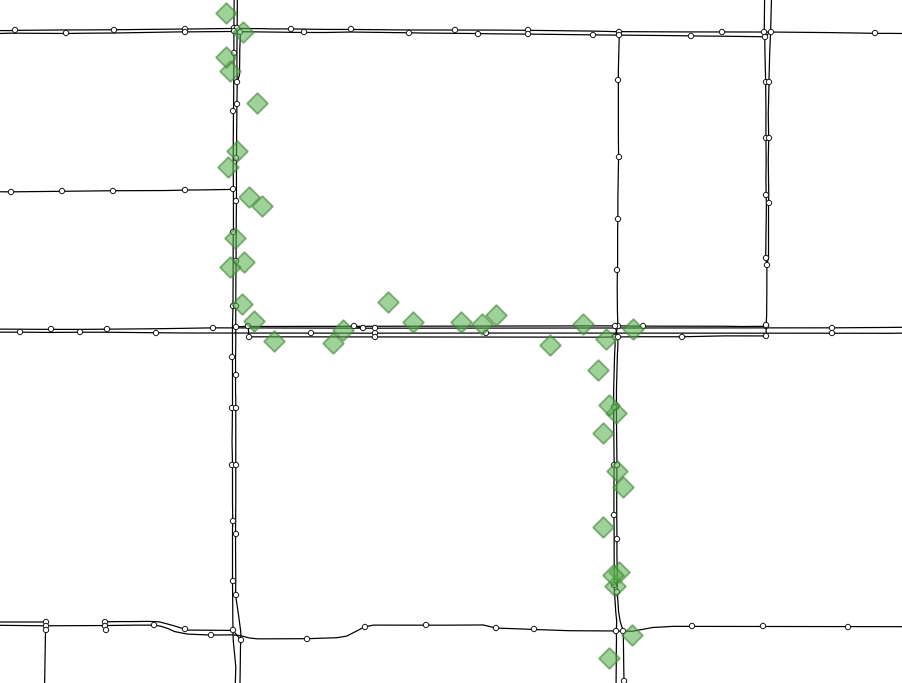

⚡️ 快速开始
===================================


地图匹配示例
--------------------

安装gotrackit
```````````````````````
安装教程见：:doc:`如何使用`


数据下载
```````````````````````
从GitHub仓库下载样例数据：`QuickStart-Match-1 <https://github.com/zdsjjtTLG/TrackIt/tree/main/data/input/QuickStart-Match-1>`_

或者从百度网盘下载样例数据：`QuickStart-Match-1 <https://pan.baidu.com/s/11UdmhGJKMz3O9vmGHHSm3A?pwd=kn74>`_


匹配代码1 - 非稀疏数据
``````````````````````````````
.. code-block:: python
    :linenos:


    import pandas as pd
    import geopandas as gpd
    from gotrackit.map.Net import Net
    from gotrackit.MapMatch import MapMatch
    from gotrackit.gps.Trajectory import TrajectoryPoints

    if __name__ == '__main__':
        # 读取GPS样例数据
        gps_df = pd.read_csv(r'./data/input/QuickStart-Match-1/example_gps.csv')

        # 利用gps数据构建TrajectoryPoints, 并且对数据进行清洗
        # 是否需要进行该步操作视实际情况而定
        tp = TrajectoryPoints(gps_points_df=gps_df, plain_crs='EPSG:32649')
        tp.lower_frequency(lower_n=2).kf_smooth(o_deviation=0.3)  # 由于样例数据定位频率高且有一定的误差，因此先做间隔采样然后执行滤波平滑
        gps_df = tp.trajectory_data(_type='df')

        # 读取路网数据并且构建Net类、初始化
        link = gpd.read_file(r'./data/input/net/xian/modifiedConn_link.shp')
        node = gpd.read_file(r'./data/input/net/xian/modifiedConn_node.shp')
        my_net = Net(link_gdf=link, node_gdf=node, not_conn_cost=1200)
        my_net.init_net()  # net初始化

        # 构建匹配类
        # 指定要输出HTML可视化文件
        # 指定项目的标志字符flag_name='general_sample', 这个用户可以自定义
        # gps数据时间列的值都是形如2022-05-12 16:27:46，因此指定时间列格式为 '%Y-%m-%d %H:%M:%S'
        # 关于gps_buffer的确定，需要将路网和gps数据一同使用gis软件可视化，大概确定GPS数据和候选路段的距离
        mpm = MapMatch(net=my_net, gps_buffer=120, flag_name='general_sample', time_format='%Y-%m-%d %H:%M:%S',
                       use_heading_inf=True, omitted_l=6.0, export_html=True, del_dwell=False,
                       out_fldr=r'./data/output/match_visualization/QuickStart-Match-1', dense_gps=False,
                       gps_radius=20.0)

        # 执行匹配
        # 第一个返回结果是匹配结果表
        # 第二个是发生警告的agent的相关信息({agent_id1: pd.DataFrame(), agent_id2: pd.DataFrame()...})
        # 第三个是匹配出错的agent的id列表(GPS点经过预处理(或者原始数据)后点数量不足2个)
        match_res, warn_info, error_info = mpm.execute(gps_df=gps_df)
        match_res.to_csv(fr'./data/output/match_visualization/QuickStart-Match-1/general_match_res.csv',
                         encoding='utf_8_sig', index=False)

关于如何确定gps_buffer，这个和GPS的定位误差大小有关系，如下图，我们将GPS数据与路网一同在QGIS中进行可视化



--------------------------------------------------------------------------------

可以看到GPS点定位频率不算低，且定位点偏离道路不算远，大概在85米左右，为了确保所有的GPS点都能关联到候选路段，我们取gps_buffer=120米较为合适


.. image:: _static/images/quick_start/general_dis.png
    :align: center

--------------------------------------------------------------------------------


匹配代码2 - 稀疏数据
``````````````````````````````
.. code-block:: python
    :linenos:

    import pandas as pd
    import geopandas as gpd
    from gotrackit.map.Net import Net
    from gotrackit.MapMatch import MapMatch
    from gotrackit.gps.Trajectory import TrajectoryPoints

    if __name__ == '__main__':
        # 读取GPS样例数据
        gps_df = pd.read_csv(r'./data/input/QuickStart-Match-1/example_sparse_gps.csv')

        # 利用gps数据构建TrajectoryPoints, 是否需要进行该步操作视实际情况而定
        tp = TrajectoryPoints(gps_points_df=gps_df, plain_crs='EPSG:32649')
        tp.dense(dense_interval=120)  # 由于样例数据是稀疏定位数据，我们在匹配前进行增密处理
        gps_df = tp.trajectory_data(_type='df')
        tp.export_html(out_fldr=r'./data/output/match_visualization/QuickStart-Match-1')  # 输出增密前后的轨迹对比

        # 读取路网数据并且构建Net类、初始化
        link = gpd.read_file(r'./data/input/net/xian/modifiedConn_link.shp')
        node = gpd.read_file(r'./data/input/net/xian/modifiedConn_node.shp')
        my_net = Net(link_gdf=link, node_gdf=node, not_conn_cost=1200)
        my_net.init_net()  # net初始化

        # 由于轨迹点中大部分点是增密后的点，所以我们需要将gps_buffer调大才能确保轨迹点关联到路段
        # 由于我们已经提前将GPS数据进行增密，因此不需要使用MapMatch中的增密 - dense_gps=False
        mpm = MapMatch(net=my_net, gps_buffer=700, top_k=20, flag_name='sparse_sample',
                       export_html=True, time_format='%Y-%m-%d %H:%M:%S', use_heading_inf=True,
                       out_fldr=r'./data/output/match_visualization/QuickStart-Match-1', dense_gps=False,
                       gps_radius=15.0)

        # 执行匹配
        # 第一个返回结果是匹配结果表
        # 第二个是发生警告的agent的相关信息({agent_id1: pd.DataFrame(), agent_id2: pd.DataFrame()...})
        # 第三个是匹配出错的agent的id列表(GPS点经过预处理(或者原始数据)后点数量不足2个)
        match_res, warn_info, error_info = mpm.execute(gps_df=gps_df)
        match_res.to_csv(fr'./data/output/match_visualization/QuickStart-Match-1/sparse_match_res.csv',
                         encoding='utf_8_sig', index=False)

如下图，我们可看到，GPS点进行增密后，增密点距离候选路段很远，大概有350米左右（蓝色点为源数据点，红色点为增密后的点）

.. image:: _static/images/quick_start/dense.png
    :align: center

--------------------------------------------------------------------------------

为了保证所有的增密点都能关联到候选路段，我们考虑较多的富余，取值gps_buffer=700，top_k=20，即选取每个GPS点附近700米范围内的最近20个路段作为候选路段


.. image:: _static/images/quick_start/dense_dis.png
    :align: center

--------------------------------------------------------------------------------

.. note::

   应对稀疏定位数据，我们也可以选择不增密的策略，比如提供较大的gps_buffer和cut_off参数: 本例中gps_buffer取值1000，cut_off取值1500，不启用轨迹增密，依旧可以匹配成功


结果输出与可视化
```````````````````````

轨迹预处理前后对比可视化
::::::::::::::::::::::::::::::::::::::::::::::::

打开tp.export_html函数输出的文件，按照如下图所示可以查看处理前后的轨迹点(蓝色：源数据；黄色：处理后的数据)

.. image:: _static/images/tp_filter.gif
    :align: center

--------------------------------------------------------------------------------


匹配结果可视化
::::::::::::::::::::::::::::::::::::::::::::::::


.. image:: _static/images/可视化操作.gif
    :align: center
-----------------------------------------------


.. image:: _static/images/show.png
    :align: center
-----------------------------------------------


以上示例为简单的介绍，更多功能使用与探索，请仔细阅读: :doc:`如何使用`

In Shapely 1.x, some of the geometry classes are mutable, meaning that you
can change their coordinates in-place. Illustrative code::

    >>> from shapely.geometry import LineString
    >>> line = LineString([(0,0), (2, 2)])
    >>> print(line)
    LINESTRING (0 0, 2 2)

    >>> line.coords = [(0, 0), (10, 0), (10, 10)]
    >>> print(line)
    LINESTRING (0 0, 10 0, 10 10)

