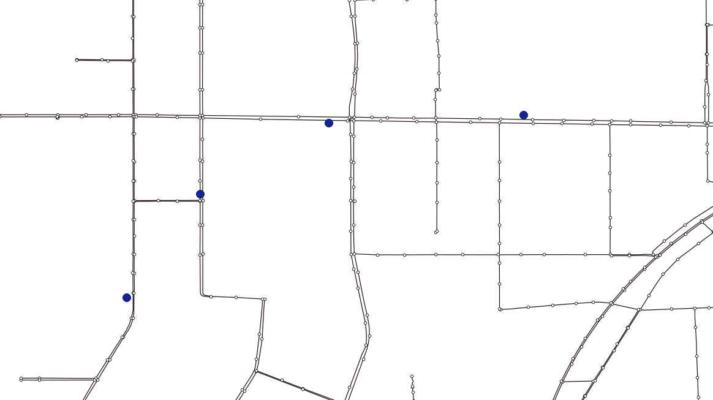
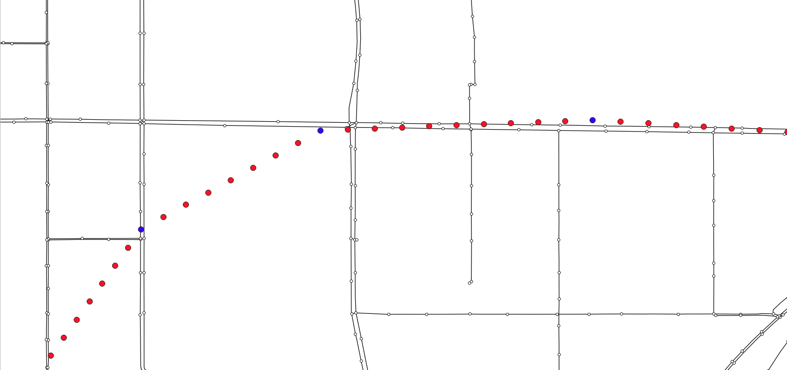
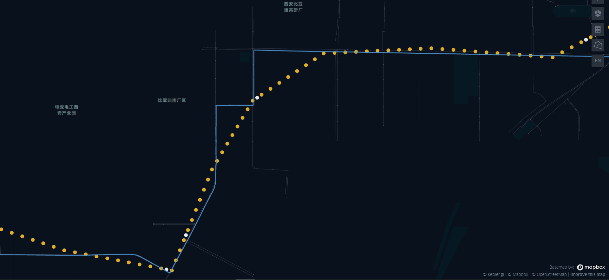
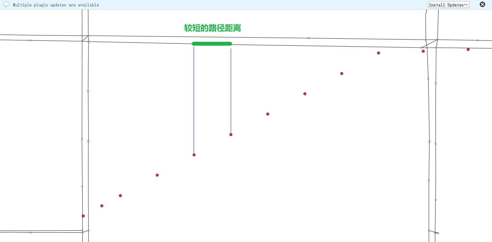
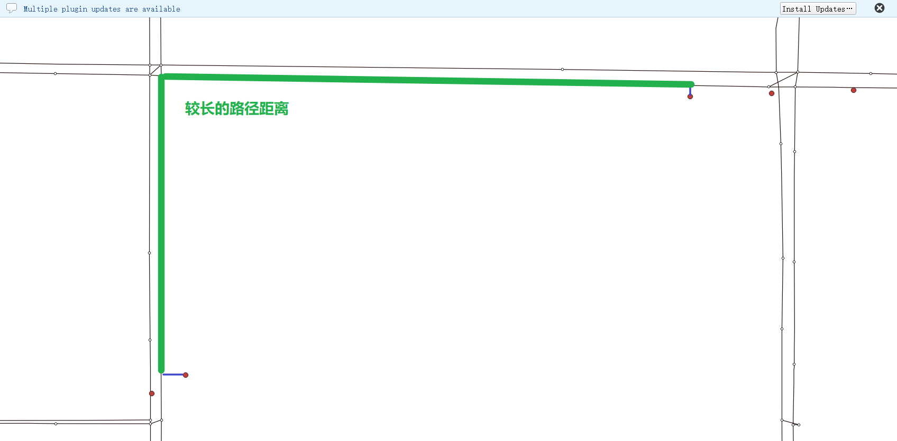
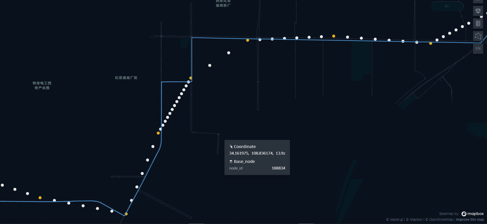
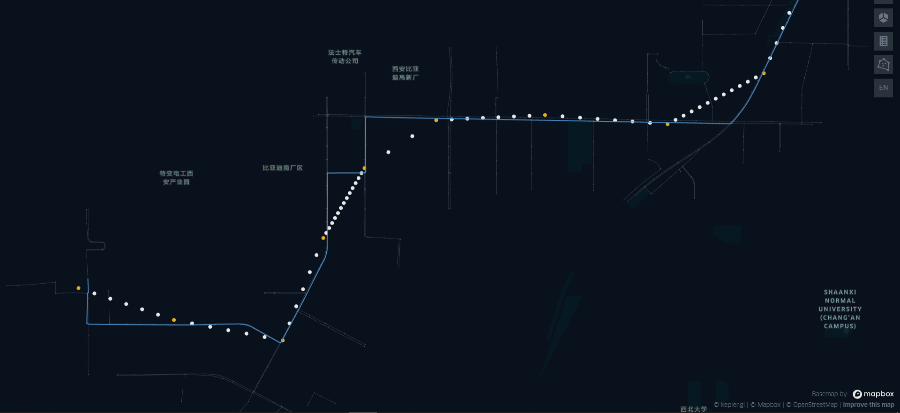

[export_html]: ../Func&API/Trajectory.md#export_html
[gps_buffer]: ../Func&API/MapMatch.md#init
[QGIS]: https://qgis.org/
[后补点解释]: https://gotrackit.readthedocs.io/en/latest/UserGuide/路径匹配/#_4

# 稀疏定位数据路径匹配

本文将使用一个较为稀疏的轨迹 - `example_sparse_gps.csv`用来做路径匹配，同时介绍了几种不同的参数组合策略。

## 数据下载

<div class="grid cards" markdown>
- :octicons-file-24: [QuickStart-Match-1-GitHub下载链接](https://github.com/zdsjjtTLG/TrackIt/tree/main/data/input/QuickStart-Match-1)
- :octicons-file-24: [QuickStart-Match-1-百度网盘下载链接](https://pan.baidu.com/s/11UdmhGJKMz3O9vmGHHSm3A?pwd=kn74)
</div>


## 策略1-子网络、增密轨迹

由于轨迹点稍微有一些稀疏，我们先对定位数据进行增密后再进行匹配，我们采用的增密参数`dense_interval=120`，即：若前后两个定位点的距离超过了120米，则会在两个点之间进行线性增密。

<figure markdown="span">
  
  <figcaption>定位点和路网</figcaption>
</figure>

如下图，我们可看到，GPS点增密后，增密点距离候选路段很远，大概有350米左右（蓝色点为源数据点，红色点为增密后的点）：

<figure markdown="span">
  
  <figcaption>定位数据增密</figcaption>
</figure>

为了保证所有的增密点都能关联到候选路段，我们考虑较多的富余，取值`gps_buffer=700`，`top_k=20`，即选取每个GPS点附近700米范围内的最近20个路段作为候选路段。


具体轨迹点增密、路径匹配代码如下：

``` py linenums="1" hl_lines="11 12 13 14 15 20 25 27 28"
import pandas as pd
import geopandas as gpd
from gotrackit.map.Net import Net
from gotrackit.MapMatch import MapMatch
from gotrackit.gps.Trajectory import TrajectoryPoints

if __name__ == '__main__':
    # 读取GPS样例数据
    gps_df = pd.read_csv(r'./data/input/QuickStart-Match-1/example_sparse_gps.csv')

    # 利用gps数据构建TrajectoryPoints
    tp = TrajectoryPoints(gps_points_df=gps_df, plain_crs='EPSG:32649')
    tp.dense(dense_interval=120)  # 由于样例数据是稀疏定位数据，我们在匹配前进行增密处理
    gps_df = tp.trajectory_data(_type='df')
    tp.export_html(out_fldr=r'./data/output/match_visualization/QuickStart-Match-1')  # 输出增密前后的轨迹对比

    # 读取路网数据并且构建Net类、初始化
    link = gpd.read_file(r'./data/input/net/xian/modifiedConn_link.shp')
    node = gpd.read_file(r'./data/input/net/xian/modifiedConn_node.shp')
    my_net = Net(link_gdf=link, node_gdf=node, not_conn_cost=1200, cut_off=300)  # 默认的路径搜索截断距离为1200, 我们试一试减小到300
    my_net.init_net()  # net初始化

    # 由于轨迹点中大部分点是增密后的点，所以我们需要将gps_buffer调大才能确保轨迹点关联到路段
    # 由于我们已经提前将GPS数据进行增密，因此不需要使用MapMatch中的增密 - dense_gps=False
    mpm = MapMatch(net=my_net, use_sub_net=True, flag_name='sparse_sample',
                   time_format='%Y-%m-%d %H:%M:%S',
                   dense_gps=False,  # gps数据在预处理环节已经增密，这里不需要再打开增密选项
                   gps_buffer=700, top_k=20, 
                   use_heading_inf=True,
                   export_html=True, 
                   out_fldr=r'./data/output/match_visualization/QuickStart-Match-1',
                   gps_radius=15.0)

    # 执行匹配
    # 第一个返回结果是匹配结果表
    # 第二个是发生警告的agent的相关信息({agent_id1: pd.DataFrame(), agent_id2: pd.DataFrame()...})
    # 第三个是匹配出错的agent的id列表(GPS点经过预处理(或者原始数据)后点数量不足2个)
    match_res, warn_info, error_info = mpm.execute(gps_df=gps_df)
    match_res.to_csv(fr'./data/output/match_visualization/QuickStart-Match-1/sparse_match_res.csv',
                     encoding='utf_8_sig', index=False)
```

匹配结果如下：

<figure markdown="span">
  
  <figcaption>匹配结果</figcaption>
</figure>


**子网络下使用增密匹配策略总结**：`gps_buffer`可以适当大一些，`cut_off`可以适当小一些

- 由于进行了轨迹点的线性增密，而线性增密一般很难保障增密点走向和实际的路径形状一致，这导致了增密点与实际路段的距离较大，为了确保增密点能关联到足够的候选路段，我们一般会将缓冲区`gps_buffer`调的大一些
- 线性增密后，路径搜索的截断半径`cut_off`可以适当小一些，以减小路径搜索开销，提升路径匹配效率


## 策略2-子网络、不增密轨迹

我们如果不增密轨迹点，那么GPS点在候选路段上的投影点间的路径距离相对来说会变大，那么就需要更大的路径搜索截断距离`cut_off`：


=== "有增密-只需要较小的路径搜索距离"

    <figure markdown="span">
      
    </figure>


=== "无增密-需要较大的路径搜索距离"

    <figure markdown="span">
      
    </figure>


我们的代码可以写为：

``` py linenums="1" hl_lines="11 12 13 14 15 16 21 24 26 27"
import pandas as pd
import geopandas as gpd
from gotrackit.map.Net import Net
from gotrackit.MapMatch import MapMatch
from gotrackit.gps.Trajectory import TrajectoryPoints

if __name__ == '__main__':
    # 读取GPS样例数据
    gps_df = pd.read_csv(r'./data/input/QuickStart-Match-1/example_sparse_gps.csv')
    
    # 注释掉该步骤的增密预处理
    # 利用gps数据构建TrajectoryPoints, 是否需要进行该步操作视实际情况而定
    # tp = TrajectoryPoints(gps_points_df=gps_df, plain_crs='EPSG:32649')
    # tp.dense(dense_interval=120)  # 由于样例数据是稀疏定位数据，我们在匹配前进行增密处理
    # gps_df = tp.trajectory_data(_type='df')
    # tp.export_html(out_fldr=r'./data/output/match_visualization/QuickStart-Match-1')  # 输出增密前后的轨迹对比

    # 读取路网数据并且构建Net类、初始化
    link = gpd.read_file(r'./data/input/net/xian/modifiedConn_link.shp')
    node = gpd.read_file(r'./data/input/net/xian/modifiedConn_node.shp')
    my_net = Net(link_gdf=link, node_gdf=node, not_conn_cost=1200, cut_off=1200)
    my_net.init_net()  # net初始化
    
    mpm = MapMatch(net=my_net, use_sub_net=True, flag_name='sparse_sample', 
                   time_format='%Y-%m-%d %H:%M:%S',
                   dense_gps=False,  # 不打开增密选项
                   gps_buffer=700, top_k=20, 
                   use_heading_inf=True,
                   export_html=True, 
                   out_fldr=r'./data/output/match_visualization/QuickStart-Match-1',
                   gps_radius=15.0)

    # 执行匹配
    # 第一个返回结果是匹配结果表
    # 第二个是发生警告的agent的相关信息({agent_id1: pd.DataFrame(), agent_id2: pd.DataFrame()...})
    # 第三个是匹配出错的agent的id列表(GPS点经过预处理(或者原始数据)后点数量不足2个)
    match_res, warn_info, error_info = mpm.execute(gps_df=gps_df)
    match_res.to_csv(fr'./data/output/match_visualization/QuickStart-Match-1/sparse_match_res.csv',
                     encoding='utf_8_sig', index=False)
```

执行上述代码，打开可视化HTML文件，可以看到匹配结果，与策略1不同的是，发现**白色的定位点(后补点)变多了**，这是因为我们没有启用增密策略，前后GPS点匹配到的路段并不是直接拓扑相连的，gotrackit为了保证匹配路段的连续性，对中间缺失的路段进行了自动的路径补全，并且为每个补全的路段生成了一个后补点。

后补点的详细解释见：[后补点解释]。

<figure markdown="span">
  
  <figcaption>匹配结果</figcaption>
</figure>


## 策略3-全局网络、不增密轨迹

在上述介绍的两个参数策略中，我们均使用的子路网`use_sub_net=True`，即：我们实际的路径搜索计算是在子路网上进行的。

**子路网络的计算逻辑**：当`use_sub_net=True`时(默认)，gotrackit会将待匹配的GPS轨迹点按照时间顺序从头到尾连接为**一条多段线**，然后对这条线做一个半径为`gps_buffer`的缓冲区，那么所有和这个缓冲区相交的路段，都会被选入这个子路网。

如果不启用子路网，即使用全局路网，我们可以使用相对较小的`gps_buffer`参数，这样匹配仍然可以成功：

``` py linenums="1" hl_lines="11 12 13 14 15 16 21 24 26 27"
import pandas as pd
import geopandas as gpd
from gotrackit.map.Net import Net
from gotrackit.MapMatch import MapMatch
from gotrackit.gps.Trajectory import TrajectoryPoints

if __name__ == '__main__':
    # 读取GPS样例数据
    gps_df = pd.read_csv(r'./data/input/QuickStart-Match-1/example_sparse_gps.csv')
    
    # 注释掉该步骤的增密预处理
    # 利用gps数据构建TrajectoryPoints, 是否需要进行该步操作视实际情况而定
    # tp = TrajectoryPoints(gps_points_df=gps_df, plain_crs='EPSG:32649')
    # tp.dense(dense_interval=120)  # 由于样例数据是稀疏定位数据，我们在匹配前进行增密处理
    # gps_df = tp.trajectory_data(_type='df')
    # tp.export_html(out_fldr=r'./data/output/match_visualization/QuickStart-Match-1')  # 输出增密前后的轨迹对比

    # 读取路网数据并且构建Net类、初始化
    link = gpd.read_file(r'./data/input/net/xian/modifiedConn_link.shp')
    node = gpd.read_file(r'./data/input/net/xian/modifiedConn_node.shp')
    my_net = Net(link_gdf=link, node_gdf=node, not_conn_cost=1200, cut_off=1200)
    my_net.init_net()  # net初始化
    
    mpm = MapMatch(net=my_net, use_sub_net=False, flag_name='sparse_sample', 
                   time_format='%Y-%m-%d %H:%M:%S',
                   dense_gps=False,  # 不打开增密选项
                   gps_buffer=100, top_k=20, 
                   use_heading_inf=True,
                   export_html=True, 
                   out_fldr=r'./data/output/match_visualization/QuickStart-Match-1',
                   gps_radius=15.0)

    # 执行匹配
    # 第一个返回结果是匹配结果表
    # 第二个是发生警告的agent的相关信息({agent_id1: pd.DataFrame(), agent_id2: pd.DataFrame()...})
    # 第三个是匹配出错的agent的id列表(GPS点经过预处理(或者原始数据)后点数量不足2个)
    match_res, warn_info, error_info = mpm.execute(gps_df=gps_df)
    match_res.to_csv(fr'./data/output/match_visualization/QuickStart-Match-1/sparse_match_res.csv',
                     encoding='utf_8_sig', index=False)
```
匹配结果如下图所示：

<figure markdown="span">
  
  <figcaption>匹配结果</figcaption>
</figure>
