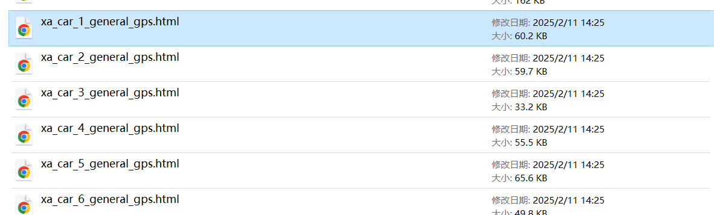
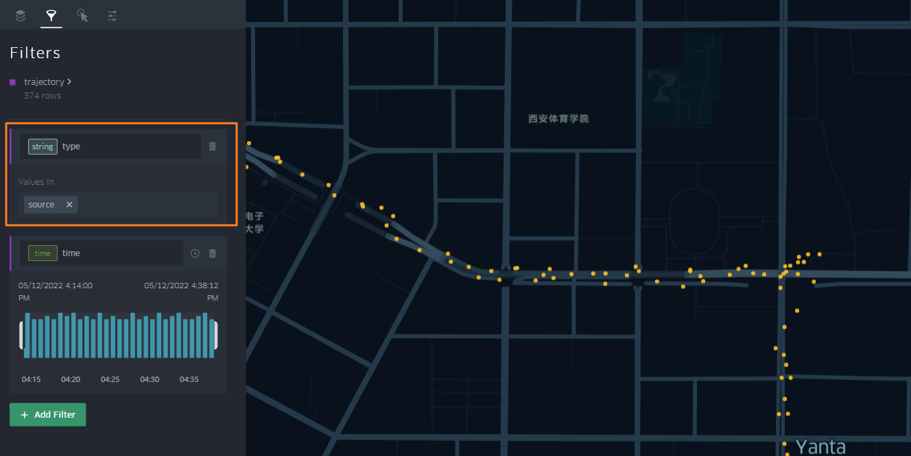
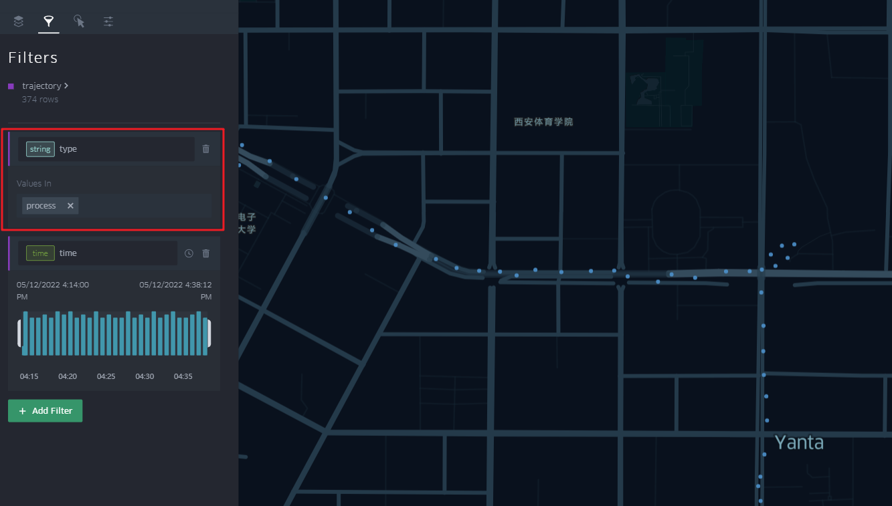
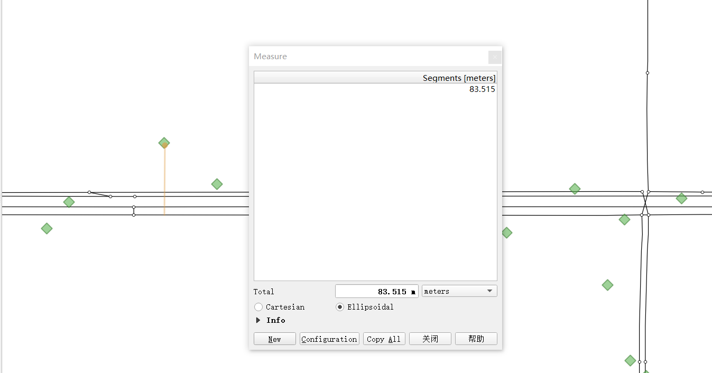

[export_html]: ../Func&API/Trajectory.md#export_html
[gps_buffer]: ../Func&API/MapMatch.md#init
[QGIS]: https://qgis.org/

# 非稀疏定位数据路径匹配


## 数据下载

<div class="grid cards" markdown>
- :octicons-file-24: [QuickStart-Match-1-GitHub下载链接](https://github.com/zdsjjtTLG/TrackIt/tree/main/data/input/QuickStart-Match-1)
- :octicons-file-24: [QuickStart-Match-1-百度网盘下载链接](https://pan.baidu.com/s/11UdmhGJKMz3O9vmGHHSm3A?pwd=kn74)
</div>


## 轨迹数据清洗
```python

# 读取GPS样例数据
import pandas as pd
from gotrackit.gps.Trajectory import TrajectoryPoints

gps_df = pd.read_csv(r'./data/input/QuickStart-Match-1/example_gps.csv')

# 利用gps数据构建TrajectoryPoints, 并且对数据进行清洗
# 是否需要进行该步操作视实际情况而定
tp = TrajectoryPoints(gps_points_df=gps_df, plain_crs='EPSG:32649')
tp.lower_frequency(lower_n=2).kf_smooth(o_deviation=0.3)  # 由于样例数据定位频率高且有一定的误差，因此先做间隔采样然后执行滤波平滑

# 获取清洗后的gps数据表
gps_df = tp.trajectory_data(_type='df')
tp.export_html(out_fldr=r'./data/output/')  # 输出清洗前后的轨迹对比文件
```

`tp.export_html`函数将会在指定的目录下生成多个HTML文件（每个HTML文件代表一个agent的轨迹），点击文件可查看**清洗前后**的可视化轨迹。

<figure markdown="span">
  
  <figcaption>输出html文件</figcaption>
</figure>

***(黄色：源轨迹数据；青色：清洗后的轨迹数据)***
<figure markdown="span">
  
  <figcaption>源轨迹数据</figcaption>
</figure>

<figure markdown="span">
  
  <figcaption>清洗后的轨迹数据</figcaption>
</figure>

## 构造Net对象

好了，轨迹数据清洗好了，我们开始进行地图匹配，首先要基于我们的路网数据构造一个Net对象

```python
import geopandas as gpd
from gotrackit.map.Net import Net

# 读取路网数据并且构建Net类、初始化
link = gpd.read_file(r'./data/input/net/xian/modifiedConn_link.shp')
node = gpd.read_file(r'./data/input/net/xian/modifiedConn_node.shp')
my_net = Net(link_gdf=link, node_gdf=node, not_conn_cost=1200)
my_net.init_net()  # net初始化
```


## 设置MapMatch参数

设置地图匹配参数进行地图匹配，具体的接口参数解释参见[官方文档](https://gotrackit.readthedocs.io/en/latest/Func%26API/MapMatch/)

```python
from gotrackit.MapMatch import MapMatch
# 构建匹配类
# 指定要输出HTML可视化文件
# 指定项目的标志字符flag_name='general_sample', 这个用户可以自定义
# gps数据时间列的值都是形如2022-05-12 16:27:46，因此指定时间列格式为 '%Y-%m-%d %H:%M:%S'
# 关于gps_buffer的确定，需要将路网和gps数据一同使用gis软件可视化，大概确定GPS数据和候选路段的距离
mpm = MapMatch(net=my_net, flag_name='general_sample', 
               time_format='%Y-%m-%d %H:%M:%S',
               gps_buffer=120, 
               use_heading_inf=True, omitted_l=6.0, 
               del_dwell=False, dense_gps=False,
               export_html=True, 
               out_fldr=r'./data/output/match_visualization/QuickStart-Match-1')

# 执行匹配
# 第一个返回结果是匹配结果表
# 第二个是发生警告的agent的相关信息({agent_id1: pd.DataFrame(), agent_id2: pd.DataFrame()...})
# 第三个是匹配出错的agent的id列表(GPS点经过预处理(或者原始数据)后点数量不足2个)
match_res, warn_info, error_info = mpm.execute(gps_df=gps_df)
match_res.to_csv(fr'./data/output/match_visualization/QuickStart-Match-1/general_match_res.csv',
                 encoding='utf_8_sig', index=False)
```

关于如何确定[gps_buffer]，这个和GPS的定位误差大小有关系，如下图，我们将GPS数据与路网一同在[QGIS]中进行可视化


<figure markdown="span">
  
  <figcaption>定位数据与路网</figcaption>
</figure>

可以看到GPS点定位频率不算低，且定位点偏离道路不算远，大概在85米左右，为了确保所有的GPS点都能关联到候选路段，我们取`gps_buffer=120`米较为合适


<figure markdown="span">
  
  <figcaption>定位数据与路网</figcaption>
</figure>

## 匹配结果可视化
若[MapMatch](https://gotrackit.readthedocs.io/en/latest/Func%26API/MapMatch/)函数指定了参数`export_html=True`，则会在指定的目录下生成HTML匹配动画文件，点击文件后，打开时间轴即可查看匹配过程。

<figure markdown="span">
  
  <figcaption>匹配结果动态可视化</figcaption>
</figure>