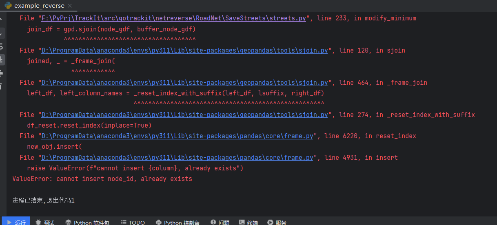
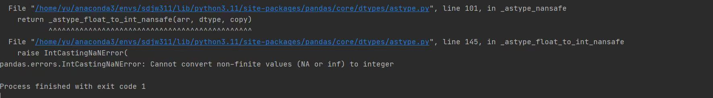
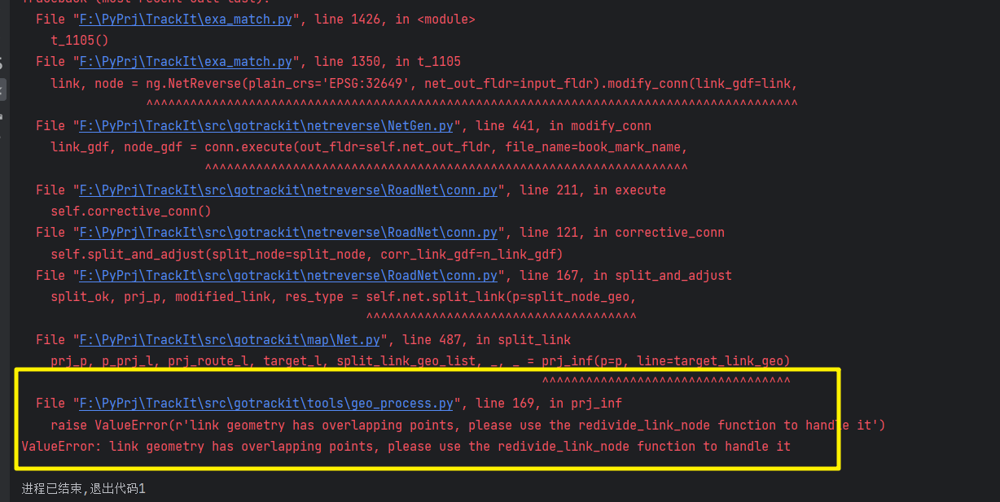

🛢️ 报错汇总
===================================

构建net对象错误报坐标系不匹配
--------------------------------------------------------

.. image:: _static/images/bug_no_crs_error.png
    :align: center

--------------------------------------------------------

解决方案：

.. code-block:: python
    :linenos:

    # 1. 从gotrackit导入相关模块Net, MapMatch
    import geopandas as gpd
    from gotrackit.map.Net import Net
    from gotrackit.MapMatch import MapMatch

    if __name__ == '__main__':
        link = gpd.read_file(r'./data/input/net/xian/modifiedConn_link.shp')
        node = gpd.read_file(r'./data/input/net/xian/modifiedConn_node.shp')

        link = link.to_crs('EPSG:4326')
        node = node.to_crs('EPSG:4326')

        # 如果还报错, 再加下面这个
        # link.crs.srs = 'EPSG:4326'
        # node.crs.srs = 'EPSG:4326'

        my_net = Net(link_gdf=link, node_gdf=node)
        my_net.init_net()  # net初始化

使用jupyter报net对象无planar_crs属性
--------------------------------------------------------

.. image:: _static/images/bug_no_planar_crs.png
    :align: center

--------------------------------------------------------

解决方案：使用pycharm

pyogrio.errors.FieldError
--------------------------------------------------------

fiona版本或者GDAL版本不兼容

.. image:: _static/images/fiona_bug.png
    :align: center

--------------------------------------------------------

解决方案：相关地理信息库推荐以下版本：

gdal(3.8.4)、shapely(2.0.3)、fiona(1.9.5)、pyproj(3.6.1)、geopandas(0.14.3)、keplergl(0.3.2)

shapely库警告
--------------------------------------------------------
出现警告信息：RuntimeWarning:invalid value encountered in line locate pointreturn lib.line locate point(line, other)

该警告会影响匹配结果，出现该警告的原因是因为你的路网线层的几何中有重复点

.. image:: _static/images/dup_points_warning.png
    :align: center

--------------------------------------------------------

解决方案-示例代码如下：

.. code-block:: python
    :linenos:

    if __name__ == '__main__':

        # 方案1：去除重复点后再构建Net
        link_gdf = gpd.read_file(r'./data/output/request/0304/道路双线20230131_84.shp')
        link_gdf['geometry'] = link_gdf['geometry'].remove_repeated_points(1e-6)

        # 方案2：使用清洗接口后再构建Net
        link_gdf = gpd.read_file(r'./data/output/request/0304/道路双线20230131_84.shp')
        link_gdf = ng.NetReverse.clean_link_geo(gdf=link_gdf, plain_crs='EPSG:32649', l_threshold=1.0)

Invalid projection: EPSG:nan
--------------------------------------------------------

境外路网构建失败，是BUG，更新gotrackit到最新版本即可解决

.. image:: _static/images/crs_error.png
    :align: center

--------------------------------------------------------

输出的路网文件字段中：中文变为乱码
--------------------------------------------------------
gotrackit存储路网文件时，默认编码为gbk，你需要检查你的原始路网文件的编码是否为gbk

--------------------------------------------------------------------------------------

输出HTML失败： Object of type bytes is not JSON serializable
----------------------------------------------------------------------------------------------------------------
可能是路网文件编码问题，比如下图的错误原因是：gpd.read_file()读取路网时没有指定合适的编码，导致road_name列是bytes类型，但是gotrackit在输出HTML时会默认将用户路网的所有字段进行输出，所以导致了输出失败

.. image:: _static/images/json_serializable.png
    :align: center
--------------------------------------------------------------------------------------

解决方案：读取shp文件时指定正确的编码 或者 删除有编码问题的字段再构建Net

gotrackit：v0.3.1会对输出HTML的路网字段进行限制，只输出关键拓扑字段

计算发射矩阵出错:ValueError(cannot convert float NaN to integer )
-------------------------------------------------------------------------------------------------
这个错误是因为路网线层中线型有重叠折点

.. image:: _static/images/dup_zd_error.png
    :align: center
--------------------------------------------------------------------------------------

解决方案-示例代码如下：

.. code-block:: python
    :linenos:

    if __name__ == '__main__':

        # 方案1：去除重复点后再构建Net
        link_gdf = gpd.read_file(r'./data/output/request/0304/道路双线20230131_84.shp')
        link_gdf['geometry'] = link_gdf['geometry'].remove_repeated_points(1e-6)

        # 方案2：使用清洗接口后再构建Net
        link_gdf = gpd.read_file(r'./data/output/request/0304/道路双线20230131_84.shp')
        link_gdf = ng.NetReverse.clean_link_geo(gdf=link_gdf, plain_crs='EPSG:32649', l_threshold=1.0)

路网获取报错/地图匹配报错:ValueError: cannot insert node_id, already exists
--------------------------------------------------------------------------------------------------------
这个错误是因为geopandas版本为最新1.0.0引起的，最新版本参数有了较大变动，gotrackitv0.3.5目前还没有针对1.0.0做更新

--------------------------------------------------------------------------------------

解决方案： 不要使用最新版的geopandas，降级到0.14.3

输出HTML失败：One of the arguments is of incorrect type
----------------------------------------------------------------------------------------------------------------

--------------------------------------------------------------------------------------

已经定位到问题，目前正在测试阶段，预计0.3.7修复

如果最新版本仍然报错，那就应该是kepler的问题，建议重开新环境，按照gotrackit的依赖库版本进行依赖库的重新安装

FutureWarning
--------------------------------------------------------
这个是警告，pandas提醒用户某个方法在未来会被舍弃，对匹配没有影响，如果不想看到该警告，可以在主程序加上以下代码：

.. code-block:: python
    :linenos:

    import pandas as pd

    if __name__ == '__main__':
        pd.set_option('future.no_silent_downcasting', True)

该警告会在0.3.6版本中通过优化代码来消除

输出HTML没有报错，但是却没有输出HTML
--------------------------------------------------------
由于最后一个Agent的GPS数据没有关联到任何路网，程序提前退出了，所以没有输出HTML.

解决方案1：匹配前先剔除关联不到任何路网的GPS数据

解决方案2：指定参数visualization_cache_times = 1

redivide_link_node函数报错
--------------------------------------------------------

--------------------------------------------------------------------------------------

原因：由于输入的路网线层中有起终点相同的link

解决方案：

1.先去除路网线层中相同起终点的link，然后reset_index()重设索引

2.等待0.3.8版本更新

报错：线层有重复点-overlapping points
----------------------------------------------------------------------------------------------------------

在使用路网相关处理函数时如果出现以下报错：

link geometry has overlapping points, please use the redivide_link_node function to handle it

--------------------------------------------------------------------------------------

这种情况是因为路网线层有环路或者自相交线段，请对线层和点层做以下清洗后再进行下一步工作(该步操作在0.3.13版本中会整合到clean函数中)：

.. code-block:: python
    :linenos:

    if __name__ == '__main__':

        link_gdf = gpd.read_file(r'XXX')
        node_gdf = gpd.read_file(r'XXX')

        # 删除自相交对象和环路
        link_gdf.reset_index(inplace=True, drop=True)
        link_gdf.drop(index=link_gdf[~link_gdf['geometry'].is_simple].index, inplace=True, axis=0)
        link_gdf.drop(index=link_gdf[link_gdf['from_node'] == link_gdf['to_node']].index, inplace=True, axis=0)
        link_gdf.reset_index(inplace=True, drop=True)

        # 统一节点层
        node_gdf.reset_index(inplace=True, drop=True)
        used_node = set(link_gdf['from_node']) | set(link_gdf['to_node'])
        node_gdf.drop(index=node_gdf[~node_gdf['node_id'].isin(used_node)].index, inplace=True, axis=0)
        node_gdf.reset_index(inplace=True, drop=True)
