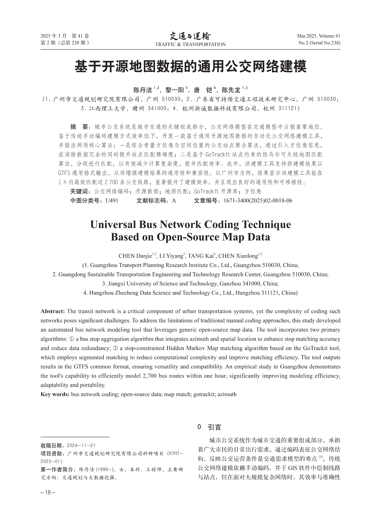
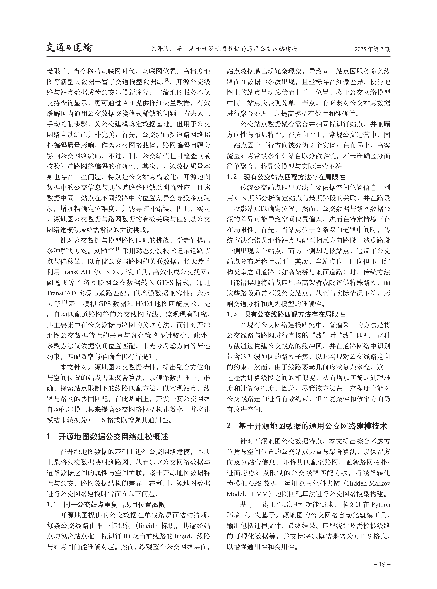
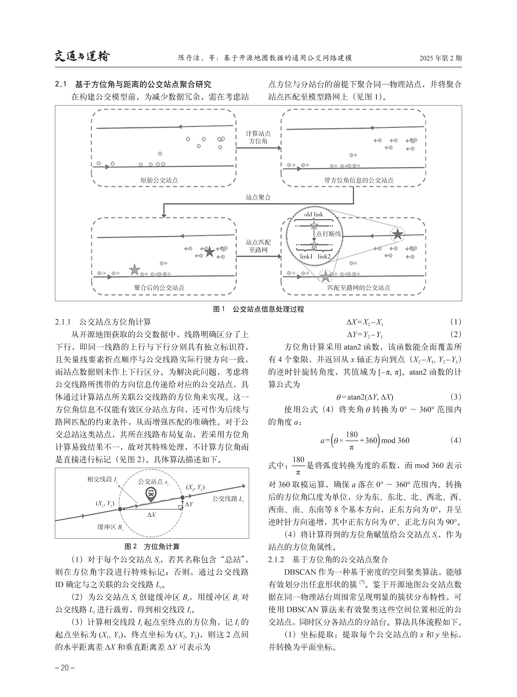
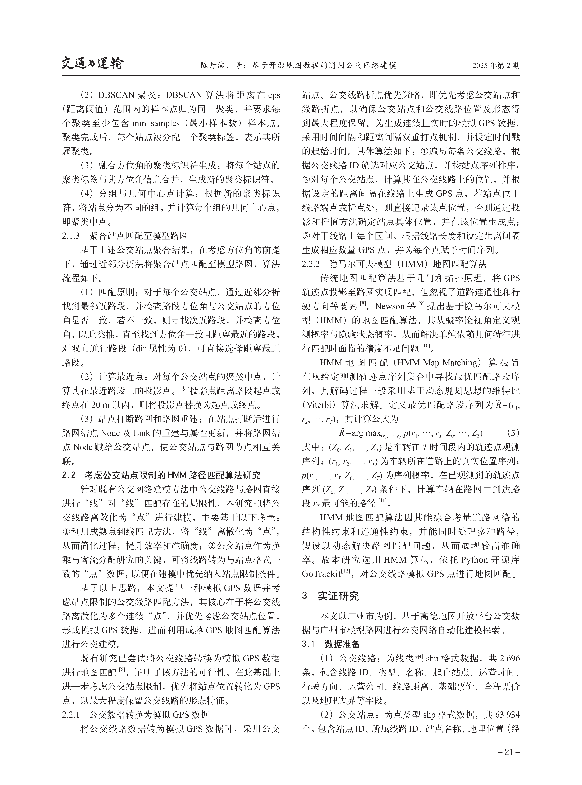
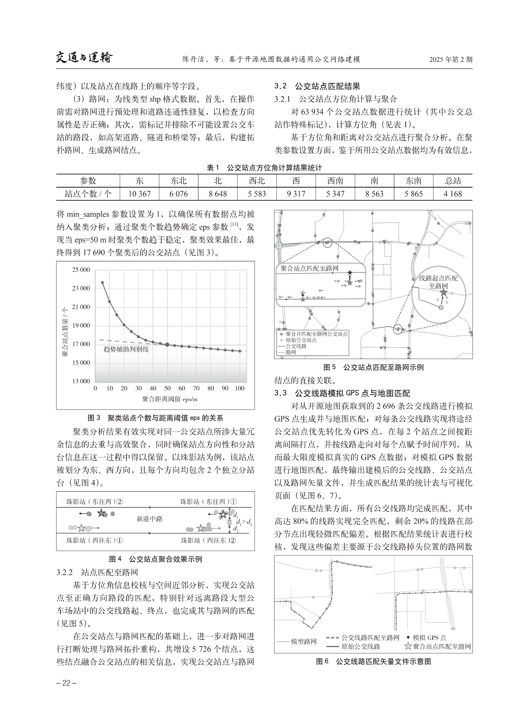
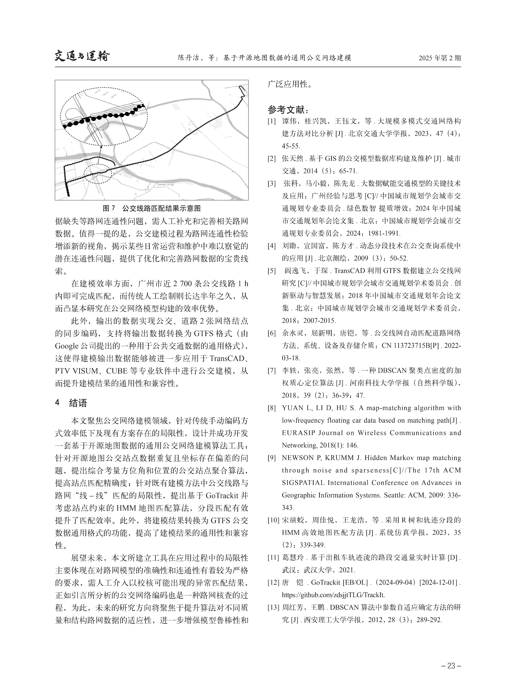

<figure markdown="span">
  
</figure>

<figure markdown="span">
  
</figure>

<figure markdown="span">
  
</figure>

<figure markdown="span">
  
</figure>

<figure markdown="span">
  
</figure>

<figure markdown="span">
  
</figure>
