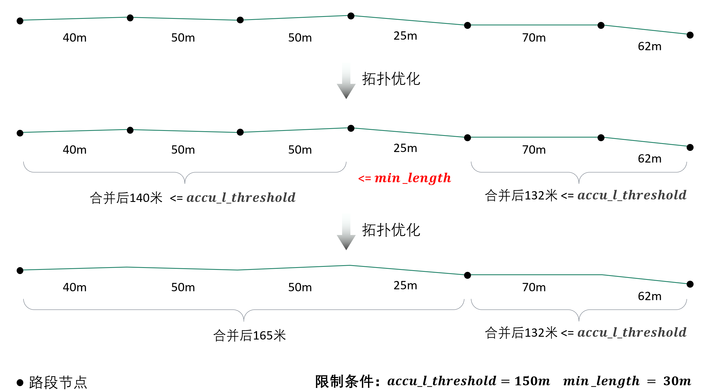
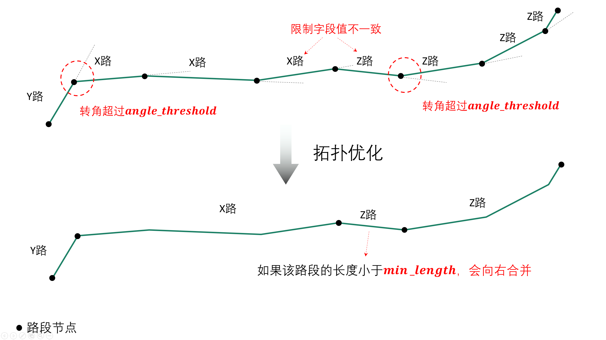
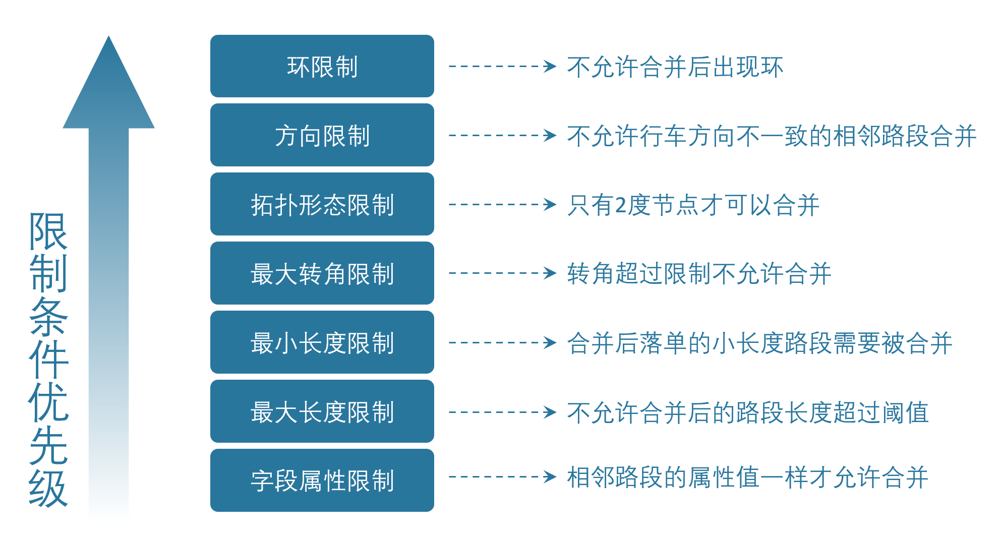

🔎类方法汇总
===================================

1. Net类
--------------------

1.1. Net类初始化
`````````````````````

.. py:class:: Net(link_path:str=None, node_path=None, link_gdf: gpd.GeoDataFrame = None, node_gdf: gpd.GeoDataFrame = None, weight_field: str = 'length', geo_crs: str = 'EPSG:4326', plane_crs: str = 'EPSG:32650', init_from_existing: bool = False,is_check: bool = True)


参数含义如下：

* link_path
    link层的路网文件路径, 若指定了该参数, 则直接从磁盘IO创建Net线层

* node_path
    node层的路网文件路径, 若指定了该参数, 则直接从磁盘IO创建Net点层

* link_gdf
    若指定了该参数, 则直接从内存中的gdf创建Net线层

* node_gdf
    若指定了该参数, 则直接从内存中的gdf创建Net线层

* weight_field
    搜路权重字段

* geo_crs
    地理坐标系

* plane_crs
    平面投影坐标系

* init_from_existing
    是否直接从内存中的gdf创建single_link_gdf, 该参数用于类内部创建子net, 用户不用关心该参数, 不用指定值

* search_method
    路径规划所使用的方法,目前支持 'dijkstra' or 'bellman-ford', 默认dijkstra

* return:


1.2. Net类方法
````````````````

create_computational_net
:::::::::::::::::::::::::::::::::

.. py:class:: Net.create_computational_net(gps_array_buffer:Polygon = None)


参数含义如下：

* gps_array_buffer
    gps影响范围polygon


1.3. Net类属性
````````````````
crs
::::::::::::::::::::::::::

有空更，待完善...


2. NetReverse类
--------------------

2.1. NetReverse类初始化
```````````````````````````

.. py:class:: NetReverse(flag_name: str = '深圳市', plain_prj: str = 'EPSG:32650', ignore_head_tail: bool = False, cut_slice: bool = False, slice_num: int = 5, generate_rod: bool = False, min_rod_length: float = 5.0,restrict_region_gdf: gpd.GeoDataFrame = None, save_split_link: bool = False,modify_minimum_buffer: float = 0.8, save_streets_before_modify_minimum: bool = False,save_streets_after_modify_minimum: bool = False, save_tpr_link: bool = False, ignore_dir: bool = False,allow_ring: bool = False, restrict_angle: bool = True, restrict_length: bool = True,accu_l_threshold: float = 200.0, angle_threshold: float = 35.0, min_length: float = 50.0,save_preliminary: bool = False, is_process_dup_link: bool = True, process_dup_link_buffer: float = 0.8,dup_link_buffer_ratio: float = 60.0, net_out_fldr: str = None, net_file_type: str = 'shp', is_modify_conn: bool = True, conn_buffer: float = 0.8) -> None

可以将参数分为5组：参数含义如下：

**第一组（总体信息）：**

* flag_name
    项目名称

* plain_prj
    平面投影坐标系

* net_out_fldr
    最终路网的存储目录

* net_file_type
    路网的输出文件类型，shp 或者 geojson


**第二组（路径拆分参数）：**

* ignore_head_tail
    是否忽略路径首尾的无名道路, 这种一般是小区内部道路，默认True

* cut_slice
    拆分路段时，是否分片处理，内存不够时可以指定为True，默认False

* slice_num
    拆分路段时，拆分为几个slice处理

* generate_rod
    是否生成连杆, 只有当参数ignore_head_tail为false时该参数才生效，默认False

* min_rod_length
    最小连杆长度，米

* restrict_region_gdf
    限制区域gdf

* save_split_link
    是否保存拆分路径后的link层文件，默认False


**第三组（拓扑关联参数）：**

* modify_minimum_buffer
    极小间隔节点优化的buffer, m

* save_streets_before_modify_minimum
    是否保存优化前的结果，默认False

* save_streets_after_modify_minimum
    是否保存优化后的结果，默认False

* save_tpr_link
    是否保存优化后且进行方向处理的文件，默认False

.. _拓扑优化参数:

**第四组（拓扑优化参数）：**

* limit_col_name
    路段合并时，用于限制路段合并的线层属性字段，默认'road_name'，如果你要使用其他字段来限制合并，请自定该参数

* ignore_dir
    路段合并时，是否忽略行车方向，默认False

* allow_ring
    是否允许路段合并后出现环，默认False

* restrict_angle
    是否启用最大转角限制来约束路段合并，默认True

* restrict_length
    是否启用最大路段长度限制来约束路段合并，默认True

* accu_l_threshold
    允许的最长的路段长度，米

* angle_threshold
    允许的最大的路段内转角，度

* min_length
    允许的最小的路段长度，米

* save_preliminary
    是否保留重复路段处理前的文件，默认False

* multi_core_merge
    是否启用多进程进行合并，默认False

* merge_core_num
    启用几个核，默认1


**第五组（重叠路段处理参数）：**


* is_process_dup_link
    是否处理重复路段，默认True

* process_dup_link_buffer
    处理重复路段所使用的buffer长度，米，使用默认值即可

* dup_link_buffer_ratio
    重叠率检测阈值，使用默认值即可


.. _联通性修复参数:

**第六组（联通性修复参数）：**

* is_modify_conn
    是否检查潜在的联通性问题并且进行修复，默认True

* conn_buffer
    检查联通性问题时使用的检测半径大小,单位米

* conn_period
    取值 'final' or 'start', 'final'表示在拓扑优化之后修复联通性, 'start'表示在拓扑优化之前修复联通性


2.2. NetReverse类方法
```````````````````````````

(1) generate_net_from_request
::::::::::::::::::::::::::::::::::::::

请求路径规划计算得到路网

.. py:class:: NetReverse.generate_net_from_request(key_list: list[str] = None, binary_path_fldr: str = None,od_file_path: str = None, od_df: pd.DataFrame = None,region_gdf: gpd.GeoDataFrame = None, od_type='rnd', boundary_buffer: float = 2000,cache_times: int = 300, ignore_hh: bool = True, remove_his: bool = True,log_fldr: str = None, save_log_file: bool = False,min_lng: float = None, min_lat: float = None, w: float = 2000, h: float = 2000, od_num: int = 100, gap_n: int = 1000, min_od_length: float = 1200.0) -> None

可以将参数分为5组：参数含义如下：

**第一组（输出结果参数）：**

* binary_path_fldr
    请求得到的路径源文件的存储目录，必须参数


**第二组（请求设置参数）：**

* key_list
    开发者key值列表，必须参数

* cache_times
    路径文件缓存数，即每请求cache_times次缓存一次数据到binary_path_fldr下，可选，默认300

* ignore_hh
    是否忽略时段限制进行请求，默认False

* remove_his
    是否对已经请求的OD重复(指的是在请求被意外中断的情况下，od_id为判断依据)请求，默认True

* save_log_file
    是否保存日志文件

* log_fldr
    日志文件的存储目录


**第三组（OD构造参数）：**

* od_file_path
    用于请求的od文件路径，可选参数

* od_df
    用于请求的od数据，该参数和od_file_path任意指定一个即可，可选参数

* region_gdf
    用于构造od的面域数据


* min_lng
    矩形区域的左下角经度

* min_lat
    矩形区域的左下角纬度

* w
    矩形区域的宽度，米

* h
    矩形区域的高度，米

* boundary_buffer
    区域边界buffer，米，可选

* od_type
    用于构造od的方法，rand_od、region_od、diy_od或者gps_based

* od_num
    需要请求的od数，默认300，只有od_type为rand_od时起效

* gap_n
    网格个数，默认1000，只有od_type为rand_od时起效

* min_od_length
    od之间最短直线距离，只有od_type为rand_od时起效


(2) generate_net_from_pickle
:::::::::::::::::::::::::::::

从路径源文件计算得到路网

.. py:class:: NetReverse.generate_net_from_pickle(binary_path_fldr: str = None, pickle_file_name_list: list[str] = None) -> None

* binary_path_fldr
    请求得到的路径源文件的存储目录，必须参数

* pickle_file_name_list
    需要使读取的路径源文件列表，如果不指定，则默认读取binary_path_fldr下的所有源文件


(3) create_node_from_link
:::::::::::::::::::::::::::::

静态方法：从线层创建点层并且添加拓扑关联

.. py:class:: NetReverse.create_node_from_link(link_gdf: gpd.GeoDataFrame = None, update_link_field_list: list[str] = None, using_from_to: bool = False, fill_dir: int = 0, plain_prj: str = 'EPSG:32650', ignore_merge_rule: bool = True, modify_minimum_buffer: float = 0.8, execute_modify: bool = True, auxiliary_judge_field: str = None, out_fldr: str = None, save_streets_before_modify_minimum: bool = False, save_streets_after_modify_minimum: bool = True) -> tuple[gpd.GeoDataFrame, gpd.GeoDataFrame, gpd.GeoDataFrame]


* link_gdf
    路网线层gdf数据，必须数据

* update_link_field_list
    需要更新的字段列表, 生产拓扑关联后需要更新的线层基本字段，从(link_id, from_node, to_node, dir, length)中选取，

* using_from_to
    是否使用输入线层中的from_node字段和to_node字段，默认False

* fill_dir
    用于填充dir方向字段的值，如果update_link_field_list中包含dir字段，那么该参数需要传入值，允许的值为1或者0

* plain_prj
    所使用的平面投影坐标系

* ignore_merge_rule
    是否忽略极小间隔优化的规则，默认True

* auxiliary_judge_field
    用于判断是否可以合并的线层字段, 只有当ignore_merge_rule为False才起效

* execute_modify
    是否执行极小间隔节点优化，默认True

* modify_minimum_buffer
    极小间隔节点优化的buffer, 米


* out_fldr
    输出文件的存储目录


* save_streets_before_modify_minimum
    是否存储极小间隔优化前的数据，默认True


* save_streets_after_modify_minimum
    是否存储极小间隔优化后的数据，默认True


(4) topology_optimization
:::::::::::::::::::::::::::::

路段拓扑优化


.. py:class:: NetReverse.topology_optimization(self, link_gdf: gpd.GeoDataFrame = None, node_gdf: gpd.GeoDataFrame = None, out_fldr: str = None)  -> tuple[gpd.GeoDataFrame, gpd.GeoDataFrame, dict]

单独使用该类方法优化已有路网，请在初始化NetReverse类时指定 `拓扑优化参数`_


* link_gdf
    请求得到的路径源文件的存储目录，必须参数

* node_gdf
    需要使读取的路径源文件列表，如果不指定，则默认读取binary_path_fldr下的所有源文件

* out_fldr：
    存储拓扑优化路网文件的目录


路段拓扑优化的相关参数的图解：

下图标注了每个路段的长度值，限制条件：合并后路段长度不超过150米，路段长度不得小于30米



----------------------------------------

若指定了limit_col_name为'road_name'，下图标注了每个路段的road_name值，限制条件：节点转角超过20°不得合并



----------------------------------------

不少场景下，无法完全满足所有的限制条件，各限制条件的服从优先级为：



----------------------------------------

(5) modify_conn
:::::::::::::::::::::::::::::

路网联通性修复


.. py:class:: NetReverse.modify_conn(self, link_gdf: gpd.GeoDataFrame = None, node_gdf: gpd.GeoDataFrame = None)  -> tuple[gpd.GeoDataFrame, gpd.GeoDataFrame]

单独使用该类方法优化已有路网的联通性，请在初始化NetReverse类时指定 `联通性修复参数`_

* link_gdf
    有标准字段的路网线层

* node_gdf
    有标准字段的路网点层


(4) redivide_link_node
:::::::::::::::::::::::::::::

路段、节点重塑、连通性修复

.. py:class:: NetReverse.redivide_link_node(self, link_gdf: gpd.GeoDataFrame = None) -> None


* link_gdf
    至少包含geometry字段的线层数据

生成的新路网在net_out_fldr(NetReverse类初始化参数)下存储


3. HiddenMarkov类
--------------------
有空更，待完善...


4. GpsPointsGdf类
--------------------
有空更，待完善...


4.1. GpsPointsGdf类初始化
````````````````````````````````````````

.. py:class:: GpsPointsGdf(gps_points_df: pd.DataFrame = None, buffer: float = 200.0, increment_buffer: float = 20.0, max_increment_times: int = 10, time_format: str = '%Y-%m-%d %H:%M:%S', geo_crs: str = 'EPSG:4326', plane_crs: str = 'EPSG:32649')

参数含义如下：


* gps_points_df
    某一辆车的一次出行的gps数据, pd.DataFrame类型, 必须包含agent_id、lng、lat、time字段

* buffer
    半径大小, 单位米，用于确定GPS点附近buffer范围内的路段, 这部分路段作为候选路段,如果GPS数据定位误差较小,这个值可以指定的小一点,计算效率会高一点

* increment_buffer
    增量半径大小, 单位米

* max_increment_times
    最大搜索次数, int类型, 在buffer范围内搜索候选路段, 若存在GPS点无法关联到任何路段, 则会针对这部分的GPS点以increment_buffer为增量半径, 增加buffer的值继续搜索, 直到关联到了候选路段或者达到了max_increment_times

* time_format
    gps_points_df数据中time时间列的格式，默认%Y-%m-%d %H:%M:%S

* geo_crs
    几何坐标系，默认EPSG:4326

* plane_crs
    平面投影坐标系，默认EPSG:32649


4.2. GpsPointsGdf类方法
```````````````````````````

(1) lower_frequency
::::::::::::::::::::::::::::::::::::::

GPS数据降频，参数含义如下：

* n
    n间隔采样，int类型


(2) rolling_average
::::::::::::::::::::::::::::::::::::::

GPS数据滑动窗口平均，参数含义如下：

* window
    int类型，窗口大小，若启用了该方法对GPS数据进行处理，则航向角信息会被忽略


(3) get_gps_array_buffer
::::::::::::::::::::::::::::::::::::::

计算GPS序列点形成的路径的总体影响面域，参数含义如下：

* buffer
    半径大小，单位米，建议这个buffer参数的取值要大于GpsPointsGdf类初始化中的buffer参数值


5. Viterbi类
--------------------
有空更，待完善...
