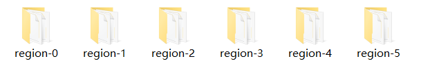
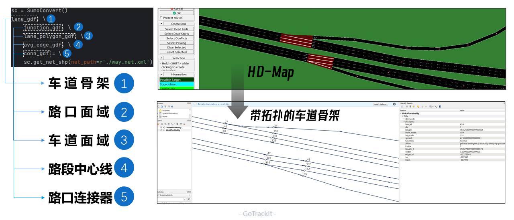

🔗 路网生产与优化
===================================

该模块提供了一系列的方法帮助您生产gotrackit标准路网，亦或是 帮助您 将 其他数据来源的路网 转化为gotrackit标准路网。gotrackit的标准路网数据结构见： :doc:`数据要求`

.. _路网生产代码示例:

使用路网生产工具，先从gotrackit导入相关模块 ::

    import gotrackit.netreverse.NetGen as ng


路网生产
-------------------------

.. note::

   该路网获取方式利用的是高德开放平台的官方API - 路径规划接口，不涉及爬虫抓包！


.. note::

   任何非官方采购形式的路网获取方法都不可能获得完整的路网数据！


.. note::

   依据本开源包的开源协议：通过该方式获取的路网数据严禁用于商业行为，仅限于教育以及科学研究课题，如有商用需求请联系高德客服进行路网采购，感谢高德开放平台的免费接口！


.. note::

   请注意：通过该方式获取的路网的坐标系是GCJ-02，一般的GPS数据坐标系都是WGS-84。

.. note::

   本开源包获取路网的原理，和osm之类的平台获取路网的原理，是不一样的：

   1.osm是库里已有路网，用户框选获取属于查询获取；

   2.gotrackit是基于路径规划API接口返回的路径进行分析计算，从而获取路网。所以OD构造的精度和数量直接决定了路网的完整度！请留意构造OD的方式和OD数量。


路网生产的相关函数不需要您提供任何的空间地理信息文件，只需指定范围、和申请 `开发者key <https://lbs.amap.com>`_ 即可获取路网。


参数详解
``````````````````````````

初始化NetReverse类
:::::::::::::::::::

* flag_name
    项目名称，必须指定；

* net_out_fldr
    最终路网的存储目录，必须指定

* plain_crs
    依据你的研究范围的经纬度(EPSG:4326)选择一个合适的平面投影坐标系，必须指定，参见: :doc:`数据要求` 中的六度带划分规则

请求参数
:::::::::::::::::::
* key_list
    开发者key值列表，必须指定

* binary_path_fldr
    请求路径源文件的存储目录(最好建立一个专门的目录)，必须指定

* is_rnd_strategy
    是否启用随机策略进行路径请求，默认False

* strategy:
    路径请求策略，可选值为：

    0：速度优先（只返回一条路线），此路线不一定距离最短；1：费用优先（只返回一条路线），不走收费路段，且耗时最少的路线；2：距离优先（只返回一条路线），仅走距离最短的路线，但是可能存在穿越小路/小区的情况；32：默认，高德推荐，同高德地图APP默认；33：躲避拥堵；34：高速优先；35：不走高速；36：少收费；37：大路优先；38：速度最快；39：躲避拥堵＋高速优先；40：躲避拥堵＋不走高速；41：躲避拥堵＋少收费；42：少收费＋不走高速；43：躲避拥堵＋少收费＋不走高速；44：躲避拥堵＋大路优先；45：躲避拥堵＋速度最快


* wait_until_recovery
    当key的配额耗尽后是否等待配额恢复，默认False


* save_log_file
    是否保存日志文件，非必须指定，默认False

* log_fldr
    日志的存储目录，非必须指定，默认None

* min_lng，min_lat
    矩形区域左下角经纬度坐标(GCJ-02坐标)，必须指定

* w，h
    矩形区域的宽度和高度(米)，必须指定，默认值2000，2000

* od_type
    生成OD的类型，rand_od、region_od、gps_based，

    以下三张图分别对应od_type参数为rand_od、region_od、gps_based：

    .. image:: _static/images/od_gen.png
        :align: center


* od_num
    生成的od数，od数目越多，请求的路径就越多，路网覆盖率就越完整，默认100个

* gap_n，min_od_length
    划分网格数、最小的od直线距离限制，非必须指定，默认100，1000，1200


所有参数解释见 :doc:`类方法汇总`


基于矩形区域随机构造OD请求路径, 获取路网
``````````````````````````````````````````````````````````````````

示例代码如下：


.. code-block:: python
    :linenos:

    if __name__ == '__main__':
        nv = ng.NetReverse(flag_name='test_rectangle', net_out_fldr=r'./data/output/reverse/test_rectangle/',
                       plain_crs='EPSG:32650', save_tpr_link=True, angle_threshold=40)

        # 参数od_num：依据自己需求确定，od_num越大，请求的路径越多，路网覆盖率越高
        nv.generate_net_from_request(key_list=['你的Key'],
                                     log_fldr=r'./', save_log_file=True,
                                     binary_path_fldr=r'./data/output/request/test_rectangle/',
                                     w=1500, h=1500, min_lng=126.665019, min_lat=45.747539, od_type='rand_od',
                                     od_num=200, gap_n=1000, min_od_length=800)

运行该代码后，先在目录./data/output/request/test_rectangle/下生成路径源文件，然后在目录./data/output/reverse/test_rectangle/下生成FinalLink.shp和FinalNode.shp文件


基于自定义区域随机构造OD请求路径, 获取路网
``````````````````````````````````````````````````````````````

我们通过读取diy_region.shp来指定我们构造随机OD的区域范围：

.. image:: _static/images/diy_region.png
    :align: center

-------------------------------------------------------

示例代码如下：

.. code-block:: python
    :linenos:

    if __name__ == '__main__':
        nv = ng.NetReverse(flag_name='test_diy_region', net_out_fldr=r'./data/output/reverse/test_diy_region/',
                           plain_crs='EPSG:32650', save_tpr_link=True, angle_threshold=20)
        target_region_gdf = gpd.read_file(r'./data/input/region/diy_region.shp')
        print(target_region_gdf)

        # 参数od_num：依据自己需求确定，od_num越大，请求的路径越多，路网覆盖率越高
        nv.generate_net_from_request(key_list=['你的Key'],
                                     log_fldr=r'./', save_log_file=True,
                                     binary_path_fldr=r'./data/output/request/test_diy_region/',
                                     region_gdf=target_region_gdf, od_type='rand_od', gap_n=1000,
                                     min_od_length=1200, od_num=200)


基于区域-区域OD请求路径, 获取路网
````````````````````````````````````````````````

读取交通小区文件，指定od_type为region_od，会自动构造两两地块形心之间的OD。使用该方法构造OD，需要确保面域文件中包含region_id字段。


.. image:: _static/images/test_taz.png
    :align: center

-------------------------------------------------------


示例代码如下：

.. code-block:: python
    :linenos:

    if __name__ == '__main__':
        nv = ng.NetReverse(flag_name='test_taz', net_out_fldr=r'./data/output/reverse/test_taz/',
                           plain_crs='EPSG:32650', save_tpr_link=True, angle_threshold=20)
        target_region_gdf = gpd.read_file(r'./data/input/region/simple_taz.shp')
        print(target_region_gdf)

        # 参数od_num在区域-区域OD下不生效，OD数 = N * N - N, N为区域数量
        nv.generate_net_from_request(key_list=['你的Key'],
                                     log_fldr=r'./', save_log_file=True,
                                     binary_path_fldr=r'./data/output/request/test_taz/',
                                     region_gdf=target_region_gdf, od_type='region_od')


基于自定义OD请求路径，获取路网
````````````````````````````````````

你可以通过自己的相关算法去构造OD，确保OD表符合 :doc:`数据要求`中的带途径点的OD数据 要求 ，然后可以使用自定义OD去请求路径、构造路网

示例代码如下：

.. code-block:: python
    :linenos:

    if __name__ == '__main__':
        nv = ng.NetReverse(flag_name='test_diy_od', net_out_fldr=r'./data/output/reverse/test_diy_od/',
                           plain_crs='EPSG:32651', save_tpr_link=True, angle_threshold=20)
        nv.generate_net_from_request(binary_path_fldr=r'./data/output/request/test_diy_od/',
                                     key_list=['你的Key'],
                                     od_file_path=r'./data/output/od/苏州市.csv', od_type='diy_od')

        # 或者
        # diy_od_df = pd.read_csv(r'./data/output/od/苏州市.csv')
        # nv.generate_net_from_request(binary_path_fldr=r'./data/output/request/test_diy_od/',
        #                              key_list=['你的Key'],
        #                              od_df=diy_od_df,
        #                              od_type='diy_od')


本算法包提供了一个依据GPS数据来生产自定义OD的接口，参见 :doc:`轨迹处理`中的 带途径点OD计算


解析路径源文件, 获取路网
````````````````````````````````````

以上介绍的nv.generate_net_from_request函数是一次性将路径请求和路网逆向做完，用户也可以将其拆分为两个单独的步骤进行：

(1). nv.request_path：只请求路径并且缓存

(2). nv.generate_net_from_pickle: 解析本地的路径源文件, 获取路网


如果已经有了请求好的路径源文件，可以直接从路径源文件中创建路网，只需要指定路径源文件目录和路径源文件名称列表

示例代码如下：

.. code-block:: python
    :linenos:

    if __name__ == '__main__':
        nv = ng.NetReverse(flag_name='test_pickle', net_out_fldr=r'./data/output/reverse/test_pickle/',
                           plain_crs='EPSG:32650', save_tpr_link=True, angle_threshold=20)
        nv.generate_net_from_pickle(binary_path_fldr=r'./data/output/request/test_taz/',
                                    pickle_file_name_list=['14_test_taz_gd_path_1'])


基于已有路网线层, 生产点层
````````````````````````````````````

如果你已经有了路网线层(从osm或者其他任何途径获取的)，缺少拓扑关联关系以及点层，你可以使用以下方式构建点层以及添加点层、线层的关联关系

该接口为NetReverse类的静态方法

示例代码如下：

.. code-block:: python
    :linenos:

    if __name__ == '__main__':
        # 对link.shp的要求: 只需要有geometry字段即可, 但是geometry字段的几何对象必须为LineString类型(不允许Z坐标)
        link_gdf = gpd.read_file(r'./data/output/create_node/link.shp')
        print(link_gdf)
        # update_link_field_list是需要更新的路网基本属性字段：link_id，from_node，to_node，length，dir
        # 示例中：link_gdf本身已有dir字段，所以没有指定更新dir
        new_link_gdf, new_node_gdf, node_group_status_gdf = ng.NetReverse.create_node_from_link(link_gdf=link_gdf, using_from_to=False,
                                                                                     update_link_field_list=['link_id',
                                                                                                             'from_node',
                                                                                                             'to_node',
                                                                                                             'length'],
                                                                                     plain_crs='EPSG:32651',
                                                                                     modify_minimum_buffer=0.7,
                                                                                     execute_modify=True,
                                                                                     ignore_merge_rule=True,
                                                                                     out_fldr=r'./data/output/create_node/')


启用多核并行逆向路网
````````````````````````````````````

若需要获取大范围的路网，我们推荐使用多核并行请求，即在初始化NetReverse类时，指定multi_core_reverse=True，reverse_core_num=x

程序会自动将路网划分为x个子区域，在每个子区域内进行并行计算，示例代码如下：

.. code-block:: python
    :linenos:

    if __name__ == '__main__':
        # 初始化ng.NetReverse类指定multi_core_reverse=True, reverse_core_num=x
        nv = ng.NetReverse(flag_name='sh',
                           net_out_fldr=r'./data/output/shanghai/net/',
                           plain_crs='EPSG:32651', save_tpr_link=True, angle_threshold=30, multi_core_reverse=True,
                           reverse_core_num=2)

        # 然后可以使用nv.generate_net_from_pickle或者nv.generate_net_from_request或者nv.redivide_link_node进行路网生产或优化




-------------------------------------------------------

计算结束后，在net_out_fldr下会生成x个子文件夹，分别存放最终的子区域路网，如果你想将这些路网进行合并，请使用路网合并接口


合并gotrackit标准路网
````````````````````````````````````

合并多个地区的标准路网，示例代码如下：

.. code-block:: python
    :linenos:

    if __name__ == '__main__':
        fldr = r'F:\PyPrj\TrackIt\data\input\net\test\all_sichuan_path\net'
        net_list = []
        for i in range(0,6):
            net_list.append([gpd.read_file(os.path.join(fldr, f'region-{i}', 'FinalLink.shp')),
                             gpd.read_file(os.path.join(fldr, f'region-{i}', 'FinalNode.shp'))])

        l, n = ng.NetReverse.merge_net(net_list=net_list, conn_buffer=0.2,
                                       out_fldr=r'F:\PyPrj\TrackIt\data\input\net\test\all_sichuan_path\net\merge')


解析高精地图
````````````````````````

给出SUMO路网(.net.xml)文件路径，该模块可以帮助你解析出相应的车道级拓扑骨架，如果你有.odr或者.xodr等高精地图数据，可以先使用sumo的 `netconvert <https://sumo.dlr.de/docs/netconvert.html>`_ 转化为.net.xml后再使用gotrackit进行解析

.. code-block:: python
    :linenos:

    from gotrackit.netxfer.SumoConvert import SumoConvert
    if __name__ == '__main__':
        sc = SumoConvert()
        lane_gdf, junction_gdf, lane_polygon_gdf, avg_edge_gdf, conn_gdf = sc.get_net_shp(net_path=r'./way.net.xml')

        # lane_gdf = lane_gdf.to_crs('EPSG:4326')
        # ......

.. note::
    解析出来的GeoDataFrame，其坐标系与net.xml保持一致，不一定是EPSG:4326，需要使用to_crs进行转换




-------------------------------------------------------

路网优化
-------------------------


以下优化操作不是必须要做的，大家依据自己的路网情况选择使用即可

.. _清洗路网线层数据:

清洗路网线层数据
```````````````````````````


如果你已经有了路网线层数据(从osm或者其他任何途径获取的), 你可能想使用nv.create_node_from_link函数来生产点层以及生产拓扑关联以得到标准的路网数据，但是nv.create_node_from_link可能会报错，因为你的路网线层数据可能包含了Multi类型或者是带有z坐标或者是线对象中含有大量的重叠点，你可以使用nv类的静态方法clean_link_geo来消除z坐标以及multi类型


示例代码如下：

.. code-block:: python
    :linenos:

    if __name__ == '__main__':

        # 读取数据
        df = gpd.read_file(r'./data/output/request/0304/道路双线20230131_84.shp')

        # 处理geometry
        # l_threshold表示将线型中距离小于l_threshold米的折点进行合并，简化路网，同时消除重叠折点
        # l_threshold推荐 1m ~ 5m，过大会导致线型细节失真
        # plain_crs是要使用的平面投影坐标系
        link_gdf = ng.NetReverse.clean_link_geo(gdf=df, plain_crs='EPSG:32649', l_threshold=1.0)


修复联通性
`````````````````

如果你已经有了路网线层和点层(且字段和拓扑关联关系满足本算法包的要求)，你可以使用以下方式来检查路网的联通性

示例代码如下：

.. code-block:: python
    :linenos:

    if __name__ == '__main__':
        link_gdf = gpd.read_file(r'./data/input/net/test/sz/FinalLink.shp')
        node_gdf = gpd.read_file(r'./data/input/net/test/sz/FinalNode.shp')

        # net_file_type指的是输出路网文件的类型
        nv = ng.NetReverse(net_file_type='shp', conn_buffer=0.8, net_out_fldr=r'./data/input/net/test/sz/')
        new_link_gdf, new_node_gdf = nv.modify_conn(link_gdf=link_gdf, node_gdf=node_gdf, book_mark_name='sz_conn_test', generate_mark=True)

        print(new_link_gdf)
        print(new_node_gdf)

在net_out_fldr下会生成联通性修复完成后的路网文件以及xml空间书签文件，将xml文件导入到QGIS可以查看修复的点位情况以便排查是否所有修复都是合理的


什么是联通性修复？

.. image:: _static/images/conn_1.png
    :align: center

--------------------------------------------------------------------------------

.. image:: _static/images/conn_2.png
    :align: center

--------------------------------------------------------------------------------


路段划分
`````````````````

你已经有了一套link和node文件, 你希望对link层进行路段重塑，即将长度大于L(m)的路段都进打断，同时点层数据也会随之自动变化

该接口为NetReverse类的静态方法

划分前：

.. image:: _static/images/before_divide.png
    :align: center

--------------------------------------------------------------------------------

划分后：

划分后，会生产一个新的字段：_parent_link，用于记录此路段在划分前所属的link_id，如果为空值，说明该路段没有发生划分

.. image:: _static/images/after_divide.png
    :align: center

--------------------------------------------------------------------------------

从gotrackit导入相关模块 ::

    import gotrackit.netreverse.NetGen as ng


.. code-block:: python
    :linenos:

    if __name__ == '__main__':
        link = gpd.read_file(r'./data/input/net/test/0317/link1.geojson')
        node = gpd.read_file(r'./data/input/net/test/0317/node1.geojson')

        nv = ng.NetReverse()
        # 执行划分路网
        # divide_l: 所有长度大于divide_l的路段都将按照divide_l进行划分
        # min_l: 划分后如果剩下的路段长度小于min_l, 那么此次划分将不被允许
        new_link, new_node = nv.divide_links(link_gdf=link, node_gdf=node, divide_l=50, min_l=5.0)

        new_link.to_file(r'./data/input/net/test/0317/divide_link.geojson', driver='GeoJSON', encoding='gbk')
        new_node.to_file(r'./data/input/net/test/0317/divide_node.geojson', driver='GeoJSON', encoding='gbk')


id重映射
`````````````````

从gotrackit导入相关模块 ::

    import gotrackit.netreverse.NetGen as ng

如果你的link表的link_id或者node表的node_id是一个非常大的整数, 使用这样的路网存在风险，你可以使用下面的函数进行ID重映射

该接口为NetReverse类的静态方法

.. code-block:: python
    :linenos:

    if __name__ == '__main__':
        l = gpd.read_file(r'./data/input/net/xian/modifiedConn_link.shp')
        n = gpd.read_file(r'./data/input/net/xian/modifiedConn_node.shp')
        print(l[['link_id', 'from_node', 'to_node']])
        print(n[['node_id']])
        nv = ng.NetReverse()
        nv.remapping_link_node_id(l, n)
        print(l[['link_id', 'from_node', 'to_node']])
        print(n[['node_id']])


路网路段、节点重塑
`````````````````

你已经有了一套link文件，但是其存在折点联通性问题，如下图：

.. image:: _static/images/before_redivide.jpg
    :align: center

--------------------------------------------------------------------------------


可以使用该接口进行路段和节点的重塑以及联通性的优化，你只需要输入一个线层，该函数会帮你重塑节点划分以及路段划分，并且修复联通性

.. code-block:: python
    :linenos:

    if __name__ == '__main__':
        # 读取数据
        origin_link = gpd.read_file(r'./data/input/net/test/0402BUG/load/test_link.geojson')
        print(origin_link)

        # 为防止线层线型有重复点，先做清洗
        origin_link = ng.NetReverse.clean_link_geo(gdf=origin_link, l_threshold=1.0, plain_crs='EPSG:32650')

        # multi_core_merge=True表示启用多进程进行拓扑优化
        # merge_core_num表示启用两个核
        nv = ng.NetReverse(net_out_fldr=r'./data/input/net/test/0402BUG/redivide',
                           plain_crs='EPSG:32650', flag_name='new_divide', multi_core_merge=True,
                           merge_core_num=2)

        # 路段、节点重新划分、联通性修复，新的网络文件在net_out_fldr下生成
        nv.redivide_link_node(link_gdf=origin_link)


重塑修复后：

.. image:: _static/images/after_redivide.jpg
    :align: center

--------------------------------------------------------------------------------


处理环路和相同(from_node，to_node)的路段
```````````````````````````````````````````

gotrackit不允许路网出现环路以及(from_node，to_node)相同的link存在(如下图), 在构建Net时会自动识别这些link并且进行删除, 如果你想保留这些link请使用circle_process进行路网处理

该接口为NetReverse类的静态方法

.. image:: _static/images/circle_before.jpg
    :align: center

--------------------------------------------------------------------------------

.. image:: _static/images/same_ft_before.jpg
    :align: center

--------------------------------------------------------------------------------


.. code-block:: python
    :linenos:

    import gotrackit.netreverse.NetGen as ng

    if __name__ == '__main__':
        l = gpd.read_file('./data/input/net/test/0506yg/link.shp')
        n = gpd.read_file('./data/input/net/test/0506yg/node.shp')

        # 处理环路和相同from_node - to_node的link
        new_link, new_node = ng.NetReverse.circle_process(link_gdf=l, node_gdf=n)

        # circle_process处理后输出的路网是平面投影坐标系, 需要转化为EPSG:4326
        new_link = new_link.to_crs('EPSG:4326')
        new_node = new_node.to_crs('EPSG:4326')

        new_link.to_file('./data/input/net/test/0506yg/new_link.shp')
        new_node.to_file('./data/input/net/test/0506yg/new_node.shp')


circle_process处理后如图

.. image:: _static/images/circle_after.jpg
    :align: center

--------------------------------------------------------------------------------

.. image:: _static/images/same_ft_after.jpg
    :align: center

--------------------------------------------------------------------------------


路网模块函数方法的相关参数见 :doc:`类方法汇总`

